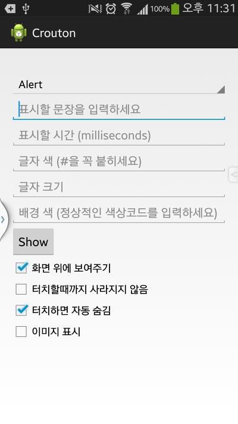
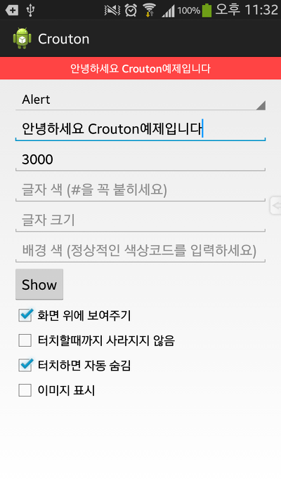
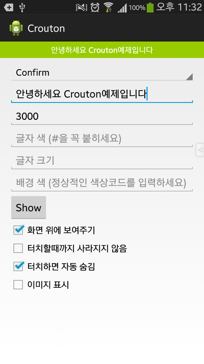
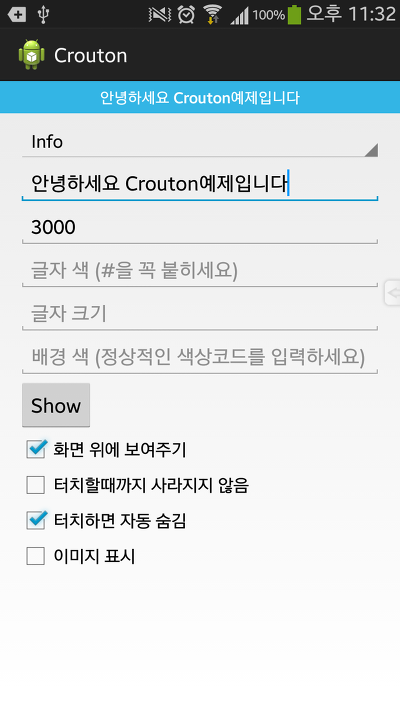
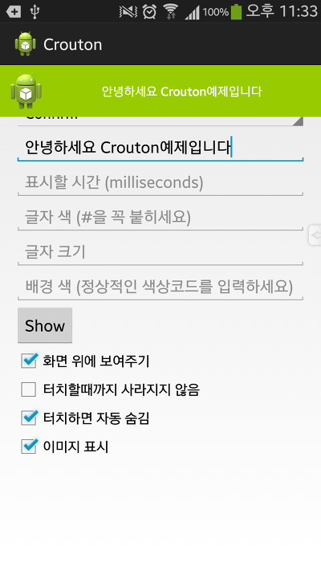
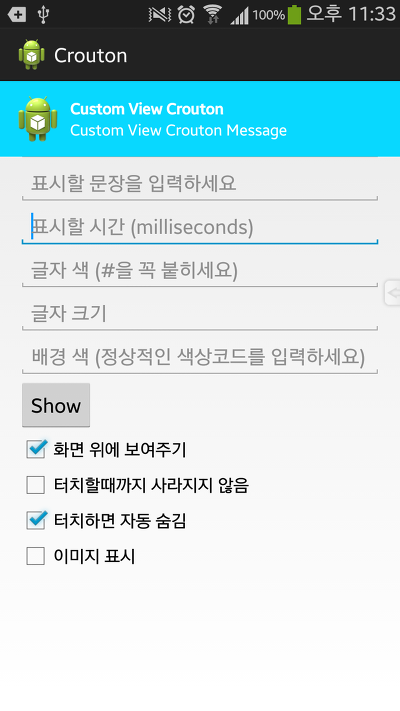

어플을 만드는 개발자가 한번은 꼭 써본 경험이 있을만한게 Toast입니다

이 토스트는 제 앱 강좌에서 도둑잡기 어플로 배운적이 있습니다

[[Development/App] - #9 Toast와, 도둑잡기 게임을 만들어 봐요! (rand함수 이용)](http://whdghks913.tistory.com/310)

사실 저 강좌에서 배운 토스트의 사용법도 전부가 아닙니다

(토스트 배경변경, 위치변경등도 할수 있습니다)

나머지 토스트 사용법은 #30~40대 강좌에서 응용 해보겠습니다

왜 Toast를 언급했냐면 이 글에서 언급하는 Crouton 라는 라이브러리도 Toast와 비슷하기 때문입니다

한마디로 언급하자면 감성적이고 이쁜 Toast의 진화 버전이라고 생각 하시면 됩니다

이 라이브러리는 아파치 라이센스이며, github에 소스가 샘플 예제와 함께 업로드 되어 있습니다

<https://github.com/keyboardsurfer/Crouton>

또한 마켓에도 Demo앱이 존재합니다

<https://play.google.com/store/apps/details?hl=ko&id=de.keyboardsurfer.app.demo.crouton>

그러나 샘플 프로젝트를 참조해도 약간 난해한 면이 많습니다

그래서 저는 이 Crouton의 예제를 직접 만들었습니다

또한 더욱더 편한 사용을 위해 CroutonHelper라는 클래스를 만들었습니다

(이 CroutonHelper를 사용하면 정말 편합니다 ㅎ)

---

**라이브러리 다운로드 (Library Download)**

  

[Crouton.zip](https://github.com/itmir913/archive/releases/download/itmir-attachments/Crouton.zip)

[CroutonHelper.jar](https://github.com/itmir913/archive/releases/download/itmir-attachments/CroutonHelper.jar)

2014-02-23 v1.0 첫 릴리즈

Crouton의 사용을 더욱 편하게 해주는 Helper 라이브러리 입니다

Crouton.zip파일안 HelperOpen폴더에 CroutonHelper.java파일이 포함되어 있으니 필요하신 분께서는 java파일을 참고해 주시길 바랍니다

---

**CroutonHelper API**

먼저 이 Helper를 사용하기 위해서는 import가 필요합니다

import com.tistory.whdghks913.croutonhelper.CroutonHelper;

그다음 Helper를 정의해야 합니다

CroutonHelper mHelper = new CroutonHelper(this);

그뒤 개발자가 mHelper를 사용하여 Text, TextSize등을 설정할수 있습니다

자세한 API는 아래와 같습니다

(지금 확인해 보니 Helper로 사용할수 있는 API가 약 35개 정도 있네요 ;;

전체 API는 아래 더보기를 눌러 확인해 주세요

주요 API는 아래와 같습니다

mHelper.setText() **[필수]**

Crouton의 글자를 설정합니다

mHelper.setTextColor()

Crouton의 글자색을 설정합니다

mHelper.setTextSize()

Crouton의 글자 크기를 설정하며, 단위는 sp입니다

mHelper.setBackgroundColor()

Crouton의 배경 색을 설정합니다 설정하지 않을경우 setStyle()의 설정을 따릅니다

mHelper.setDuration()

Crouton이 표시될 초를 설정합니다, 단위는 밀리세컨트초(1000=1초)입니다

mHelper.setCustomView()

Crouton에 Text대신 커스텀 View를 사용할때 사용합니다

mHelper.setStyle()

Style을 설정합니다

Style.ALERT : 빨강색, Style.CONFIRM : 초록색, Style.INFO : 파랑색

mHelper.setViewResId()

Crouton이 화면 맨 위에 표시되지 않고 View에 표시되도록 설정할때 사용합니다

mHelper.setInfinity()

Crouton이 사용자가 터치해야만 사라질수 있도록 설정합니다

사용자가 터치하지 않을경우 계속 나타납니다

mHelper.setImageResource()

이미지를 표여줄때 사용합니다

mHelper.setAutoTouchCancle()

터치하면 표시시간에 상관없이 사라지도록 설정합니다

모든 설정을 한다음 .show()를 호출해야 Crouton이 표시됩니다

아래에 자세한 API 설명이 있으니 참고해 주시기 바랍니다

제가 실수로 아래에 빠트린 API가 몇개 있을수 있습니다 mHelper.을 입력하신다음 컨트롤+스페이스 누르시면 사용할수 있는 API목록이 나타나니 참고 부탁드립니다

API 보기

mHelper.setText(resId)

mHelper.setText(croutonText)

- resId : getString으로 String을 가져올수 있는 id값, 예를들면 R.string.xx
- croutonText : 표시할 Text, 타입 : String

mHelper.setTextAppearance(textAppearanceResId)

- textAppearanceResId :  android.R.attr.textAppearanceLarge등 글자 크기 속성

mHelper.setTextColor(textColor)

mHelper.setTextColorResource(textColor)

- int textColor : 컬러값이며, int형입니다
- String textColor : 컬러값이며 String을 입력할수도 있습니다 이경우 Helper가 자동으로 변환해주며, 자체적으로 try-catch가 적용되어 있습니다
- resource textColor : R.color.xx와 같이 xml에 정의한 컬러값을 입력합니다

mHelper.setTextSize(textSize)

- textSize : 글자 크기, 단위는 "sp"입니다 (추후 변경 가능 업데이트}

mHelper.setStyle(style)

- style : import는 de.keyboardsurfer.android.widget.crouton.Style; 이며 사용할수 있는 값은 Style.ALERT, Style.CONFIRM, Style.INFO입니다
- 이 API는 setBackgroundColor(), setCustomView()와 동시에 사용할경우, 정상 기능을 할수 없습니다
- 스타일을 설정하지 않을경우 Style.INFO가 기본적으로 적용됩니다

mHelper.setViewGroup(viewGroup)

mHelper.setViewResId(resID)

- viewGroup : Crouton을 화면 상단에 표시하지 않고 다른 view에 표시할때 사용합니다
- resID : 한 view의 id를 파라메터로 지정하면, 그 뷰가 Crouton의 표시에 사용됩니다

예제소스의 activity.xml을 참조하세요

mHelper.setInfinity(setInfinity)

- setInfinity : 값이 true일경우 사용자가 터치를 해야만 사라집니다
- 이 API를 사용할경우, setAutoTouchCancle(), setDuration()의 설정이 무시되며, setInfinity()값이 우선됩니다

mHelper.setDuration(croutonLong)

mHelper.setDuration(duration)

- croutonLong : true 일경우 Toast.LENGTH\_LONG과, false일경우 Toast.LENGTH\_SHORT와 같습니다
- int duration : 밀리 세컨드초 단위이며, 입력한 시간동안 Crouton을 표시합니다
- String duration : int와 같으며, String을 int로 변환하는 과정을 생략할수 있습니다

mHelper.setCustomView(customViewId)

mHelper.setCustomView(view)

- customViewId : Crouton에 표시할 커스텀 View이며, 예를 들면 R.layout.xx 입니다
- view : View를 넘겨줄수도 있습니다
- 이 API를 사용하면, 아래 목록의 API의 설정값등이 무시됩니다
- mHelper.setStyle()
- mHelper.setText()
- mHelper.setTextAppearance()
- mHelper.setTextColor()
- mHelper.setTextColorResource()
- mHelper.setTextSize()
- mHelper.setGravity()
- mHelper.setHeight()
- mHelper.setImageDrawable()
- mHelper.setImageResource()
- mHelper.setBackgroundColor()
- mHelper.setBackgroundColorResource()
- mHelper.setBackgroundDrawable()

mHelper.setHeight(height)

- height : Crouton의 높이를 설정할수 있습니다

mHelper.setGravity(gravity)

- gravity : 위치를 설정할수 있으며, Gravity.CENTER\_VERTICAL, Gravity.CENTER\_HORIZONTAL, Gravity.LEFT등을 사용할수 있습니다

mHelper.setBackgroundColor(bgColorResId)

mHelper.setBackgroundColor(bgColor)

mHelper.setBackgroundColorResource(bgColorResId)

mHelper.setBackgroundDrawable(bgDrawableResId)

- bgColorResId : 배경의 색을 변경합니다, 타입은 int입니다
- bgColor : bgColorResId와 같지만, String을 입력할수 있습니다.
- bgColorResId : R.color.xx를 사용할수 있습니다
- bgDrawableResId : 배경 이미지를 설정하며, R.drawable.xx를 사용합니다

mHelper.setImageDrawable(imageDrawable)

mHelper.setImageResource(imageResId)

- imageDrawable : Crouton의 왼쪽에 이미지를 설정합니다 타입은 Drawable입니다
- imageResId : imageDrawable와 같지만, R.drawable.xx를 사용합니다

mHelper.setPaddingDimensionResId(paddingResId)

- paddingResId : Crouton의 상하좌우에 여백을 줍니다

mHelper.setAutoTouchCancle(autocancle)

- autocancle : true일경우 알림을 터치하면 표시시간에 관계없이 사라집니다
- 이 API를 사용하면 setOnClickListener()가 취소됩니다

mHelper.setOnClickListener(clickListener)

- clickListener : 터치할경우 할 작업을 설정할수 있습니다
- 이 API를 사용하면 setAutoTouchCancle()이 취소됩니다

mHelper.show()

- 설정한 Crouton을 표시합니다

mHelper.clearCroutonsForActivity();

- 남아있는 Crouton 메세지를 모두 지웁니다, show()를 호출하기 전에 이 메소드를 호출하시는걸 추천드립니다

---

**어플 예제 소스**

[Crouton.apk](https://github.com/itmir913/archive/releases/download/itmir-attachments/Crouton.apk)

Helper를 이용한 예제 어플입니다

    

Style.ALERT, Style.CONFIRM, Style.INFO가 각각 (↑) 오른쪽 (↓) 모두 순서대로 입니다

경고/알림/정보로 중요도에 따라 색이 다릅니다

    

    

왼쪽(위) 스크린샷은 이미지 표시로 mHelper.setImageResource()를 사용한 결과이며

오른쪽(아래) 스크린샷은 커스텀 뷰 모습입니다

전체 메소드 수가 많아서 복잡해 보이실수 있지만 사용하시다 보면 정말 간단합니다

예제 소스를 다운로드 하셔서 확인해 보시길 강력 추천드립니다

그럼 이렇게 해서 Crouton을 마치겠습니다~

---

## 첨부파일

- [Crouton.apk](https://github.com/itmir913/archive/releases/download/itmir-attachments/Crouton.apk) `285 KB`
- [Crouton.zip](https://github.com/itmir913/archive/releases/download/itmir-attachments/Crouton.zip) `843 KB`
- [CroutonHelper.jar](https://github.com/itmir913/archive/releases/download/itmir-attachments/CroutonHelper.jar) `26 KB`
