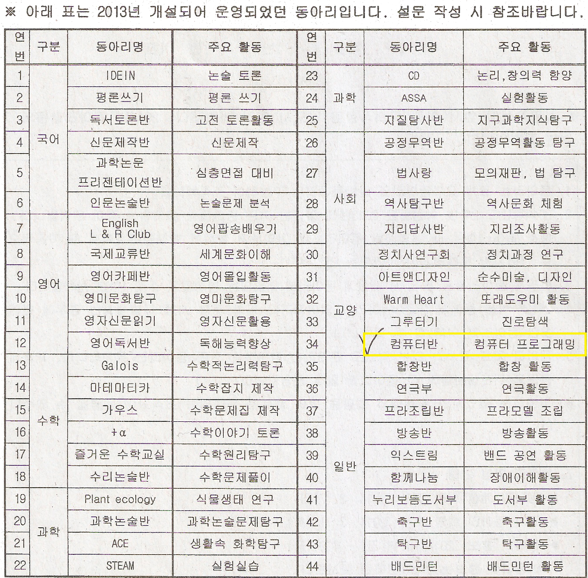

안녕하세요.

벌써 03월 07일입니다.

3월 3일 날 개학한 뒤로부터 5일이라는 시간이 흘렀습니다.

처음으로 고등학교에 입학해서 이제 저도 고등학교 1학년이 되었는데요.

첫 날과 둘째 날은 모르는 애들도 많고 여기가 어딘지 나는 누군지 할때가 많았는데,

4~5일정도 되니까 이제 조금씩 친해지는 애들도 있고, 여기는 강당이다!, 여기는 식당이다! 정도는 할 수 있게 된거 같아요.

이 글을 읽는 분들 중의 대부분이 학생 여러분일 겁니다.

다들 새 학기 개학은 어떠셨나요?

제가 다니고 있는 고등학교는 약간의 야자 반강제와 몇 주 뒤에 방과후 학교를 할 텐데, 이것도 말로만 선택이지 반강제라고 하더라고요.

야자 안하고 저녁만 먹고 버스타고 오면 6시 반에서 7시 전후 정도 됩니다.

버스타면 5분도 안되는 거리 (약 2~3km되더라고요)여도 이 놈의 버스가 20분 배차 간격이라서...

아침에는 스쿨버스 신청해서 타고 다니지요~ 학교가 운영하는 건 아니고, 개인이 학생들 모집해서 운영하는겁니다.

아무튼 야자하면 집에 9시 30에 옵니다.

오늘도 아홉시 반정도에 온 거 같아요.

씻고 옷 갈아입고 필요한거 정리하다 보면 벌써 10시가 넘어가고 있고, 공부 조금하면 11시가 넘어갑니다.

아 정말 중학교때 4시에서 5시정도 오는 게 편한거 같아요.

지금 중3분들 누리세요 고등학생되면 힘듭니다..

사실 제 생각에는 부모님과 청소년(그중에서도 고딩)의 소통을 막는게 야자라고 생각하는데... 음 어쩔 수 없는 부분이 많아서..

어째든 내일은 토요일 입니다~~!

개학 이후 처음 오는 주말이니 좀 쉬고 싶은데, 내일 또 결혼식이 있네요. 쿨럭..

이렇게 해서 고등학교 입학후 첫 1주일 소감을 끝냈습니다.

그런대 여기서 끝나면 명색이 IT 정복기 인대 IT가 아니죠?

또 하나의 주제가 있습니다.

오늘 학교 동아리에 관해서 안내 유인물이 나갔습니다.

스캔해서 아래에 첨부합니다.

사실 프로그래밍 동아리는 있을지 몰랐어요. ㅋㅋ

그런대 34번을 보시면 아시겠지만 컴퓨터 프로그래밍 동아리가 존재합니다 ㅋㅋㅋㅋ~

이거 꼭 들어가야죠.

요놈의 학교가 동아리 활동이 일 년에 50번 이상이라고 한거 같아요.

한 달, 아니 몇 주에 한번 동아리 활동을 할탠데, 매주 야자 안하고 프로그래밍을 하게 되다니~~~~~~~

매우 기쁩니다. ㅋㅋㅋ

이야 이 고등학교 오길 잘했어요.

그럼 불타는 금요일 보내세요~
