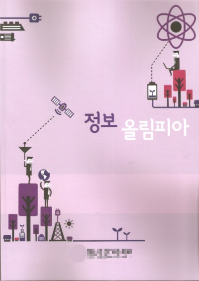

이번달 들어서 글을 하나도 못쓰고 있네요..

가벼운 주제는 네이버 블로그를 통해 쓰고 있어서 티스토리는 잠수처럼 보일수도 있지만 모두 감시(?)중입니다 ㅋㅋ

이번에 학교에서 올림피아 대회를 하더라고요

귀찮은대 하지 말까 하다가 확 신청하고 왔답니다 ㅎ

그런대 중요한 문제가 있는데..

올림피아드는 C를 사용합니다

전 Java를 사용합니다

완벽하게 c == java가 아니라서 조금 어려울거 같기도 해요

그래도 일단 java를 조금 알긴 아니까 아에 모르는거 보다는 나쁘지 않을거 같습니다

이번 대회는 그냥 실전 경험을 만들기 위해 참가하는대 의의를 두려고요

... 혹시 정보 올림피아드 준비하신분 또는 참가 하신 경험이 있으신 분께서는 조금 조언해 주시면 감사드리겠습니다...

참가하는 학생들의 수준이 어느정도인지...

공모전이 있다고 하더라고요

앱도 포함이던데 이미 만들어둔 앱 (마켓에 출시한 앱)으로 대회 공모에 참가할수 있는지 여부도...

할 수 있으면 "세번만"앱이라던지 이런거 공모해보고 싶긴 한데 말이죠 ㅋㅋ
