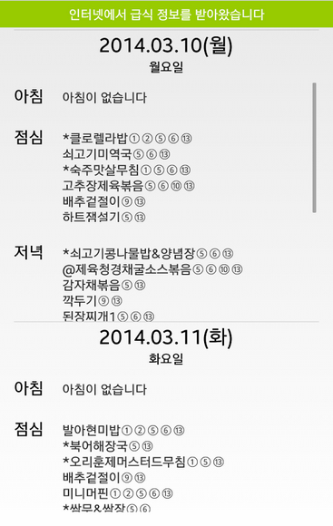

## Android Meal Open Library

나이스에서 오픈 API로 급식 정보를 공개함에 따라, 급식 파싱 라이브러리의 지원을 공식적으로 중단합니다.  
지금까지 제 라이브러리를 사용해주신 모든 분들께 감사의 말씀을 드리며, 아래 사이트로 접속하여 정부에서 공개한 API 정보를 확인하시기 바랍니다.  
https://open.neis.go.kr/portal/data/dataset/searchDatasetPage.do

나이스의 보안프로그램 적용으로 급식 파싱 라이브러리 사용이 제한될 수 있으며, 영구적으로 사용이 불가능할 수도 있습니다.

자세한 내용은 [[Application] - 나이스 보안 프로그램과 현재 급식 파싱 불가능 관련](http://itmir.tistory.com/614)을 참고하세요.

급식 라이브러리 가이드가 작성되었습니다.

오래된 이 글보다 아래 가이드 글을 참고해주세요!

<http://itmir.tistory.com/579>

<https://github.com/itmir913/wondanghighschool>

위 주소로 접속하신다음 app/src/main/java/toast/library/meal 으로 이동하시면 자세한 README를 확인할수 있습니다.

요즘 김급식, 장급식같은 학교 급식을 파싱하는 어플이 많이 있습니다

또한 한번 앱을 만들기 시작해서 조금씩 실력을 쌓다보면 자신이 다니고 있는 학교 앱을 만들고 싶어하는 마음이 누구나 들 것입니다

앱 만들수 있고, 마켓 개발자 계정을 득하게 되면 먼저 올리고 싶은것이 바로 학교 앱일겁니다

그런대 학교 앱을 만들때 한번쯤은 급식 목록을 가져오는 화면을 구성하고 싶지 않나요?

그렇지만 급식 목록을 가져오는게 또 큰일입니다

왜냐면 급식을 DB로 저장한다고 하면 매번 업데이트 해야 하는 귀찮음이 있고 그걸 언제 DB화 할까요...??ㅋ

그래서 생각할수 있는 가장 기본적인 방법이 바로 "파싱" 입니다

처음에 학교 홈페이지 또는 나이스 홈페이지를 파싱한다면 머리 터질겁니다

(물론 저도 몇번..)

인터넷을 검색하다 보면 Toast라는 분의 급식 파싱 오픈 라이브러리가 존재합니다

<http://blog.naver.com/rimal>

이 글에서는 이 라이브러리를 사용해서 급식을 파싱하는 부분을 알아보겠습니다

물론 Toast님의 라이브러리를 조금 수정해서 제가 직접 다시 만들었습니다

1. 급식 칼로리와 인원수를 받아오지 못하는 부분 수정

2. 일주일치 급식을 가져올때, 날짜 선택을 할수 있도록 수정

*3. 한달치 급식을 가져올수 있습니다* 기능 삭제되었습니다

그럼 이 급식 파싱 라이브러리를 직접 사용해 보겠습니다

## 1. 라이브러리를 사용하기 전에..

이 급식 파싱 소스는 Toast님께서 기본을 만드셨고, 제가 소스를 대부분 뜯어 고쳤습니다

원본 소스 문의는 <http://blog.naver.com/rimal>에서...

**급식을 파싱하는데 3G기준으로 약 1초~2초가 걸립니다**

짧은 시간이지만 사용자를 위해 ProgressDialog등을 사용하시는걸 추천드립니다

**한번 파싱하는데 데이터를 약 500kb (+-300kb)정도 소모합니다**

적은 용량이지만 한번 파싱한 데이터는 저장해서 다음부턴 오프라인으로 저장된 데이터를 불러들이는 센스를 발휘합시다 ㅎㅎ (저도 제가 만든 학교앱에 이 장치를 해뒀습니다)

**인터넷이 연결되지 않았을경우 예외처리는 되어있지 않으므로 직접 하셔야 합니다**

연결되어 있을때만 파싱을 하시면 됩니다

혹시 이부분을 어떻게 처리할지 모르시는 분께서는 글을 조금 내리면 나오는 오픈소스 사이트에 접속하셔서 어떻게 코드 구성이 이루어져 있는지 확인해 주세요

**html을 파싱하기 위해 jericho-html 파싱 라이브러리를 사용했습니다**

함께 추가해 주셔야 합니다

**네트워크 작업이므로 Thread 또는** **AsyncTask****를 사용해 주세요**

Toast님께서 AsyncTask를 사용하라고 하셨습니다

기존에는 제 앱소스에도 Thread를 사용해서 처리하였으나, 최근 업데이트로 코드 구성을 모두 AsyncTask로 변경하였습니다

작업전, 작업중, 작업후 3단계로 나눠 구분하므로 더 효율적인 코드 구성을 할수 있습니다

Thread를 사용하면 핸들러까지 사용하지만, AsyncTask에서는 이 핸들러가 필요 없습니다

**어떤 나쁜 학교는 급식을 제공하지 않을수도 있어요**

나이스에 문의해 보시는것도 나쁘지 않은 방법일겁니다

**인터넷 사용 권한을 AndroidManifest.xml에 추가하셔야 되요**

당연한 사실..!

<uses-permission android:name="android.permission.INTERNET" />

<uses-permission android:name="android.permission.ACCESS\_NETWORK\_STATE" />

이거 두개는 필수로 넣어주셔야 합니다

## 2. Android Meal Library

**[다운로드]**

최신 : 2015-02-25 업데이트, 버전 6.0.0

meallibrary.java를 삭제했습니다. 자세한 다운로드 방법과 삭제 이유에 대한 내용은 아래 굵은 글씨를 확인해주세요.

[jericho-html-3.3.jar

다운로드](./file/jericho-html-3.3.jar)

**최신버전의 Android Meal Library사용방법은**

**<https://github.com/itmir913/wondanghighschool> (src/toast/library/meal)에 오픈소스로 공개되어 있습니다.**

**정확한 주소는 app/src/main/java/toast/library/meal/MealLibrary.java 입니다.**

github에 공개된 사용법이 더 최신방법입니다.

오픈소스 사이트에는 Thread를 이용한 방법말고 AsyncTask를 이용한 방법으로 변경하였습니다.

개발자분께서는 꼭 **AsyncTask로 파싱을 해주시길 바랍니다.**

**첨부한 AndroidMealLibrary.zip 프로젝트를 삭제**합니다.

**라이브러리는 언제나 오류를 수정하여 변경**되므로 이 글에 첨부된 파일보다 위 링크에 있는 자료를 사용하는것이 더 빠른 방법입니다.

오픈소스에는 날짜를 지정해서 급식을 가져오는 기능등의 예가 포함되어 있습니다.

오픈소스 어플을 테스트해보고 싶으신 분께서는 아래 주소로 접속해서 앱을 받아주시기 바랍니다.

<https://play.google.com/store/apps/details?id=wondang.icehs.kr.whdghks913.wondanghighschool>

**[변경 내역]**

- 2014-03-16 v1.0.0

첫 업로드

- 2014-07-13 v2.0.0

나이스 홈페이지의 구조 변경 대응

**getMealNew(), getDateNew()** 메소드를 사용해 주세요

구조가 변경된 나이스 홈페이지 사용 지역은 아직 getKcal, getPeople, getMonthMeal 메소드를 지원하지 않습니다

새로운 getMealNew, getDateNew 메소드의 사용방법은 기존 라이브러리의 사용방법과 같습니다

-2014-08-24 v3.0.0

getDateNew와 getMealNew 두개의 메소드에 전달할수 있는 값(year, month, day)추가

getMealNew(String CountryCode, String schulCode, String schulCrseScCode, String schulKndScCode, String schMmealScCode, **String year, String month,** **String day**)

getDateNew(String CountryCode, String schulCode, String schulCrseScCode, String schulKndScCode, String schMmealScCode, **String year, String month,** **String day**)

- 2014-09-06 v5.0.0

getKcalNew(), getPeopleNew() 메소드 추가

- 2015-02-25 v6.0.0

New()가 붙지 않은 기존 메소드 제거, 기존 메소드는 이제 더이상 지원하지 않습니다

getPeopleNew(year, month, day) 메소드가 기존 getPeople()메소드의 파싱방식이 적용되어 있었습니다;;;

- 2018-02-12 MealLibrary Version 8 Update

<https://github.com/itmir913/wondanghighschool>

위 오픈소스 사이트의 app/src/main/java/toast/library/meal/MealLibrary.java 파일을 받아주세요.

가장 최신 파일입니다.

두 라이브러리를 받아서 자신의 프로젝트에 추가해 주세요

### (1) 파싱 설명

Deprecated된 메소드 : getDate(), getKcal(), getMeal(), getMonthMeal(), getPeople()

이 메소드는 사용하지 마시고 아래 메소드를 사용해주세요

**MealLibrary.getDateNew()**

- MealLibrary.getDateNew(CountryCode, schulCode, schulCrseScCode, schulKndScCode, schMmealScCode)

- MealLibrary.getDateNew(CountryCode, schulCode, schulCrseScCode, schulKndScCode, schMmealScCode, year, month, day)

**MealLibrary.getKcalNew()**

- MealLibrary.getKcalNew(CountryCode, schulCode, schulCrseScCode, schulKndScCode, schMmealScCode)

- MealLibrary.getKcalNew(CountryCode, schulCode, schulCrseScCode, schulKndScCode, schMmealScCode, year, month, day)

**MealLibrary.getMealNew()**

- MealLibrary.getMealNew(CountryCode, schulCode, schulCrseScCode, schulKndScCode, schMmealScCode)

- MealLibrary.getMealNew(CountryCode, schulCode, schulCrseScCode, schulKndScCode, schMmealScCode, year, month, day)

**MealLibrary.getPeopleNew()**

- MealLibrary.getPeopleNew(CountryCode, schulCode, schulCrseScCode, schulKndScCode, schMmealScCode)

- MealLibrary.getPeopleNew(CountryCode, schulCode, schulCrseScCode, schulKndScCode, schMmealScCode, year, month, day)

모든 정보의 반환은 String[]으로 반환하며, 맨 마지막 한달 급식을 가져오는 메소드를 제외하고 모두 [0]에서 [6]까지 정보가 담깁니다

[0]은 일요일 정보이며, [6]은 토요일 정보입니다

*한달 급식 정보도 String[] 형식이지만, 길이가 달마다 다릅니다*

*Month.length등으로 길이를 가져오셔야 하며, [0]은 매월 1일, [1]은 매월 2일 ... 이며 정보가 없을경우 null이 담깁니다*

### (2) 변수 설명

**CountryCode** : 학교 교육청 코드, nice홈페이지 도메인의 과 같습니다

경상 북도는 gbe.kr이며, 경상도는 .kr, 다른 교육청은 go.kr 도메인을 사용합니다

EX) 인천 : ice.go.kr

**schulCode** : 학교 고유 코드번호 입니다

교육청에서 학교를 구분할때, 학교에 공문을 내릴때 사용하며 아래 참조에서 코드를 찾을수도 있습니다

EX) 인천의 학교 코드 검색 : http://hes.ice.go.kr/sts\_sci\_si00\_001.do (학교 검색후 E10000xxxx 부분)

**schulCrseScCode**는 학교 분류입니다

"1" : 병설유치원

"2" : 초등학교

"3" : 중학교

"4" : 고등학교

분류번호랑 종류랑 안맞으면 리턴을 안합니다

**schulKndScCode**는 학교 종류입니다

"01" : 유치원

"02" : 초등학교

"03" : 중학교

"04" : 고등학교

**schMmealScCode** : 식사 값을 의미합니다

조식 : "1"

중식 : "2"

석식 : "3"

**schYmd** : (일주일치 정보를 얻어오는 메소드에서) 원하는 날짜의 급식 정보를 얻기 위해 필요합니다

String 형식 : 년.월.일

EX) "2014.03.16"

**schYm** : (한달치 정보를 얻어오는 메소드에서) 원하는 달의 급식 정보를 얻기 위해 필요합니다

String 형식 : 년.월

EX) "2014.03"

**year, month, day** : schYmd와 schYm의 정보를 세분화 해서 각각 정보를 넘겨줄때 사용합니다

EX) year = "2014", month = "03", day = "16"

대구 지역의 경우 나이스 홈페이지 구조 변경으로 새로운 메소드인 getMealNew, getDateNew를 사용해 주세요

새로운 New메소드는 지금은 getKcal, getPeople, getMonthMeal을 지원하지 않습니다 이제 지원합니다!

### (3) 사용 예제

String[] lunch = MealLibrary.getMealNew("ice.go.kr", "E100001786", "4", "04", "2");

인천의 한 고등학교 점심을 가져오는 구문입니다

String[]에 index값 0에 일요일 점심이, 1에 월요일 ... 6에 토요일 점심 목록이 나타납니다

긊식이 존재하지 않을경우 null이 들어있습니다

for문등으로 String[]에 들어있는 급식 목록을 원하는 리스트에 뿌려주시면 됩니다

자세한 예제는 제가 직접 만든 학교앱에 이 라이브러리를 사용해서 어플을 만들어 두었습니다

오픈소스로 공개되어 있으니 확인해 보세요

오픈소스 주소 : <https://github.com/itmir913/wondanghighschool>

### (4) 사용 스크린샷

아래 스크린샷은 제가 직접 만든 학교 앱에 들어간 급식 파싱 부분 스크린샷 입니다

원리는 다음과 같습니다

날짜, 아침, 점심, 저녁값을 받아온다음 for문으로 리스트에 각각 뿌려줍니다

리스트뷰의 getView()에서 파싱한 날짜 형식을 Format을 변경해서 "월요일", "화요일"을 추출합니다 (20xx.xx.xx(요일))

(참고로 제 학교앱에는 MealLibrary 말고도 전에 포스팅한 CroutonHelper 라이브러리도 사용됬습니다)

이 스크린샷의 학교 어플은 위에 오픈소스 링크를 첨부해 두었습니다

## 3. Ps..

학교 급식 파싱하는거 장난 아니더라고요;

그렇지만 이렇게 급식정보를 받아오는 라이브러리를 모두 완성해서 기분 좋습니다

아무튼 이제 저처럼 급식 파싱하려고 별짓을 다하시는 분들께 도움이 됬으면 합니다

갑자기 파싱이 안된다던가 라는 문제가 있다면 티스토리 덧글 또는 제 이메일 whdghks913@naver.com으로 언제든지 메일주세요

시간 나는대로 원인 파악후 수정하겠습니다

---

## 첨부파일

- [jericho-html-3.3.jar](https://github.com/itmir913/archive/releases/download/itmir-attachments/jericho-html-3.3.jar) `194 KB`
