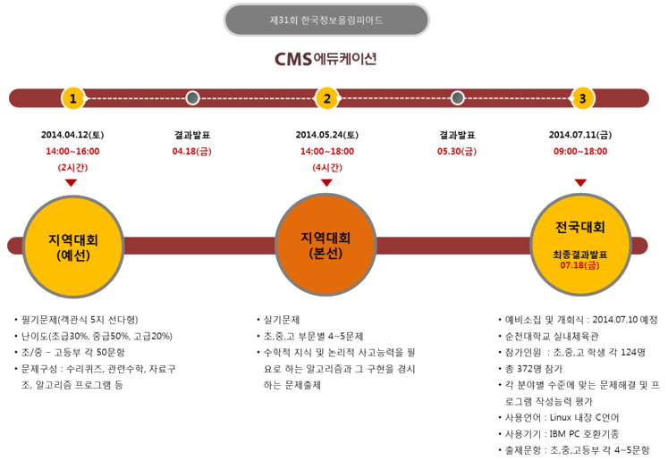

안녕하세요.

이번에는 정보 올림피아드 관련 정보를 가져 왔습니다.

o 주최 : 미래창조과학부

o 주관 : 한국정보화진흥원

o 후원 : 17개 시도 교육청/한국정보과학회

정보 올림피아드는 국내에서 유일하게 정부 주관으로 열리는 IT대회라고 합니다.

약 1년간 진행되며, 자세한 일정은 아래 사진으로 확인할수 있습니다.

그림 출처 : <http://cmsblog.kr/90189625324>

자세한 대회 내용은 첨부한 hwp파일에서 확인할수 있습니다.

아래는 한글 파일의 내용중 일부입니다.

**가. 지역대회(예선)**

o 참가신청서 접수

    - 학교장 추천을 받은 재학생은 시도 교육청 접수(휴학생 제외)

    - 대안학교 재학생, 검정고시 출신자 등의 참가자는 NIA에서 접수

 o 대안학교 재학생, 검정고시 출신자 등 모든 청소년을 대상

  - 다만, 취학연령을 기준으로 각 부문별 제한연령 이하이며 해당부문의 재학생과 동등한 자격요건을 구비한 자에 한함

   ※ 초등학교(만 12세 이하), 중학교(만 15세 이하), 고등학교(만 18세 이하)

 o 참가자는 해당지역 교육청(원)에서 개최하는 예,,본선 대회 참가

   (참가신청은 정보문화포털(http://www.digitalculture.or.kr)을 통해 공지)

o 개최일시 : 4. 12(토), 14:00~16:00

o 문제유형 : 필기문제(객관식 5지 선다형으로 출제)

o 문 제 수 : 초, 중,고등부 각 50문항

o 대회시간 : 2시간

o 문제구성 : 수리퀴즈, 관련수학, 자료구조, 알고리즘 등

   ※ 프로그램 관련문제는 **Linux 내장 표준C/C++**을 기준으로 IOI 출제기준에 준하여 출제

   ※ 문제구성 비율은 출제위원회에서 최종 결정

o 문제채점 : 감독관이 취합하여 해당 지역 교육청(원)에서 자체 채점

o 이의신청 접수(4. 12,토 ~ 4. 14,월) : KOI 홈페이지에 이의신청

o 이의신청 분석 및 통보(4. 15,화~4. 16,수) : 홈페이지 이의신청에 답글 게재

o 결과 발표(4. 18,금) : 교육청 홈페이지

**나. 지역대회(본선)**

o 개최일시 : 5. 24(토), 14:00~18:00

o 문제유형 : 실기문제

o 문 제 수 : 초, 중, 고 부문별 4 ~ 5문제(교육청별 문항 선택 가능)

o 대회시간 : 4시간

o 문제구성 : 수학적 지식 및 논리적 사고능력을 필요로 하는 알고리즘과 그 구현을 경시하는 문제출제

o 문제채점(5.25,일~5.26,월) : 별도의 NIA 채점실에서 일괄 채점

   ※ **Linux(Ubuntu 12.04 LTS i386) 내장 표준C/C++언어 이외의 버전은 채점불가**

o 이의신청 접수(5.24,토~5.26,월) : KOI 홈페이지에서 이의신청 접수

o 이의신청 분석 및 결과통보(5.27,화 ~ 5.28,수) : 홈페이지 이의신청에 답글 게재

o 결과 발표(5. 30,금) : 교육청 홈페이지

o 시  상 : 시도 교육청 자체 시상

**다 전국대회**

o 일    시 : 2014. 7. 11(금), 09:00 ～ 18:00 예정

    - 예비소집 및 개회식 : 2014. 7. 10(목), 15:00 예정

o 장    소 : 순천대학교 실내체육관/70주년 기념관(전남 순천시 소재)

o 참가인원 : 초,중,고등학생 각 124명 총 372명

o 문제출제

    - 각 분야별 수준에 맞는 문제해결 및 프로그램 작성능력 평가

    -사용언어 : **Linux(Ubuntu 12.04 LTS i386)내장 표준C/C++**

    -사용기기 : IBM PC 호환기종

    - 출제방향 : 수학적 지식 및 논리적 사고능력을 필요로 하는 알고리즘과 그 구현을 경시하는 문제출제(IOI 출제경향)

    - 출제문항 : 초,중,고등부 각 4~5문항(4시간)

o 평가방법

    - 참가자는 작성된 프로그램을 본인 PC에서 네트워크로 제출

    - 네트워크로 제출된 프로그램을 실시간으로 성적 확인 가능

    - 네트워크로 취합된 작성 프로그램을 자동 채점프로그램으로 평가

o 시상내역 : 국무총리상 1명, 미래창조과학부장관상 12명, 한국정보화진흥원장상 78명, 한국정보과학회장상 281명 등, 총 372명 이내 시상 및 메달 수여

       ※ 지도교사상 : 장관상(3명, 대상수상자 지도), NIA원장상(3명, 금상수상자 지도)

작년 2013 올림피아드 부터 OS환경이 우분투로 변경되고, 사용 언어도 리눅스 표준 c로 변경되었는데요.

뭐.. 저야 우분투 항상 만지던거니까.. ㅋㅋ

전에 정보 올림피아드 측에서 우분투 가상 디스크 파일을 배포한 적이 있습니다.

그런대 지금은 아에 자료가 사라졌어요.

그 파일의 이름은 KOI.OVA 입니다.

이 파일은 버추얼박스 가상머신 디스크 파일입니다.

아무리 찾아도 없길래 첨부합니다.

[DOWNLOAD]

[2014 KOI 운영계획.hwp](https://github.com/itmir913/archive/releases/download/itmir-attachments/487-2014-KOI-plan.hwp)

[제31회 한국정보올림피아드 세부계획 (홈페이지게시용).hwp](https://github.com/itmir913/archive/releases/download/itmir-attachments/487-KOI31-schedule.hwp).hwp)

<https://docs.google.com/file/d/0B2t_9XLUrUKEcVRhWVhKTDZvYX>

---

## 첨부파일

- [2014 KOI 운영계획.hwp](https://github.com/itmir913/archive/releases/download/itmir-attachments/487-2014-KOI-plan.hwp) `57 KB`
- [제31회 한국정보올림피아드 세부계획 (홈페이지게시용).hwp](https://github.com/itmir913/archive/releases/download/itmir-attachments/487-KOI31-schedule.hwp) `46 KB`
