목요일날 카페에서 케이스를 10원에 떨이 판매 한다는 글을 봤습니다

그래서 한번 사볼까? 해서 가입 - 검색 ...

케이스는 정말 10원이 맞지만 좀 싸보이는 젤리케이스더라고요

그리고 다양하지도 않고 그래서 패스

좀 검색했더니 OTG케이블을 발견했습니다 ㅋㅋ

전부터 OTG케이블 한번 사고 싶었는대 이때다 해서 바로 질렀습니다 ㅋㅋㅋ

사실 지른게 아니라 회원가입하니 적립금 5000원을 주더라고요

사고싶은게 SD카드 OTG케이블이랑 그냥 OTG케이블 두개라 적립금이 모자라길래 어쩌구 해서 구매 완료 ㅎ

돈 한푼 안들이고 샀습니다

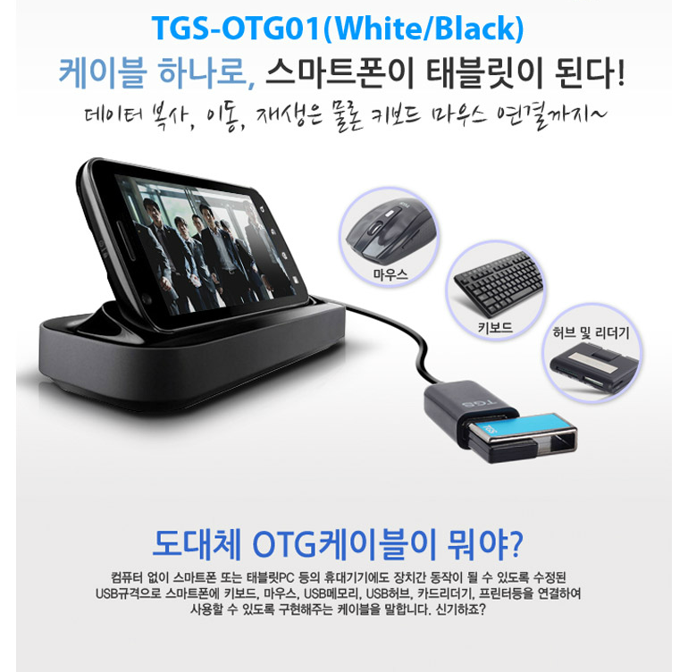

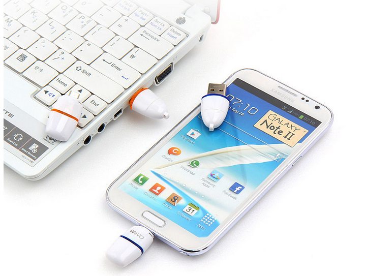

한번 써봤는대 나쁘진 않습니다

먼저 마이크로 SD카드를 OTG로 또는 USB로 연결해 주는 젠더입니다

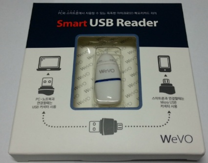

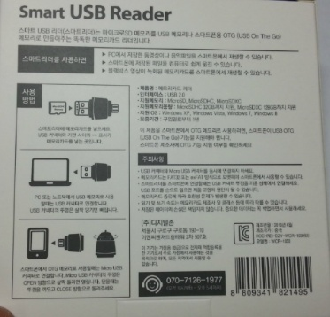

그다음은 흔한 OTG케이블 입니다

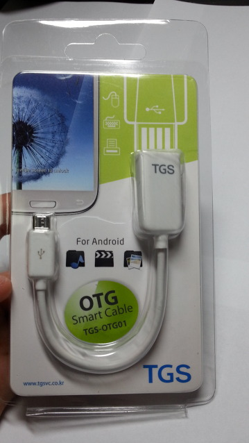

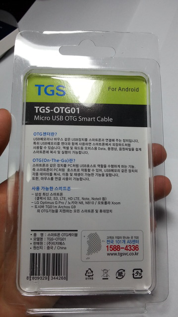

가격이 모두 싼편이었어요

배송비 2500원 더해도 각각 6000원, 4000원대였으니

그리고 가장 중요한건 적립금으로 사서 **꽁짜!!!**

일단 돈안들이고 샀으니 만족해야...

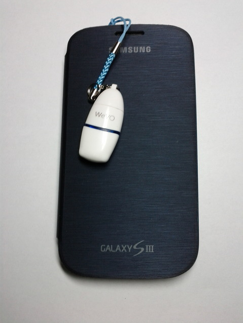

이어캡이랑 연결해서 가지고 다닐수 있도록 했더라고요

그런대 저게 조금 가지고 다니면 잘 빠진다는게 함점..

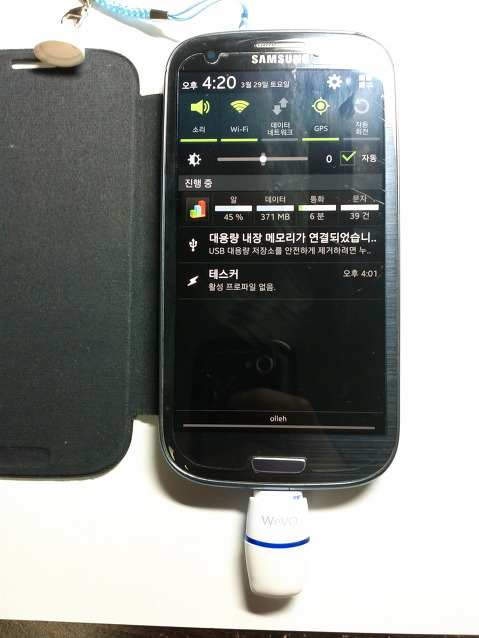

sd카드 낀다음 연결해 봤습니다

잘 인식됩니다 ㅎㅎ

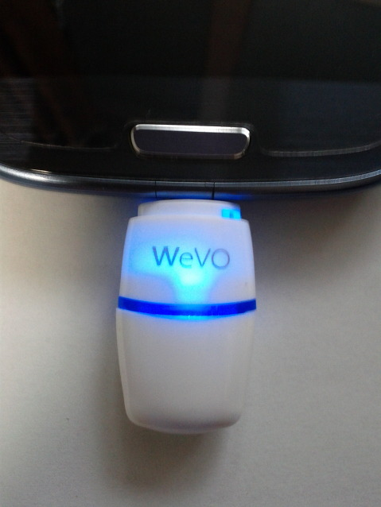

작동중일땐 파랑색으로 빛나네요

다음은 OTG케이블 입니다

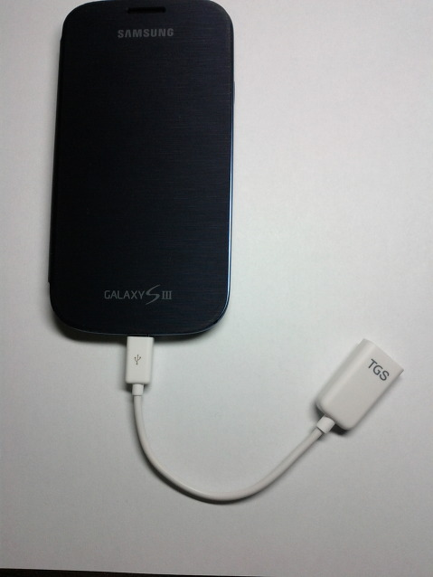

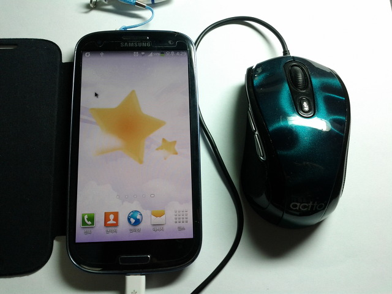

뭘 껴볼까 하다가 마우스 한번 껴봤습니다

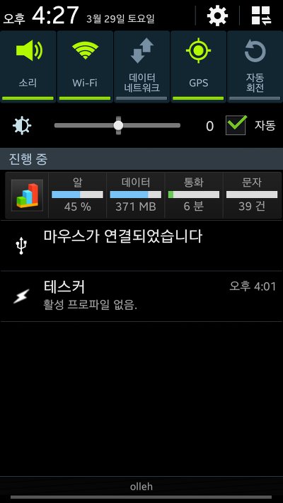
    
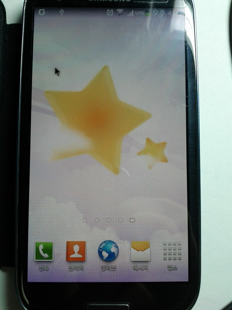

커서 나타나고 잘 인식됩니다 ㅎㅎ

혹시 이 OTG케이블으로 할수 있는 재밌는거 아시는분 있으시면 알려주세요 ㅋㅋ

한가지 팁을 드리자면..

OTG로 마우스 연결하고 조작법은 아래와 같습니다

왼쪽 클릭 : 터치와 같습니다

오른쪽 클릭 : 뒤로가기 입니다

휠버튼 : 스크롤 입니다

(일부 기종에 한해) DPI 설정 : 이건 PC에서도 마우스 속도 조절인대요 되더라고요

그리고 한가지더

마우스 커서 속도를 조절하고 싶으시면 아래 설정을 바꿔주세요

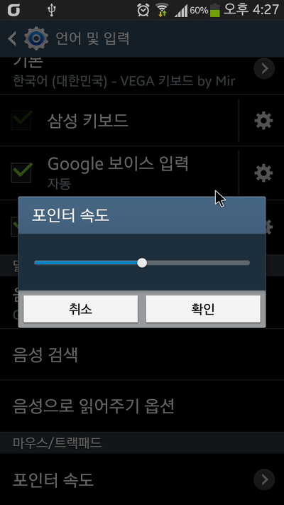

설정의 포인터 속도를 조절해 주면 커서 속도가 바뀝니다

(이게 이런 기능인지 처음 알았다는...)
