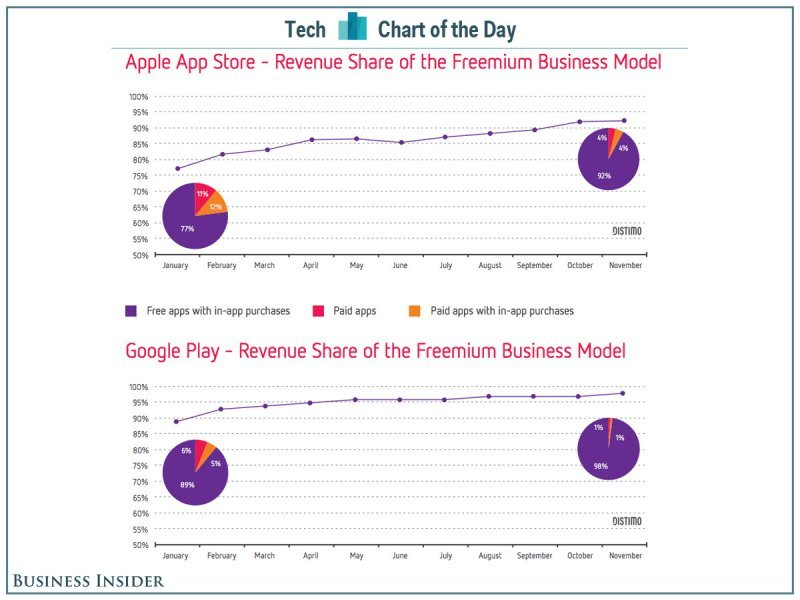
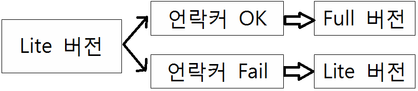
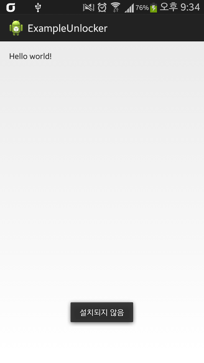
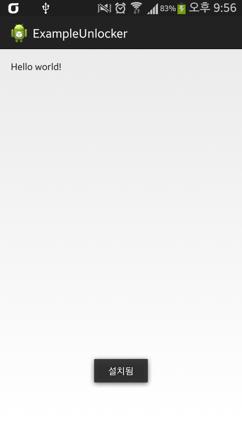

- 안내

제게 크랙을 부탁하는 메일을 보내지 마세요.

요즘 어플로 수익을 얻기 위해 가장 많이 사용하는 결제 방법은 인앱 결제라는 방법입니다.

또한 언락커 방식도 존재합니다.

한 조사 결과에 따르면 AppStore와 PlayStore 모두 대부분의 결제에서 인앱 결제가 사용된다는 통계가 있습니다.



출처 : <http://www.businessinsider.com/chart-of-the-day-paid-apps-are-dead-2013-12>

점차 인앱 결제가 대세가 되고 있는데요.

그런대 이 인앱 결제 방식도 크랙할 수는 있습니다.

먼저 인앱 결제 말고 언락커 방식의 어플의 크랙방법을 알아볼께요.

## 1. 언락커(Unlocker)

+2016.1.1

언락커 방식의 크랙을 방지하기 위해 이 글을 보시는 앱 개발자들에게.

언락커를 쓰지 마시고 유료와 무료 앱을 구분해서 빌드하시는걸 추천드립니다.

이럴 경우에는 구매말곤 답이 없습니다.

유료 기능은 유료 앱에만 존재하고 무료 앱에선 아에 찾아볼 수가 없기 때문입니다.

저도 만약 앱을 유료 판매한다면 기능을 분류해서 빌드할 생각입니다.

언락커를 적용한 어플의 경우 마켓에 두 가지 어플을 업로드 합니다.

하나는 lite버전이고, 하나는 pro key입니다.

lite버전은 pro key 어플이 설치되었을경우 full버전으로 변경되는 어플입니다.

그림으로 표현하면 아래와 같습니다.



자, 위 사진을 분석하면 Unlocker를 이용한 어플이 크랙할 수 있는 여지를 살펴볼 수 있습니다.

언락커가 설치되어 있으면, Full, 없으면 Lite버전입니다.

언락커 앱이 설치가 안 되어 있어도 설치된 것처럼 true를 반환하면 완성~~ 이지요. ㅋㅋ

저번에 다룬 안드로이드 라이센스 크랙하기 포스팅과 99% 관련이 있습니다.

[[Development/App] - 안드로이드 어플 라이센스 크랙하기 (DRM Crack)](/archive/itmir/2013/408)

그럼 한번 해보겠습니다.

언락커를 확인하는 방법은 몇 가지 있겠지만 대표적으로 패키지 명을 확인해서 기기내 A 패키지명을 가진 어플이 존재하는가? 를 검사하는 경우가 있습니다.

이건 가장 쉬운 경우고요.

언락커를 깔고 진짜 구매한게 맞는지 검증 과정을 거치는 경우가 가장 흔한 케이스가 되겠습니다.

검증 과정은 어플마다 차이다 있을 수 있습니다.

일단 패키지가 설치되어 있는 지 검사하는 코드부터 알아보겠습니다.

```java
// onCreate()메소드안에서

if (isUnlockerInstalled("com.lee.tistory.com")) {

    Toast.makeText(this, "설치됨", Toast.LENGTH_LONG).show();

} else {

    Toast.makeText(this, "설치되지 않음", Toast.LENGTH_LONG).show();

}

private boolean isUnlockerInstalled(String unlockerPackageName) {

    PackageManager pm = getPackageManager();

    try {

        pm.getApplicationInfo(unlockerPackageName,

        PackageManager.GET_META_DATA);

        return true;

    } catch (NameNotFoundException e) {

        return false;

    }

}
```

onCreate() 메소드 안에서 if문을 통해 isUnlockerInstalled라는 메소드를 호출합니다.

저 try-catch문안에서 패키지가 설치된 게 확인되면 true반환, 만약 패키지가 없을경우 catch로 넘어와서 false가 반환됩니다.

이 java코드를 smali로 보면 아래와 같습니다.

```smali
# virtual methods

.method protected onCreate(Landroid/os/Bundle;)V

    // 생략

    .line 17

    const-string v0, "com.lee.tistory.com"

    // 이 아래 코드가 언락커를 확인하는 메소드를 실행하는 부분입니다.

    invoke-direct {p0, v0}, Lcom/example/exampleunlocker/MainActivity;->isUnlockerInstalled(Ljava/lang/String;)Z

    move-result v0

    // v0, 즉 반환값이 0(false)일경우 아래 설치됨 부분을 건너 뜁니다.

    if-eqz v0, :cond_1b

    .line 18

    const-string v0, "설치됨"

    invoke-static {p0, v0, v1}, Landroid/widget/Toast;->makeText(Landroid/content/Context;Ljava/lang/CharSequence;I)Landroid/widget/Toast;

    move-result-object v0

    invoke-virtual {v0}, Landroid/widget/Toast;->show()V

    .line 22

    :goto_1a

    return-void

    .line 20

    :cond_1b

    const-string v0, "설치되지 않음"

    invoke-static {p0, v0, v1}, Landroid/widget/Toast;->makeText(Landroid/content/Context;Ljava/lang/CharSequence;I)Landroid/widget/Toast;

    move-result-object v0

    invoke-virtual {v0}, Landroid/widget/Toast;->show()V

    goto :goto_1a

.end method

.method private isUnlockerInstalled(Ljava/lang/String;)Z

    .registers 5

    .param p1, "unlockerPackageName"    # Ljava/lang/String;

    .prologue

    .line 32

    invoke-virtual {p0}, Lcom/example/exampleunlocker/MainActivity;->getPackageManager()Landroid/content/pm/PackageManager;

    move-result-object v1

    .line 35

    .local v1, "pm":Landroid/content/pm/PackageManager;

    const/16 v2, 0x80

    .line 34

    :try_start_6

    invoke-virtual {v1, p1, v2}, Landroid/content/pm/PackageManager;->getApplicationInfo(Ljava/lang/String;I)Landroid/content/pm/ApplicationInfo;

    :try_end_9

    .catch Landroid/content/pm/PackageManager$NameNotFoundException; {:try_start_6 .. :try_end_9} :catch_b

    .line 37

    const/4 v2, 0x1

    .line 39

    :goto_a

    return v2

    .line 38

    :catch_b

    move-exception v0

    .line 39

    .local v0, "e":Landroid/content/pm/PackageManager$NameNotFoundException;

    const/4 v2, 0x0

    goto :goto_a

.end method
```

아래 빨간 부분을 보시면 v2를 반환합니다.

try{ } 부분에서 오류가 날 경우 catch로 넘어온다는건 java 기초 상식입니다.

설치되지 않을 경우 catch로 넘어와 false를 반환하며, 설치되어 있으면 true를 반환을 하게 됩니다.

그럼, return부분에 무조건 true를 반환하게 하면 됩니다.

```smali
.method private isUnlockerInstalled(Ljava/lang/String;)Z

    .registers 5

    .param p1, "unlockerPackageName"    # Ljava/lang/String;

    .prologue

    .line 32

    invoke-virtual {p0}, Lcom/example/exampleunlocker/MainActivity;->getPackageManager()Landroid/content/pm/PackageManager;

    move-result-object v1

    .line 35

    .local v1, "pm":Landroid/content/pm/PackageManager;

    const/16 v2, 0x80

    .line 34

    :try_start_6

    invoke-virtual {v1, p1, v2}, Landroid/content/pm/PackageManager;->getApplicationInfo(Ljava/lang/String;I)Landroid/content/pm/ApplicationInfo;

    :try_end_9

    .catch Landroid/content/pm/PackageManager$NameNotFoundException; {:try_start_6 .. :try_end_9} :catch_b

    .line 37

    const/4 v2, 0x1

    .line 39

    :goto_a

const/4 v2, 0x1

    return v2

    .line 38

    :catch_b

    move-exception v0

    .line 39

    .local v0, "e":Landroid/content/pm/PackageManager$NameNotFoundException;

    const/4 v2, 0x0

    goto :goto_a

.end method
```

return 바로 앞에 0x1을 집어 넣어주면 끝~

실행 결과를 봅시다.


    


com.lee.tistory.com이란 패키지명을 가진 어플은 존재하지 않습니다.

그러나 smali를 수정하면 저 어플이 없어도 설치된 것처럼 인식됩니다.

언락커 관련 크랙은 이런 방식으로 뚫을 수 있습니다.

그렇지만 뚤리지 않는 어플도 있습니다.

대표적으로 파워앰프 입니다.

요놈은 사인키 검사, 난독화, 변조 검사, 라이센스 체크 등 모든 방법을 사용하는데요.

개발자들은 이 파워앰프를 본받아서 앱을 만들어 봐야겠습니다.

## 2. 인앱 결제(Inapp Billing)

이 인앱 결제는 좀 까다롭습니다.

개인 또는 중소기업이 만든 어플의 인앱 결제는 대체적으로 뚫기 쉽지만,

대기업의 인앱 결제 앱은 뚫기 어렵습니다.

왜 그러냐면, 인앱 결제의 크랙을 막기 위해 자체 서버를 돌려서, 서버에서 값을 확인한다음, 성공 여부를 판단하기 때문입니다.

(물론 개인도 서버만 있다면야..)

따로 서버를 운영해서 검증하는 방식을 사용하는 앱의 경우, 뚫는 시도를 포기하시는게 정신 건강에 편할겁니다.

(서버 인증 부분까지 뚫으실수 있다면 이 글을 볼 필요도 없을거라 생각합니다.)

저번에 디벨로이드에서 관련 글을 본것 같은데 까먹었네요.

아무튼.. 인앱 결제는 두 가지 방법이 있겠습니다.

먼저 하나는..

구매내역 복구 기능 아시나요?

또는 구매 버튼을 누르려고 하면 이미 구매했습니다~~~ 라는 문구라던지..

이때 무조건 "이미 구매했습니다~~" 가 나오도록 true를 반환하게 만들면 됩니다.

또 하나는 결제 창이 나타난 후, 콜백 메소드가 있습니다.

onActivityResult()라는 메소드 인데요.

이 메소드를 크랙하면 가능합니다.

+2016.1.1

그러나 경험상 결제 창이 나타난 뒤에 크랙을 하는 방법은 비효율적입니다.

왜냐하면 사용자가 결제창을 한 번이라도 실행해야 하기때문이죠.

그래서 다른 측면으로 생각해봐야 합니다.

여기서 잠깐 질문,

인앱 결제 앱은 매번 앱 실행때마다 인터넷에 접속해서 구글 서버와 통신을 할까요?

그러니까 앱을 킬때마다 결제 확인을 하냐? 라는 뜻입니다.

이 질문은 매우 중요합니다.

어처피 길은 하나지만 그 길로 갈 수 있게 도와주는 길잡이랄까요?

제가 본 대부분의 앱은 한번 결제 정보를 가져오면 그걸 저장합니다. 오프라인에.

어떻게 저장하냐고요?

그건 저도 모르죠 :D

큰 부분에서 소스를 살펴보는 안목을 키울 필요가 있습니다.

그리고 이 안목은 복잡한 앱을 만들어 봤을때 키울 수 있습니다.

다시 요점으로 돌아와서, 생각해봅시다.

정상적으로 결제를 한다고 했을 때, 일단 결제 창이 뜨고 결제를 하겠죠?

그러면 인앱 결제 앱에서 결제된 서비스를 이용할 수 있을겁니다.

1회용 결제 서비스(생명같은거 충전)가 아니고 지속적이고 장기적인 서비스라면 이 결제 정보를 저장해둬야 하지 않겠습니까?

인터넷이 안되는 오프라인에서는 앱 못쓰게 막을거예요?

그럼 이제 한 가지 고민이 남았습니다.

도대체 어디에 어떻게 결제 정보를 저장했을까?

모든 앱의 데이터는 /data/data/패키지명 폴더에 저장됩니다.

예외가 있다면 /sdcard/Android/data 폴더나 /sdcard 자체에 저장할 수도 있을텐데, 이는 수정의 위험이 있고 또 여기에 저장해야 할 필요가 없습니다.

/data/data 폴더는 루팅하지 않고 앱을 크랙에서 파일을 복사하는 코드를 일부로 삽입하지 않는 이상 나 외 다른 앱의 접근이 불가능 합니다.

데이터를 저장하는 방법은 많습니다.

Preference라던가 db라던가..

여기서 부턴 직접 알아내셔야 합니다.

그리고 그 부분을 어떻게 수정해야 하는지도 고민해보셔야 합니다.

자바에서 데이터를 검증할땐 if-else말곤 딱히 없습니다 (있다면 ? : 이런건 있군요)

사실 검증이라는게 if문으로 확인하는거말곤 다른게 없어요.

java의 if문은 smali의 if-xx입니다.

smali문법 조금만 알면 쉽습니다.

인앱 관련 예제도 드리고 싶은데, 직접 짤 수가 없어 인앱 크랙은 다음에 기회되면 예제까지 업데이트 하겠습니다.

(저번 라이센스 크랙에서 사용한 방법이 조금만 다르지 기본 지식은 같다라는것 눈치 채실겁니다. ㅎㅎ)

저번에 올린 라이센스 크랙 게시글과 이 게시글을 함께 연구하시면 성과가 있으실겁니다.

</archive/itmir/2013/408>

인앱 결제 관련 좋은 글이 있어 소개합니다.

<http://blog.waldotic.com/291>

<http://blog.waldotic.com/292>