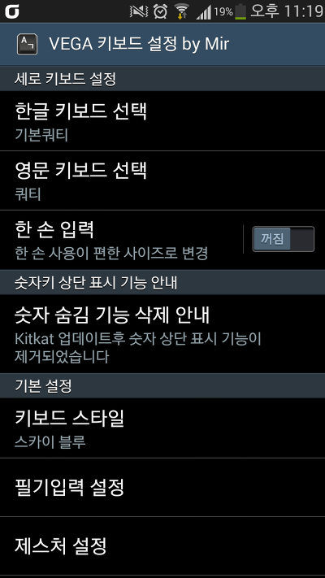
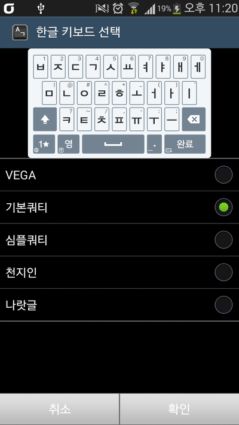
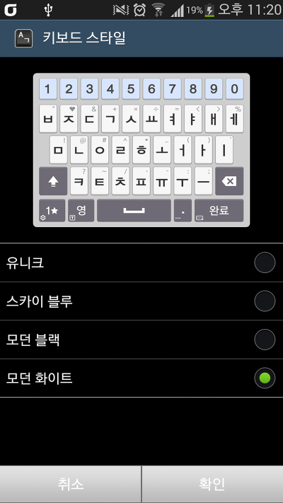
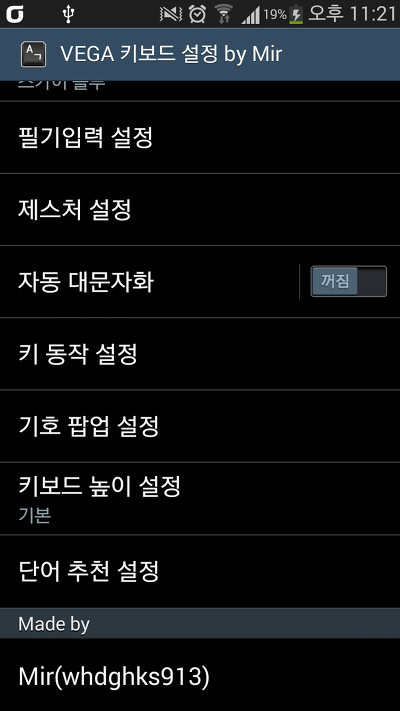
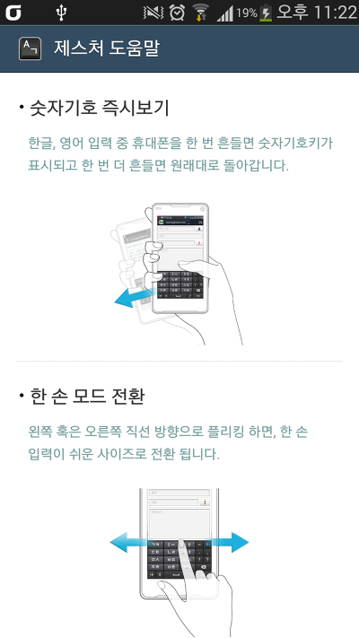
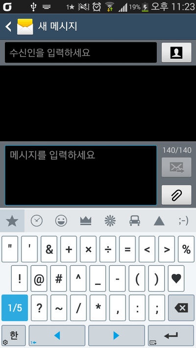
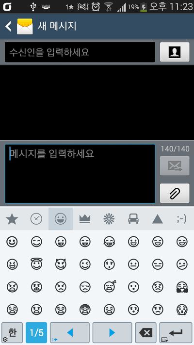
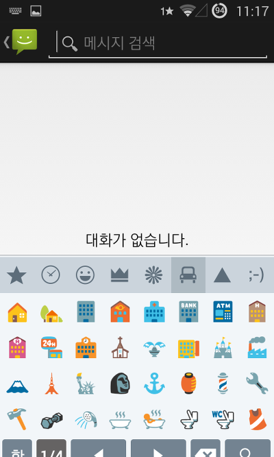
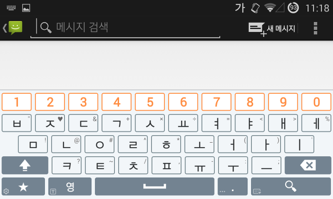

저번에 1월달에 베가 시크릿 업 키보드를 전 기종용으로 만든적이 있습니다

지난 4월달에 베가 시크릿 업이 Kitkat으로 업데이트 되면서 키보드 또한 업데이트 되었는대요

오늘은 이 업데이트된 베가 키보드를 들고 왔습니다

지난 버전과 크게 달라진점은 없지만 이모티콘을 쓰고싶으신 분께는...!

[참고] 지난 버전

[[Application] - [APP] Vega Secret UP (베가 시크릿 업) 키보드](http://itmir.tistory.com/425)

[[Application] - Vega Secret UP 키보드 오류 수정 완료](http://itmir.tistory.com/426)

먼저 아이콘이 변경되었습니다

힌색바탕 아이콘에서 검은색으로 변경되었습니다

설정 모습입니다~

스샷에도 있지만 킷캣부터는 키보드의 상단 숫자 숨김 기능이 동작하지 않더라고요...

그래서 관련 설명을 삽입해뒀습니다

    

키보드 종류와 테마에는 변함이 없습니다

    

이번 업데이트때 젤리빈 버전에서 해결하지 못한 버그를 픽스하였습니다

필기 입력 도움말과 제스처 도움말을 선택하면 강제종료 됬던 반면 이번에는 정상적으로 로딩됩니다

단 필기입력은 아직도 사용할 수 없습니다

    

이렇게 이번 업데이트에서는 이모티콘이 추가되었습니다~

[이분들은 안됩니다...ㅠㅠ]

1. 기존 베가 키보드가 있으신분

-패키지 네임을 변경하면 키보드가 무한 강종이라 변경할수 없었습니다.. 루팅후 기존 SkyIME를 지우셔야 사용 가능합니다

2. 진동/소리가 울리지 않습니다

둘다 SkySetting에서 설정하는 문제라 사용할수 없는 기능입니다..

(원래 대부분의 키보드는 키보드 설정에서 이를 담당하는대 팬택은 SkySetting에서 담당하는지라..ㅡ

베가 쓰시는분은 설정 - 소리라던가 디스플레이 들어가시면 스카이 키보드 진동 설정이 보이실겁니다)

3. hdpi기기는 해상도가 짤립니다

아래는 넥서스s에서 찍은 스샷입니다

이렇게 짤립니다...

상단 숫자 숨김이 없으므로.....

가로보기에서는 정상으로 표시 됩니다

[다운로드]

2014-05-04 : v1 첫 업로드

[20140504-VEGAIME.apk

다운로드](./file/20140504-VEGAIME.apk)

티스토리 블로그에서만 파일을 받으실수 있습니다 (추후 업데이트시 일일히 첨부파일을 교체하는 부담 덜음)

---

## 첨부파일

- [20140504-VEGAIME.apk](https://github.com/itmir913/archive/releases/download/itmir-attachments/20140504-VEGAIME.apk) `8.0 MB`
