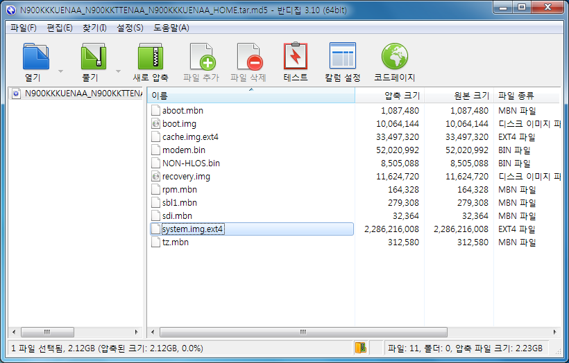
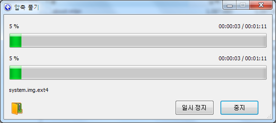
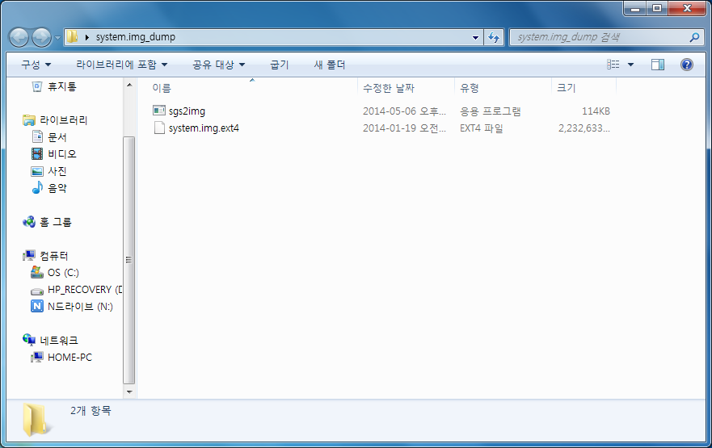
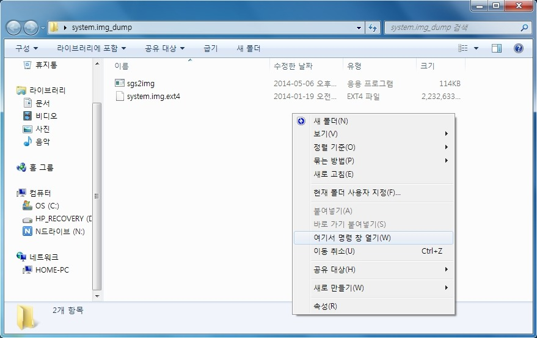
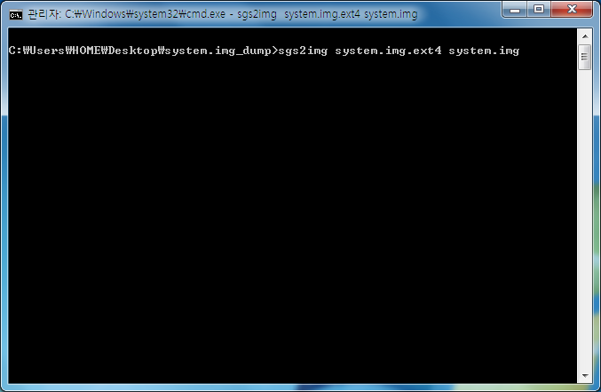
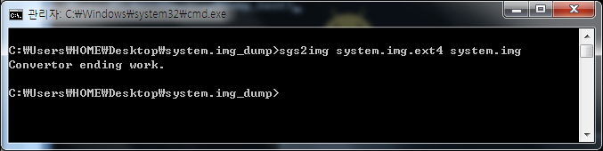
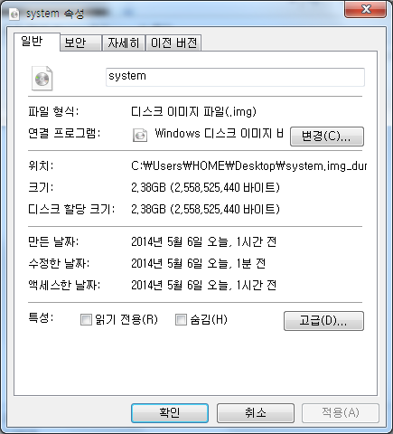
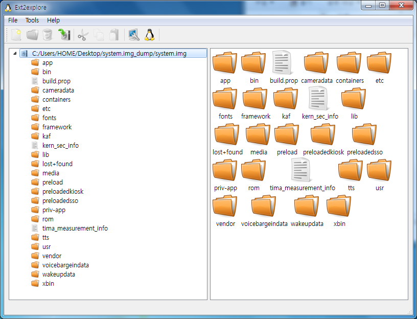
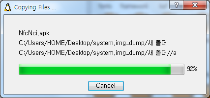

삼성 펌웨어의 경우 펌웨어를 tar파일로 뽑아낼수 있습니다

이 tar 압축파일 안에는 system.img.ext4이라는 파일이 존재합니다

이것이 system dump파일인대요

아쉽지만 이 상태로는 우리가 추출하고자 하는 dump파일을 뽑아낼수 없습니다

그래서 저걸 img로 변환한다음 추출해야 합니다

이번에는 system.img.ext4을 분해해서 System 덤프를 뽑아내보도록 하겠습니다

[필요한 프로그램]

[sgs2img.exe

다운로드](./file/sgs2img.exe)

[ext2explore v2.2.71.zip

다운로드](./file/ext2explore v2.2.71.zip)

---

**1. system.img.ext4을 Img확장자로 변환하자**

먼저 펌웨어 파일에서 system.img.ext4을 압축해제 해야 합니다

알집 또는 반디집 같은 프로그램으로 tar펌웨어에서 system.img.ext4을 압축해제 해주세요

용량이 큰 파일이므로 압축해제 하는대 시간이 많이 소요될 수 있습니다

압축 해제가 모두 되셨다면 압축푼 system.img.ext4와 다운받은 sgs2img파일을 한 폴더에 몰아 넣어 주세요

폴더의 이름은 system.img\_dump로 지정하였습니다

폴더 안에서 쉬프트키(Shift)를 누른후 마우스 오른쪽을 클릭하시면 여기서 명령 창 열기(W)가 나타납니다

클릭해 주세요

"여기서 명령 창 열기"말고 cmd(명령 프롬포트)를 연다음 만드신 폴더로 이동할수도 있습니다

그러면 검은색 화면이 나타납니다

아래 명령어를 입력해 주세요

sgs2img system.img.ext4 system.img

이때 system.img라는 이름은 변환된 파일의 이름이며, 마음대로 하셔도 좋습니다

용량이 크므로 작업하는대도 시간이 많이 소요됩니다

제경우 노트3 펌웨어를 작업하는대 약 1시간 정도 걸린듯 합니다

작업이 끝나면 Convertor ending work.이라는 문구가 나타납니다

만들어진 img파일은 아래 사진을 보시면 원본 system.img.ext4파일보다 용량이 조금 큰걸로 확인할 수 있습니다

이제 ext2explore.exe를 실행해 주세요

무설치 프로그램 입니다

그다음 File - Open Image를 선택해주신다음 system.img를 열어주세요

이제 Tools - Save를 눌러 파일을 추출해 주시면 됩니다

추출을 완료하면 System Dump를 얻을수 있습니다~

---

## 첨부파일

- [sgs2img.exe](https://github.com/itmir913/archive/releases/download/itmir-attachments/sgs2img.exe) `114 KB`
