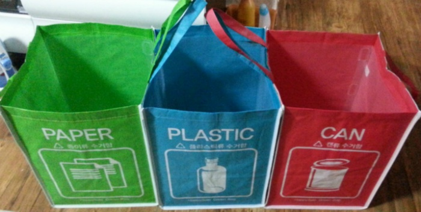

어제는 5/8일 어버이날 이었어요~

제 블로그 방문하신 분들 모두 어버이날 잘 보내셨나요?

저같은 경우는 저희 집에 분리수거 함이 없어서 플라스틱 박스에 분리수거를 하거든요.

그래서 정식(?) 분리수거 함 사려고 했는데 주변에 안팔길래 질렀습니다. ㅋㅋ

공인인증서 발급받은걸로 Gmarket에서 질렀어요. ㅋㅋ

관련글 : [[Note] - 공인 인증서를 발급받았어요~](http://whdghks913.tistory.com/492)

조립해놓고 보니 좋네요. ㅎㅎ

그다음에 얼마 안하지만 카네이션도 하나 샀습니다

"사랑합니다. 고맙습니다."

저번 달 세월호 참사를 보고 가족에게 더 잘해야 겠다는 생각이 들긴 하는데 자구 행동이랑 마음이 다르네요..

이제부터는 언행일치 사람이 되어야겠어요.
