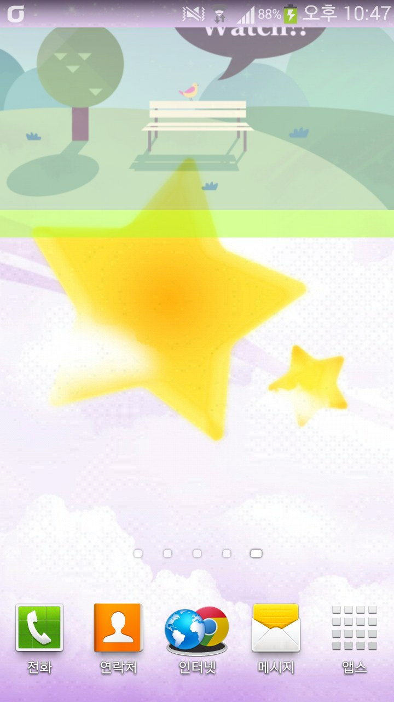
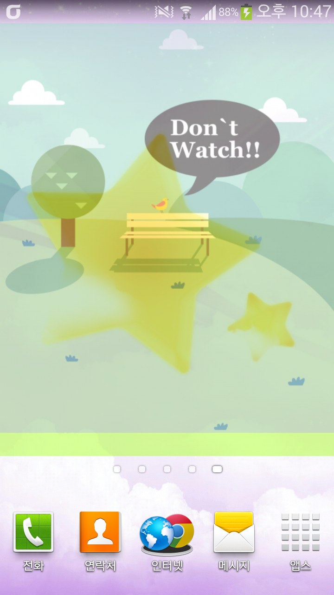
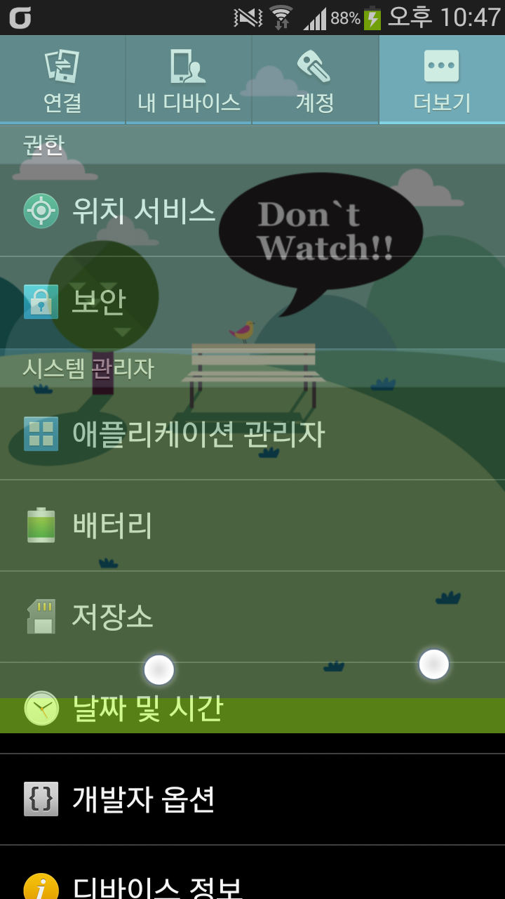

베가 시크릿 업의 시크릿 블라인드 기능을 S3에서 해봤습니다  
  
오늘 한 2시간? 정도 뻘짓해서 만든 어플입니다 ㅋㅋ  
  
베시업처럼 두손가락으로 스와이프해야 움직입니다  
터치 하나로는 안되요~ 무조건 2개일때만 작동합니다

스와이프 해서 내리거나 올릴수 있어요  
사진은 베가 시크릿 업에 있는 블라인드 사진을 빼와서 적용해 봤어요

딴 어플에서도 유지되요 ㅎㅎ  
심지어 상단바에서도..ㅋㅋㅋㅋ

일단 급조한 어플이라 퀼리티가 떨어집니다  
투명값을 못바꾼다던지 사진을 못바꾼다던지..  
  
  
일단 내일부터는 컴킬 기회가 없을듯 하고 주말쯤 손봐야 할거 같은대요  
  
그런대 이게 이미 팬택에서 만든 기능인대 이걸 제가 도움없이 만들었습니다  
저 어플 완성해서 마켓에 올려도 될까요?;  
이미 존재하는 기능이라 저작권에 걸릴거 같은대.. 소스가 다르니 상관은 없을지도..  
물론 업로드한다면 앱 이름은 바꿔야 겠지요 ㅎㅎ;;  
  
  
아무튼 편리하네요 ㅎㅎ  
  
  
ps. 저 마지막 질문 이 어플을 만들어서 마켓에 올려도 문제 없을까요? 에 대한 답변이 시급합니다...
