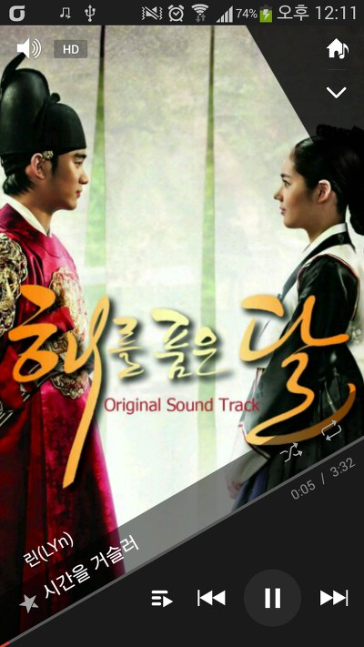
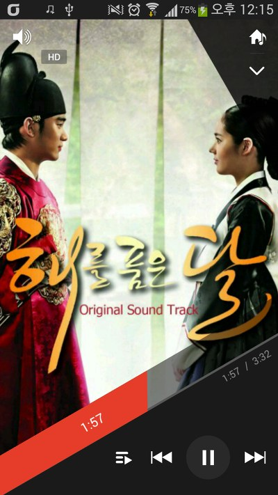
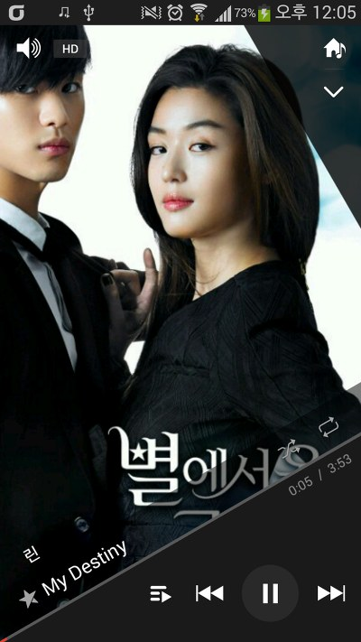
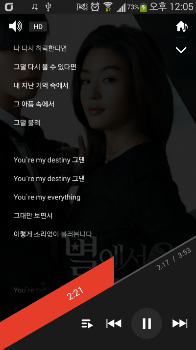

이번에 새로 출시된 베가 아이언2 다들 보셨나요?

맨 처음에 봤을때는 갤투 + 베가 아이언의 테두리 같아서 디자인 망했다...ㅠㅠ 이런 생각 했지만..

이거 어플 UI같은거 보니 진짜 와......

이번 MusicPlayer의 UI도 끝내줍니다

와 진짜 누가 이런 디자인을 했는지 정말 ~~~

   

   

독특한 UI와 저 처음보는 음악 재생바까지....

대박이네요 이번 UI는 ㅋㅋ

아 진짜 사고싶다....

이 플레이어는 루팅 없이도 대부분의 폰에서 되는것 같으니 한번 설치해 보세요~

참고로.. 원래는 음악 재생바를 터치하면 강제종료 되는게 정상입니다

이유는 음.. 베가만의 SDK같아요

java.lang.NoSuchFieldError: android.view.WindowManager$LayoutParams.oemFlags

이런 오류가 발생하는대 oemFlags가 뭔지... http://developer.android.com/에도 없고 네이버에도 없고...

아무튼 강제종료를 해결한 버전도 첨부합니다

[Download] - 2014-05-18 PM 7:34

[2014-05-18 PM 7-34 VEGAMusicPlayer.apk](https://github.com/itmir913/archive/releases/download/itmir-attachments/2014-05-18-PM-7-34-VEGAMusicPlayer.apk)

지원하지 않는 테마입니다 라는 토스트 알림 제거

[Download]

[oemFlags 수정 VEGAMusicPlayer.apk](https://github.com/itmir913/archive/releases/download/itmir-attachments/497-oemFlags-VEGAMusicPlayer.apk)

[VEGAMusicPlayer.apk](https://github.com/itmir913/archive/releases/download/itmir-attachments/497-VEGAMusicPlayer.apk)

갤럭시 S3에서 작동한 결과는 일단 "지원하지 않는 테마입니다" 라는 문구가 뜨고

폴더 재생 기능이 작동 안되네요;

폴더 재생이 없습니다

그럼 이만~

---

## 첨부파일

- [2014-05-18 PM 7-34 VEGAMusicPlayer.apk](https://github.com/itmir913/archive/releases/download/itmir-attachments/2014-05-18-PM-7-34-VEGAMusicPlayer.apk) `4.2 MB`
- [oemFlags 수정 VEGAMusicPlayer.apk](https://github.com/itmir913/archive/releases/download/itmir-attachments/497-oemFlags-VEGAMusicPlayer.apk) `4.2 MB`

- [VEGAMusicPlayer.apk](https://github.com/itmir913/archive/releases/download/itmir-attachments/497-VEGAMusicPlayer.apk) `4.2 MB`
