안녕하세요~ 어제 이시간쯤 베가 아이언2 키보드를 가지고 염장을 쿡 했는대요 ㅋㅋ

오늘 조금더 다듬어서 키보드 배포하려고 합니다~

베가 아이언2 키보드 정말 좋습니다

지금까지 제가 만진 키보드중 최고네요~~

베가 아이언2 키보드는 기본적으로 베가 시크릿 업의 킷캣 키보드와 비슷합니다

[[Application] - [KitKat] Vega Secret UP (베가 시크릿 업) 키보드 킷캣 업데이트](/archive/itmir/2014/493)

[[Application] - [APP] Vega Secret UP (베가 시크릿 업) 키보드](/archive/itmir/2014/425)

[[Application] - Vega Secret UP 키보드 오류 수정 완료](/archive/itmir/2014/426)

이 키보드에서 몇가지 테마가.. 아니 엄청난 테마가 추가되서 나온것이 철2 키보드 입니다

먼저 키보드 설정 화면 입니다

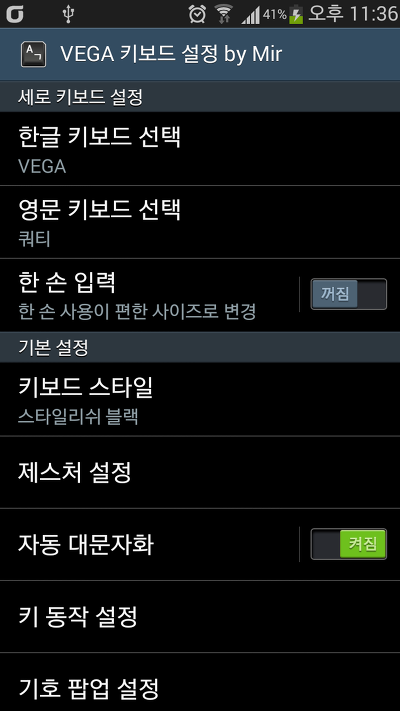
    
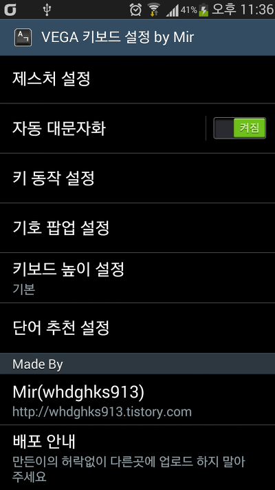

아래에다 블로그 주소를 박았어요

어디서 제 자료를 자신이 배포를 허락하네 마네 이러시고 계시길래... 어쩔수 없이 기록했습니다

이해부탁드립니다...

키보드 스타일에 들어가면 아래 화면이 나타납니다

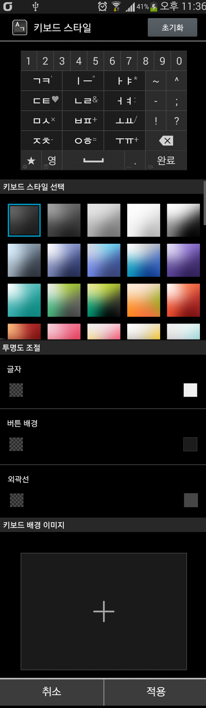

여기서 작동하지 않는 기능이 있는대 투명도 조절부분이 안됩니다

테마 설정과, 키보드 배경 이미지만 작동할수 있습니다

(그 이유는 오류 해결할때 기능 정지(?)됬나봐요..)

잠시 키보드 종류를 확인해 보겠습니다

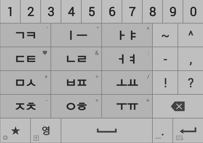
   
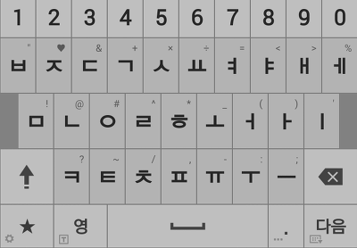

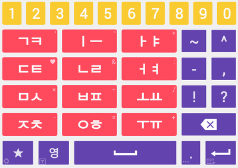
   
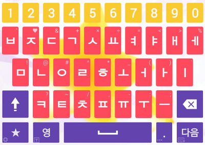

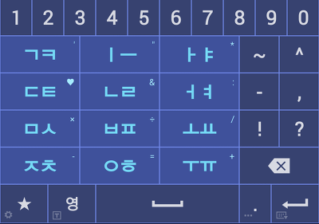
   
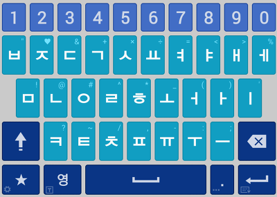

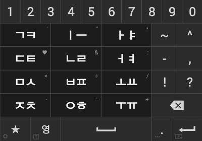
   
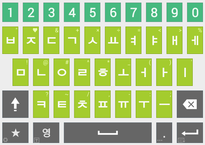

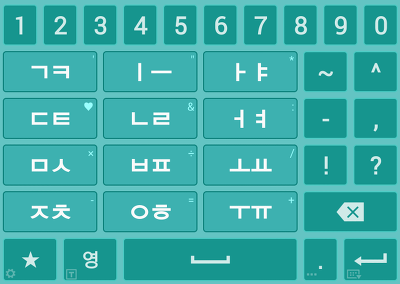

몇개만 골라서 사진 뽑아봤습니다 ㅎㅎ

이외 20개 정도의 테마가 준비되어 있습니다 ㅋㅋㅋ

또한가지, 베가 시크릿 업 키보드와 다른 한가지는 특수문자, 이모티콘 입력 부분에 스페이스 바가 생겼습니다

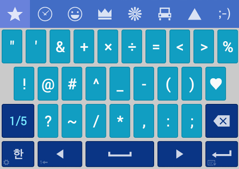

이렇게 스페이스 바가 생긴 모습을 볼수 있습니다

가장 중요한(?) 다운로드..!

[DownLoad]

-2014-05-20

파일 다운로드 링크 제거

**[apk가 업데이트 되었습니다 : /archive/itmir/2014/499](/archive/itmir/2014/499)**

**위 파일을 다운로드 할경우, 다른 제 3곳에 허락없이 무단으로 업로드 하는 행위를 하지 않겠다라는 것에 동의하시게 됩니다**

힘들게 만들었는대 그냥 파일만 쏙 빼가시는거 보기 심히 안좋습니다

일반 어플 설치하는것 처럼 설치하시면 됩니다 만 Vega기종의 경우 패키지명 충돌로 인해 루팅후 기존 SkyIme (또는 VegaIme)를 삭제하셔야 합니다

개발자용 노트는 지금 적고싶으나 밤이 너무 늦었으므로... 추후 적겠습니다

어제 제가 이 글에 해결법 적어드린다고 덧글로 알려드렸는대 못알려드려서 그렇네요...;

파일 비교 툴으로 한번 확인해 보시길...

개발자용 노트는 추후 시간이 지난후에 추가됩니다

그리고, 위 게시글의 apk파일을 사용해도 되나요? 라는 질문이 혹시 있을수 있어 메모 남겨둡니다..

파일을 가져가지 마시고 꼭 링크로만 첨부해 주세요 apk를 따로 첨부하지 말아 주세요...

(나중에 업데이트시 이글만 수정하면 되므로 정말 편합니다)