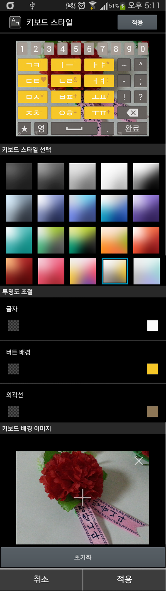
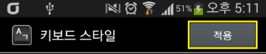
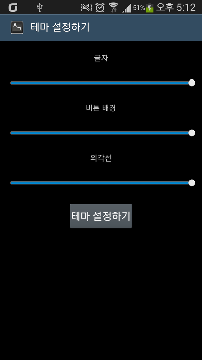
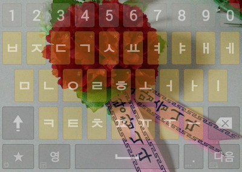
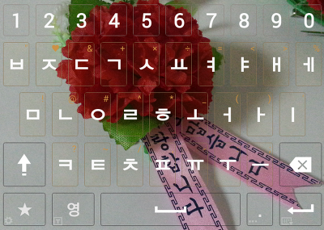
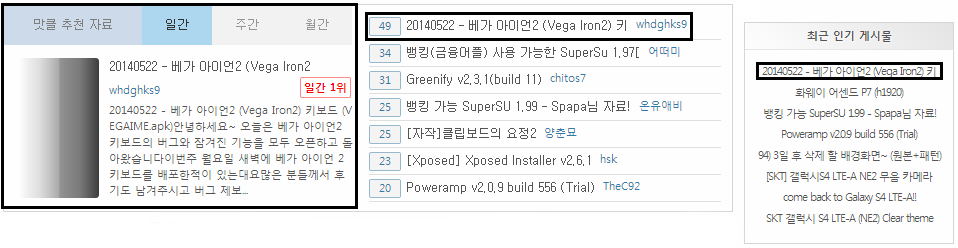
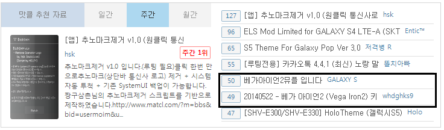
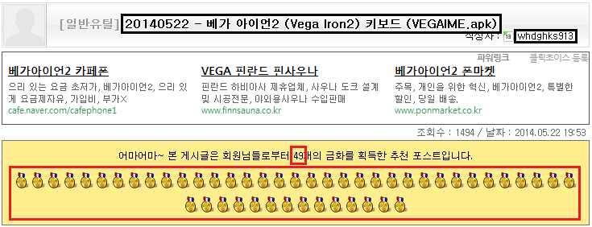

안녕하세요~ 오늘은 베가 아이언2 키보드의 버그와 잠겨진 기능을 모두 오픈하고 돌아왔습니다

이번주 월요일 새벽에 베가 아이언 2 키보드를 배포한적이 있는대요

많은 분들께서 후기도 남겨주시고 버그 제보도 해주셔서 오류를 잡는대 수월했습니다

먼저 오류 해결을 위해 늦은 시간까지 로그켓을 뽑아주시고 갑작스럽지만 어플 테스트를 허락해 주신 분들께 감사드립니다~

강제종료 오류를 잡고 기능을 활성화 하기 위해 몇일동안 오류를 수정한 끝에

**"베가 아이언2 키보드의 모든 기능을 활성화 했습니다" (진동/소리 제외, 이건 나중에 해볼께요 ㅎㅎ)**

이번 버전에서 수정된 점은 아래와 같습니다

1. 키보드 설정이 투명 배경이 되거나, 작은 팝업처럼 나오거나 하는 문제 해결

2. hdpi기기 또는 해상도가 맞지 않는 기기에서 키보드 스타일을 적용할수 없는 문제 해결 (초기화 버튼을 아래로 내리고 적용 버튼을 올렸습니다)

3. 글자, 버튼 배경, 외각선의 투명도를 설정할수 없는 오류 해결

4. 생략

위 점을 제외하고는 기존 버전과 동일합니다

[[SmartPhone] - [APK] 베가 아이언2 (Vega Iron2) 키보드 (VEGAIME.apk)](http://itmir.tistory.com/498)

그럼 이번 버전에서 수정한 부분의 스크린샷을 확인해 보겟습니다

외관상으로는 별 달라진 점이 없는것 같지만 자세히 보시면 적용 버튼이 위에 있는것을 알수 있습니다

보시면 기존 초기화 버튼이 있던 자리가 적용 버튼으로 변경되었습니다

넥서스s등 hdpi기기에서 테마를 설정하고 적용할수 없었던 문제를 해결하기 위해 자리를 바꿨습니다

초기화 버튼은 키보드 배경 이미지 밑에 추가했습니다 (hdpi등에서는 초기화 버튼부터 안보일수 있습니다)

참고로 아래에 있는 취소/적용 에서 "적용 버튼은 작동하지 않습니다"

그다음에 투명도를 조절할수 있는 기능이 생겼습니다

위에 있는 키보드 스타일 설정에 넣었으면 더 좋겠지만 팬택이 SeekBar를 커스텀 하면서 이상하게 꼬여버린거 같아요

그래서 제가 직접 액티비티를 만들었습니다

글자, 버튼 배경, 외각선의 투명도를 설정할수 있으며, 움직이는 동시에 적용이 됩니다

참고로 런처에 하나의 아이콘이 또 생길겁니다

런처에서 키보드 모양 아이콘이 있는 "테마 설정하기"를 눌러 진입 가능합니다

진짜로 작동되는지 확인해 볼께요

   

프로그래스바를 움직이고 키보드를 열면 위 화면처럼 알파 값이 변경되면서 투명도가 바뀝니다

가장 중요한(?) 다운로드..!

[DownLoad]

-2014-05-22

[20140522-VEGAIME.apk

다운로드](./file/20140522-VEGAIME.apk)

[20140522-VEGAIME for VEGA.apk

다운로드](./file/20140522-VEGAIME for VEGA.apk)

Vega기종은 for Vega를 받아주세요

**위 파일을 다운로드 할경우, 다른 제 3곳에 허락없이 무단으로 업로드 하는 행위를 하지 않겠다라는 것에 동의하시게 됩니다**

힘들게 만들었는대 그냥 파일만 쏙 빼가시는거 보기 심히 안좋습니다

일반 어플 설치하는것 처럼 설치하시면 됩니다 만 Vega기종의 경우 패키지명 충돌로 인해 루팅후 기존 SkyIme (또는 VegaIme)를 삭제하셔야 합니다

[Download for Not Root]

-2014-05-25

[20140525-VEGAIME for Not Root.apk

다운로드](./file/20140525-VEGAIME for Not Root.apk)

[20140525-VEGAIME for VEGA Not Root.apk

다운로드](./file/20140525-VEGAIME for VEGA Not Root.apk)

이제 더이상의 업데이트는 없을것 같습니다

이 버전을 설치하시고도 테마 스타일 변경에서 강제종료가 일어난다면... 그건 어쩔수가........;

3일동안 매일 새벽 1시까지 작업한 어플입니다

다운받으시고 덧글 하나 부탁드립니다~

본문에 나와있는 질문은 무시합니다

그리고 몇몇분들께 테스트 부탁드렸던 어플을 요청하시는 분들이 계셨는대

앞으로는 안그려셨으면 좋겠습니다

테스트 결과 강제종료가 안 일어난다고 모든 오류가 없어지는건 아니거든요

앞으로 자제 부탁드립니다...

테스트 어플을 받으신 분들은 logcat을 뽑아 제게 보내드릴수 있어야 하는대 로그켓이 무엇인지 모르시는 상태에서 보내드리면 또 같은 오류 발생시 제가 알 방법이 없어서 안보내 드리는 겁니다

오해는 말아주세요

맛클 일간 추천자료에 올라왔습니다~~

주간 자료에는 제가 만든 베가 아이언2 뮤직 플레이어 까지 올라왔네요 ㅎㅎ

---

## 첨부파일

- [20140522-VEGAIME for VEGA.apk](https://github.com/itmir913/archive/releases/download/itmir-attachments/20140522-VEGAIME-for-VEGA.apk) `4.9 MB`
- [20140522-VEGAIME.apk](https://github.com/itmir913/archive/releases/download/itmir-attachments/20140522-VEGAIME.apk) `4.9 MB`
- [20140525-VEGAIME for Not Root.apk](https://github.com/itmir913/archive/releases/download/itmir-attachments/20140525-VEGAIME-for-Not-Root.apk) `4.9 MB`
- [20140525-VEGAIME for VEGA Not Root.apk](https://github.com/itmir913/archive/releases/download/itmir-attachments/20140525-VEGAIME-for-VEGA-Not-Root.apk) `4.9 MB`
