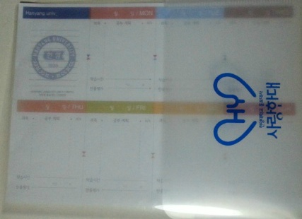
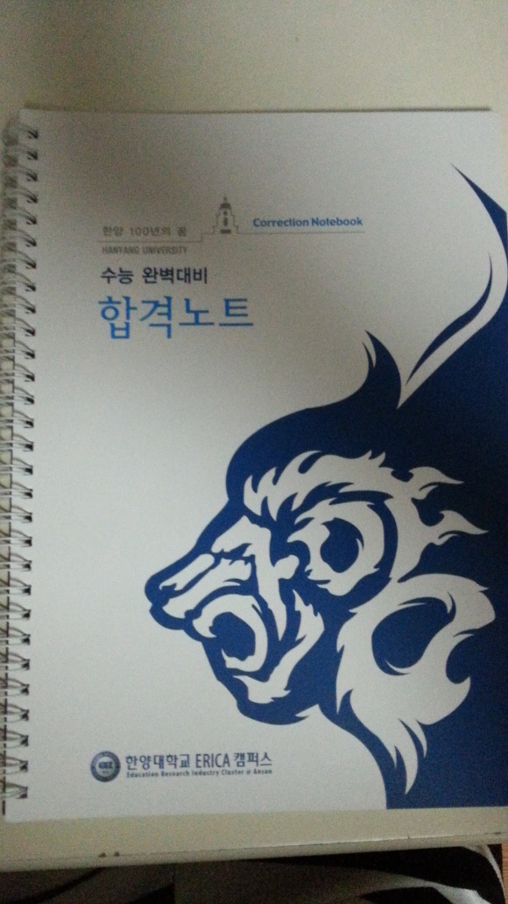
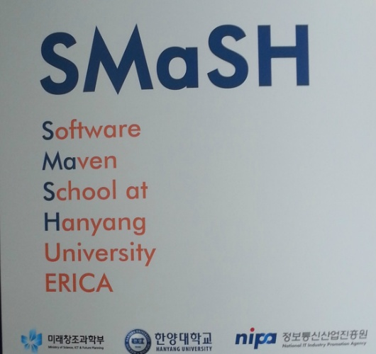
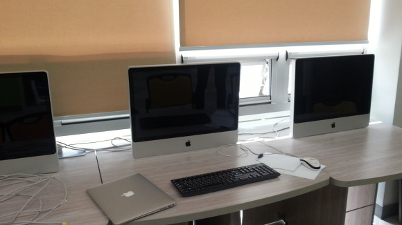
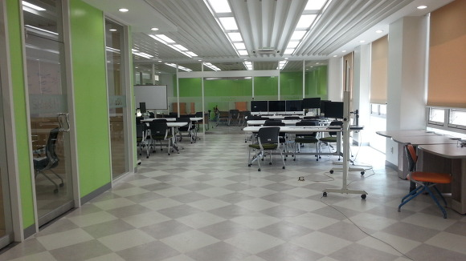
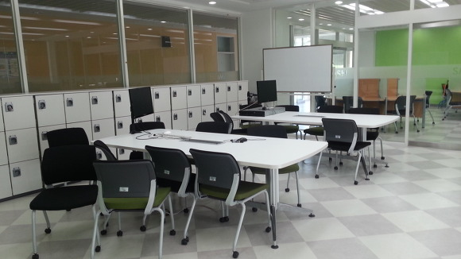
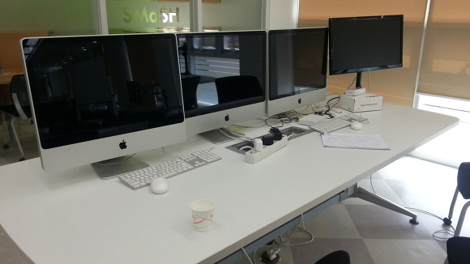

오늘 동아리 활동으로 한양 대학교 에리카 캠퍼스로 대학 탐방을 했습니다

처음에 프리젠 테이션 시간에 퀴즈 맞춰서 주간 일정을 짤수있는 종이 받았어요

그 문제가 컴퓨터 공학 팀? 사업?

SMaSH가 되면 주어지는 두가지 장점인대 ㅋㅋ

그리고 프리젠테이션 하는 장소에 있었던 합격노트

앞부분에는 한양대학교 지원에 대해 있었고 뒤는 오답노트입니다

점심이후에 1시부터 컴퓨터 프로그래밍과(?)의 교수님과 동아리 맴버가 모여서 한 한시간? 그정도 질문 답변했어요

SMaSH 라는 것이 한양대학교에만 있다는대

컴퓨터 학과를 2학년 과정에 졸업하면 우수 학생 30명을 선발해서

**"개인 노트북 (맥북) 제공, SMaSH실 언제든지 이용,**

**졸업할때까지 등록금의 절반 지원, 해외 대학 방문 교육"**

와.. 해택 좋네요 ㅎㅎ

교수님의 배려로 직접 SMaSH 30명이 이용 가능한 SMaSH실에 가봤어요

맥북부터..............와

사진에는 아무도 없지만 왼쪽이랑 오른쪽에 대학생 형들 있습니다

저 맥북 부럽네요 ㅠㅠ

그리고 ㅋㅋ 저기 SMaSH실에서 이클립스로 졸업 작품 만들고 있는 대학생 형 봤어요 ㅋㅋ

아 맥에서 돌리는 이클립스 부럽네요

이렇게 대학 탐방 후기를 마치겠습니다
