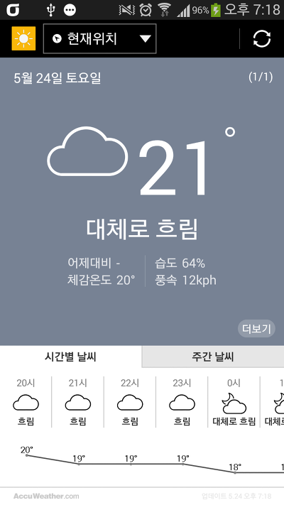
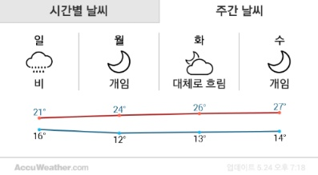
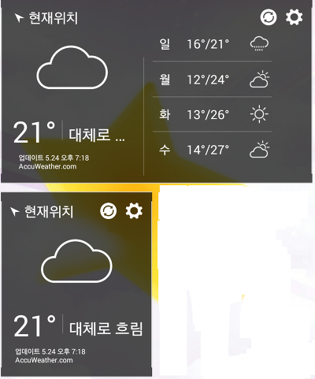

안녕하세요

오늘은 베가 아이언2의 날씨 어플을 들고 왔습니다

스샷을 먼저 보겠습니다

시간별 날씨는 좌우로 스크롤 가능합니다

주간 날씨는 스크롤 안되네요..

위젯 3개중에 2개는 잘 되는걸로 확인되고

하나는 투명한 배경 위젯인대 짤리는걸로 보입니다

[DownLoad]

-2014-05-25

[20140525-Weather.apk](https://github.com/itmir913/archive/releases/download/itmir-attachments/20140525-Weather.apk)

이 파일을 받는 동시에 다른곳에 배포하지 않겠다는 것에 동의하게 됩니다

사실 아무런 표시가 없어도 모든 자료는 무단 배포 / 무단으로 apk를 업로드하는것이 안됩니다

그정도는 모두 아실것 같아 따로 메모를 남기지는 않겠습니다 ㅎ

강제종료 버그가 일단 S3에서는 안일어 나고 현재 위치까지 모두 잘 동작했습니다

다른 기기에서 강제종료 된다고 해도 당분간 고칠수는 없고

**~기기에서 강제종료 됬어요 라는 덧글에는 사실 답글을 달아드릴수 없습니다**

**강제종료시 로그켓을 주셔야만 버그를 잡을수 있으므로 로그켓과 함게 제보 부탁드립니다**

패키지 이름을 변경하지 않았습니다 (귀찮...;;)

베가 기종은 일반 설치에 불이익이 있을수 있습니다

루팅해서 투척하면 될지도 모르겠습니다 고수분들의 덧글을 기다립니다~~

감사합니다~

---

## 첨부파일

- [20140525-Weather.apk](https://github.com/itmir913/archive/releases/download/itmir-attachments/20140525-Weather.apk) `2.5 MB`
