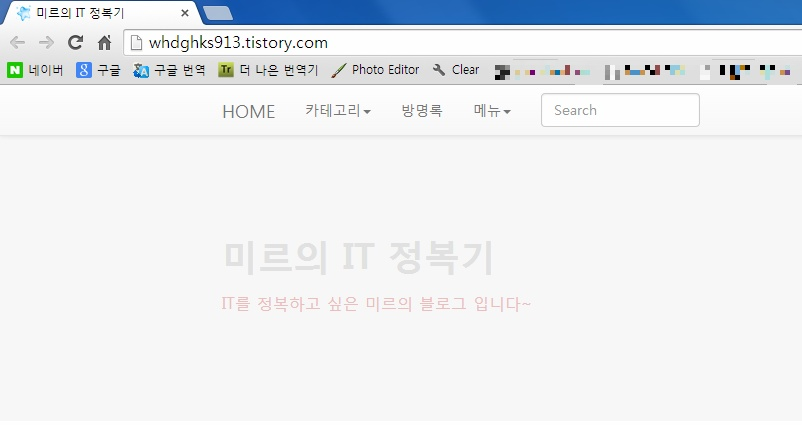
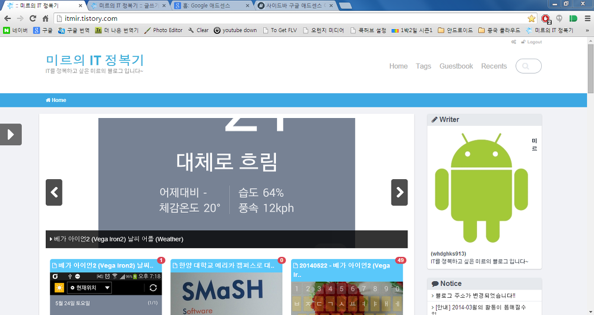
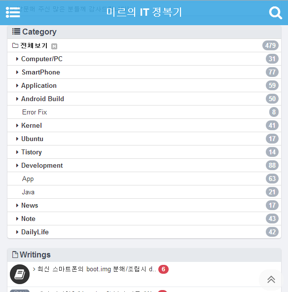
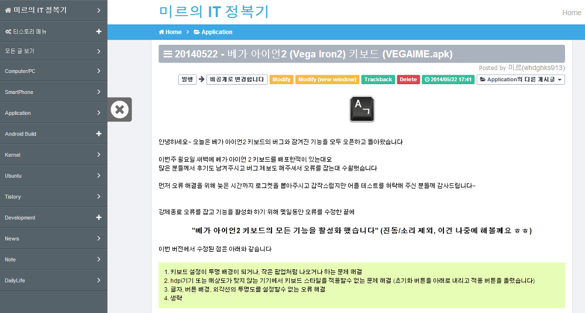

안녕하세요~~ 다름이 아니라 제 블로그 주소가 변경되어 안내말씀 드립니다!!

기존 제 블로그 주소가 외우기 어렵고, 제 ID로 이루어져 있어 블로그 제목과도 어울리지 않는 부분이 많았습니다.

<http://whdghks913.tistory.com> 이라는 주소에서 <http://itmir.tistory.com> 으로 변경되었습니다~~

주소는 IT + Mir로 구성되어 있습니다.

Mir보다 IT가 먼저 태어났고(?) 역사가 깊습니다.

저는 지금 고1밖에 안됬어요 ㅎㅎ..

그래서 IT가 먼저고 Mir가 나중입니다~

기존 whdghks913.tistory.com 주소로 접속하셔도 자동으로 itmir.tistory.com으로 접속됩니다~~

깔끔하고, 심플하고, 모든 화면에서 잘보이는 스킨으로 변경하여 정말 좋습니다. ㅎㅎ

오늘 동아리 시간에 (글 수정 : 2014-06-13) 스킨만 뜯었네요;

집에 와서 3시간 넘게 작업한 결과물입니다. ㅎㅎ

전에 쓰던 스킨은 PC보기에서 음...이상했는대요 막 깨지고 사진 이상하고 난리가 아니었습니다.

이 스킨은 fastboot라는 스킨인데요. 모바일에서도 잘 표시됩니다. ㅎㅎ

화면 왼쪽에 있는 화살표를 누르시면 이렇게 옆으로 메뉴가 나타납니다.

정말 이번 스킨 마음에 드네요. ㅎㅎ

이 스킨에 관심 있으신 분들은 <http://blog.readiz.com/> 방문해 주세요.

항상 제 블로그 방문해 주셔서 감사합니다!!

+2014-06-14

06/14일부터 애드센스 광고가 추가되었습니다. ㅎㅎ

사이드바에 하나, 본문 위 두 개 총 3개입니다~
