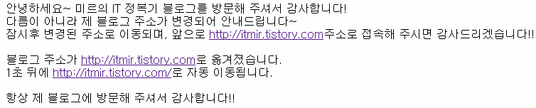
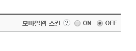

안녕하세요~

오늘은 티스토리 주소를 이전하고, 전에 쓰던 주소를 새로운 주소로 연결하는 방법을 알아보겠습니다.

제 블로그 주소가 <http://whdghks913.tistory.com/> 에서 <http://itmir.tistory.com/> 으로 변경되었습니다.

많은 분들이 말씀하시기를.. 주소를 변경하는건 많은 유입을 포기하는거라고 하시더라고요.

왜냐하면 기존 주소로 접속하면 없는 블로그라 나오기 때문입니다.

그래서 검색한 결과, 정말 좋은 방법을 찾아서 소개합니다!!

지금 소개하는 방법은 뒷부분 주소까지 함께 이동시키는 스크립트 입니다.

예를들어, 알려진 대부분의 방법은 <http://whdghks913.tistory.com/123> 으로 접속하면 그냥 <http://itmir.tistory.com> 으로 접속되는데요.

이 방법은 뒷부분인 123까지 함께 이동되어 </archive/itmir/2013/123> 으로 이동됩니다.

이 방법은 <http://blog.gyongsu.com/194> 에서 소개된 방법입니다. 좋은정보 공유해주신 Dr.lee님께 감사드립니다.

## 1. 준비 작업

일단 기존 티스토리 주소를 가지고 있는 블로그와 주소가 변경된 블로그 총 2개를 모두 가지고 있어야 합니다.

기존 주소를 A라고 하고 바꿀 주소를 B라고 하겠습니다.

1. A 주소의 블로그의 주소를 B로 바꿔주세요.

2. 빨리 A 주소로 블로그를 하나 만들어 주세요.

2번까지 하시면 기존 블로그의 주소는 B이고 A주소로 접속하면 새로 만든 블로그로 접속될겁니다.

## 2. html수정

새로만든 A 블로그의 관리자 권한으로 진입하신후 html을 수정해 줍시다.

기존의 html을 싹 지우고 모두 아래 코드로 바꿔주세요.

```
<html>
<head>
<script type="text/javascript">
    pathArray = window.location.pathname.split( '/' );
    document.write("<meta http-equiv=\"Refresh\" content=\"1\;url=http:\/\/변경된주소\/", pathArray[1], "\">");
</script>
<title>블로그 주소가 변경되었습니다.</title>
</head>
<body>
블로그 주소가 <a href="http://변경된주소">http://변경된주소</a>로 옮겨졌습니다.</br>
1초 뒤에 <script type="text/javascript">
pathArray = window.location.pathname.split( '/' );
document.write("<a href=\"http:\/\/변경된주소\/", pathArray[1], "\">http:\/\/변경된주소\/", pathArray[1], "<\/a>");
</script>로 자동 이동됩니다.</br>
</body>
</html>
```

[블로그주소이동.txt](./file/블로그주소이동.txt)

이때 "변경된 주소" 부분을 바꾼 주소인 B로 바꿔주세요.

http://는 제외하고 입력하셔야 합니다.

작동 테스트는 제 기존 블로그 주소인 <http://whdghks913.tistory.com/> 에 접속해 주시면 됩니다.



또한 블로그의 모바일 웹 스킨을 OFF로 해주셔야 합니다.

OFF하지 않으시면 모바일에서 접속시 자동 이동되지 않습니다.



감사합니다~~

---

## 첨부파일

- [블로그주소이동.txt](./files/블로그주소이동.txt)