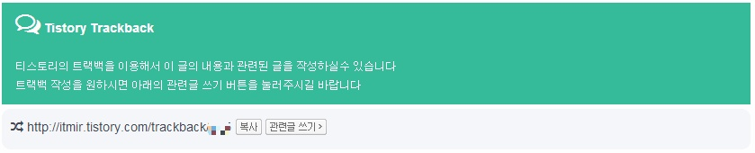
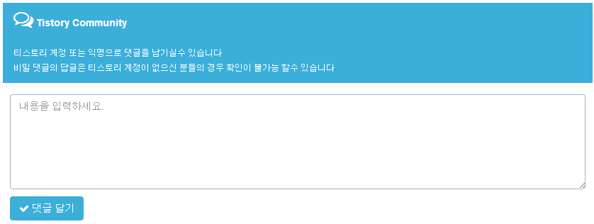
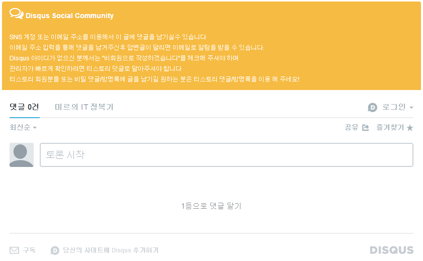

디스커스(Disqus)란 요즘 티스토리 댓글 시스탬에서 벗어나고 싶은 블로거분들이 자주 쓰는 댓글 서비스입니다.

네이버와 티스토리의 차이점 중 티스토리의 최악 단점이 바로 댓글 작성자가 자신의 댓글에 달린 답글을 바로 확인할 수 없다는 점인데요.

이런 문제로 일부 블로거분들은 디스커스를 사용하고 있습니다.

검색으로 알아본 이 서비스의 장점은 이메일만 입력하면, 댓글의 답글이 달릴 때 이메일로 알려준다고 합니다. ㅎㅎ

그래서 어제 저녁과 오늘 작업결과 제 블로그에도 디스커스를 달았습니다. ㅎㅎ

> 디스커스 달고싶으신 분들은 잘 설명된 사이트 하나 소개해 드립니다.
>
> http://hackya.com/ko/disqus-api-사용하는-방법/
>
> 나중에 저도 제가 구현한 방법 (버튼을 눌러서 표시/숨기기 기능)을 정리해서 올리겠습니다.

본문의 마지막을 보시면 Disqus Social Community 버튼이 생긴걸 확인할수 있습니다.

디스커스 넣는김에 트랙백이랑 티스토리 덧글의 디자인도 조금 추가했어요. ㅎㅎ

먼저 트랙백입니다.

그다음은 티스토리 댓글 입력란의 디자인입니다. ㅎㅎ

마지막으로 디스커스의 디자인입니다. ㅎㅎ

일관성 있게 파랑으로 하려고 했으나 그냥 버튼색이랑 맞췄어요. ㅋㅋ

아.. 디스커스 댓글을 누르면 나타나고, 또다시 누르면 사라지게 하는거 구현하느라 시간을 다잡아먹었네요.. ;;

> 참고로 저 설명 디자인은 http://onasaju.tistory.com/ 님의 블로그에서 얻었습니다.

지금 생각했을때 디스커스의 단점은 제가 확인을 못할 수 있겠네요..;

디스커스로 덧글 다시는 분들~ 티스토리 덧글로도 다시 써주시면 감사드리겠습니다. (이러면 왜 달았죠?ㅋㅋㅋ)

+추가 의견.

딱히 디스커스를 유지할 필요성을 느끼지 못해서 결국 티스토리 블로그에서 디스커스를 제거했네요...!
