애드센스를 사용하고 있는 블로거라면 가장 불안한 부분이 바로 부정/무효클릭으로 인한 계정 정지일 겁니다.

애드센스 부정/무효클릭에 걸려서 계정이 비활성화 된다면 지금까지 얻은 모든 수익이 압수된다고 합니다.

만약, 지금 애드센스의 최소 출금 금액인 $100이 있는데 계정 비활성화를 당하면, 100달러가 사라지게 되는거죠...

그래서 언제 계정이 비활성화 될지 모르기 때문에 100달러가 되면 바로 찾는 것이 좋습니다.

애초에 받을 돈은 바로 받는 게 좋아요.

애드센스 광고의 부정클릭은 본인이 할 수도, 다른사람이 할 수도 있습니다.

내가 하는 부정클릭은 고의로 하는 경우가 아니라 실수일 때가 많습니다.

또한 광고 차단을 위해 url을 얻을때 클릭할수도 있는데요. 이 것도 부정클릭이라서 구글이 하지 말라고 합니다.

광고 url을 얻기 위한 클릭도 금지라서요.

이런 실수를 줄여주기 위한 프로그램이 있습니다.

크롬 브라우저에서만 사용이 가능한 확장 프로그램인 Google Publisher Toolbar가 바로 그러합니다.

Chrome 웹 스토어에 접속해서 Google Publisher Toolbar를 다운로드 받아야 합니다.

직접 링크로 접속할수도 있고 검색해서 찾을수도 있습니다.

**[바로가기](https://chrome.google.com/webstore/detail/google-publisher-toolbar/omioeahgfecgfpfldejlnideemfidnkc)**

또는 설정 - 확장프로그램에 들어가 주세요.

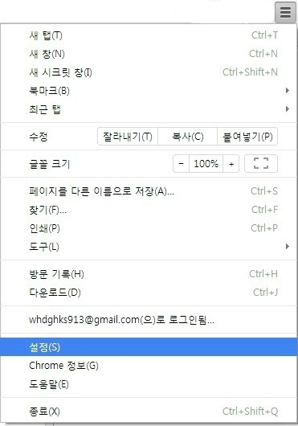

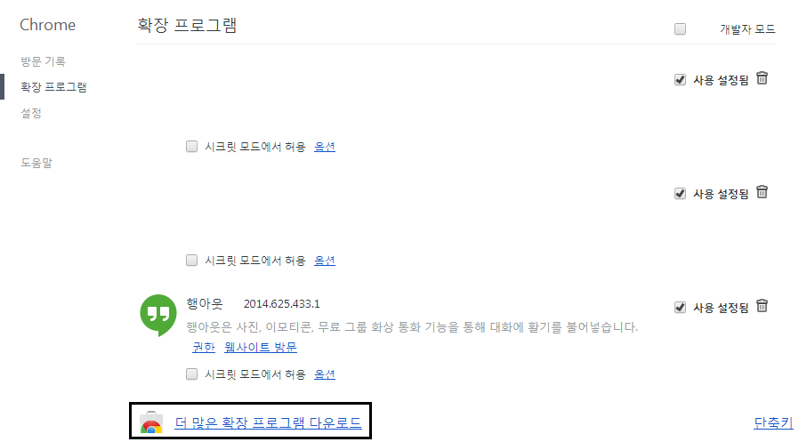

여기서 "더 많은 확장 프로그램 다운로드" 를 눌러주세요.

크롬 웹 스토어에 Google Publisher Toolbar를 검색해 주세요.

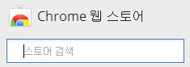

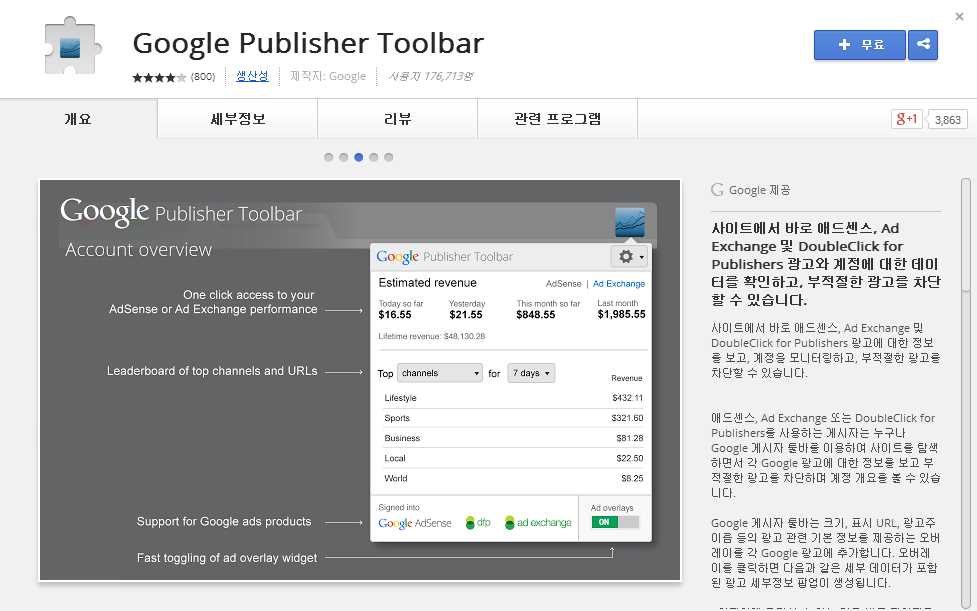

그다음 오른쪽 위에 있는 "+추가" 버튼을 눌러주시면 됩니다.

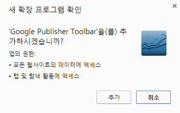

추가!

하시게 되면 크롬 오른쪽 위에 새로운 아이콘이 하나 생깁니다.

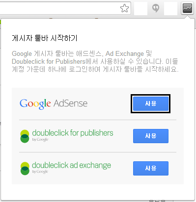

새로 생긴 아이콘을 클릭하면 왼쪽 그림과 같이 나타납니다.

Google Adsense 사용 버튼을 눌러주신후 구글 계정을 입력하시면 됩니다.

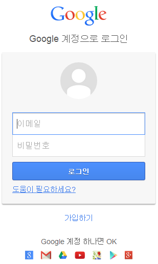
   
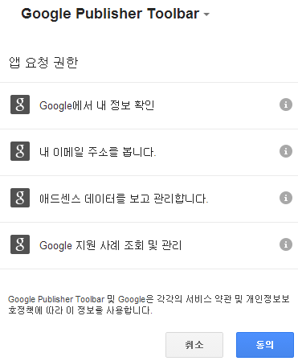

구글 계정으로 로그인 하신다음 앱 요청 권한에 동의해 주시면 사용 가능합니다.

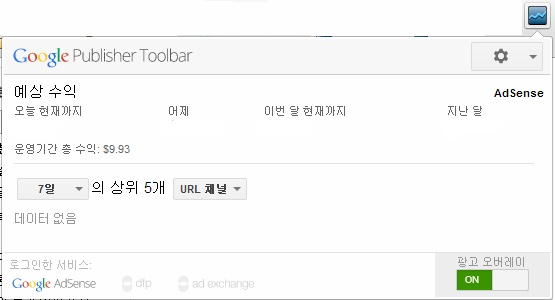

처음에 왼쪽 아래에 있는 광고 오버레이가 OFF로 되어 있을겁니다 ON으로 해주세요.

그다음 Google Publisher Toolbar 아이콘을 클릭하고 옵션에 들어가주세요.

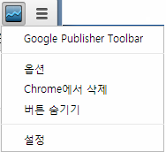

광고 오버레이 표시가 허용된 사이트에 자신의 애드센스를 게시한 사이트 주소를 입력해 주세요.

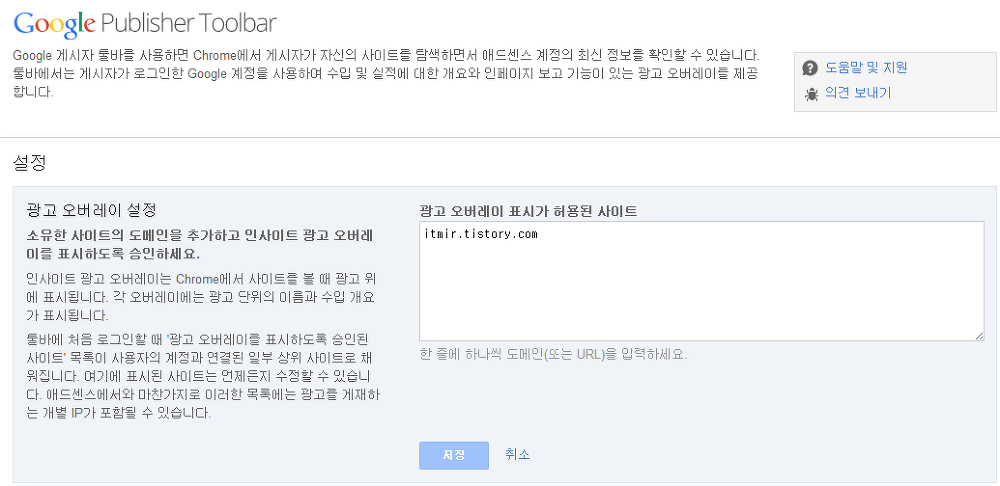

광고 오버레이는 아래 화면처럼 나타납니다.

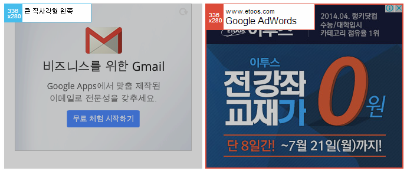

제 티스토리에 있는 광고입니다.

마우스를 갖다대면 위 사진처럼 정보가 나타납니다.

정보가 없는 광고도 클릭이 방지됩니다.

왼쪽처럼 파란색 박스가 나타나는 광고는 클릭해서 광고 세부정보를 확인할 수 없습니다.

오른쪽처럼 빨간 박스가 나타나면 클릭해서 광고의 세부정보를 확인할수 있습니다.

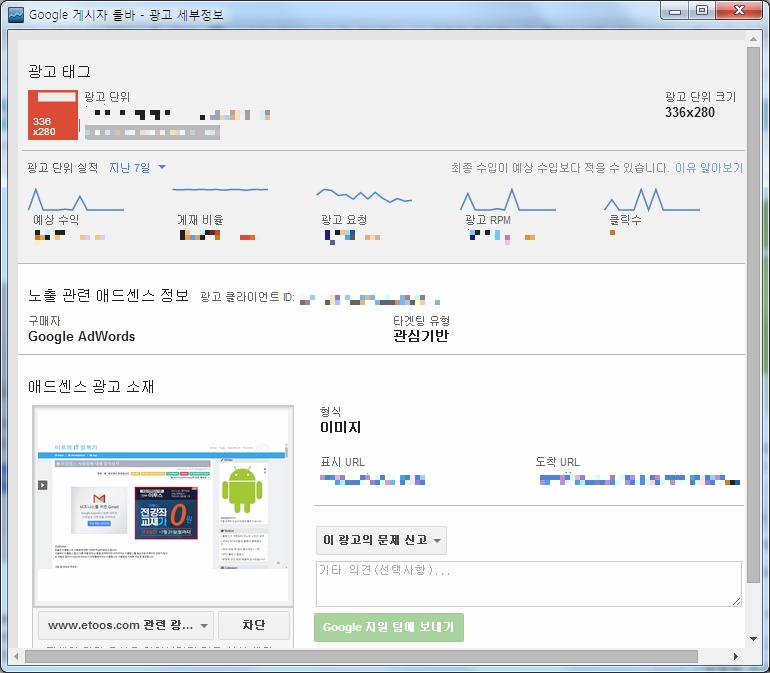

이 확장 프로그램을 설치한다면 자신의 광고를 클릭했을때 부정클릭으로 적발될 일이 없겠죠?

처음에 정보가 로딩될때까지 시간이 걸립니다. 광고의 왼쪽 위에 박스가 나타날 때까지는 클릭하시면 안 됩니다.

크롬에서만 사용해야 한다는 단점이 있지만, 내 광고의 부정클릭을 막고, 광고 정보를 알 수 있는 유용한 툴입니다.
