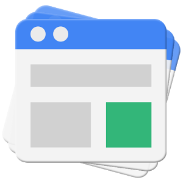
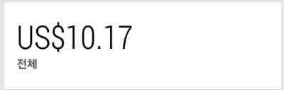
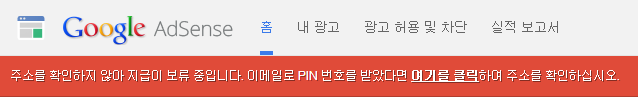
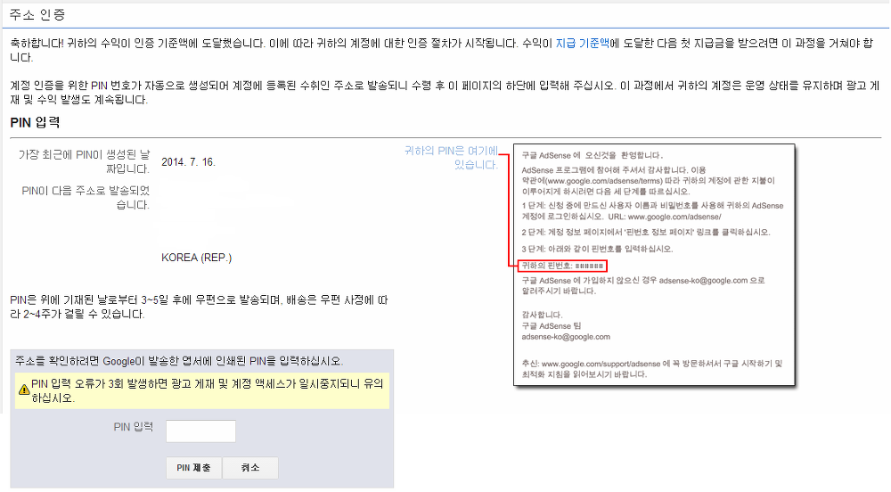

구글 애드센스를 알게된지는 1~2년이 된 거 같고.. 블로그 주소와 스킨을 갈아 엎으면서 애드센스 시작한 것도 1달이 넘어가는거 같습니다.

[[Tistory] - [애드센스] 구글 애드센스 (Google Adsense) 신청하기](/archive/itmir/2014/508)

글 보니까 딱 한 달이 되는거 같네요. ㅋㅋ

매일매일 안드로이드 애드센스 어플으로 수익을 확인하는데, 벌써 $10가 넘었네요.

(엄청 기다렸..)

이 어플 사용한지도 한 달이 넘어가네요.

위젯으로 꺼내놓고 쉬는시간마다 확인했는데..ㅋㅋ

작년 1월까지만 해도 애드센스 앱이 없었는데, 언제부터인가 어플이 있더라고요.

그래서 통계라던지 이런거 편하게 보고 있습니다.

다만.. 어플에 뜨는 애드센스 잔액과 홈페이지에 뜨는 잔액이 좀 다르다는 문제가..

이렇게 왼쪽 스크린샷처럼 $10을 넘었습니다~~

애드센스 홈페이지에 가봅시다.

링크 : <https://www.google.com/adsense>

그러면 아래처럼 지급 보류 관련 빨간색 경고가 뜹니다.

들어가 보시면 아래 화면이 뜨는데요.

설정해야 하는 건 없습니다.

PIN번호가 생성되서 처음에 애드센스를 가입한 주소로 날라갑니다.

우편으로 발송된다고 하더라고요.

이게 미국에서 오는거라..

미국 → 미국도 5일정도 걸린다는데, 미국 → 한국은 4주 넘게 걸린다고 하더라고요.

일단 잊고 지내야 하겠습니다.

한 달이 지나도 안오면 주소를 확인해보고 다시 요청해 보라고 하네요.