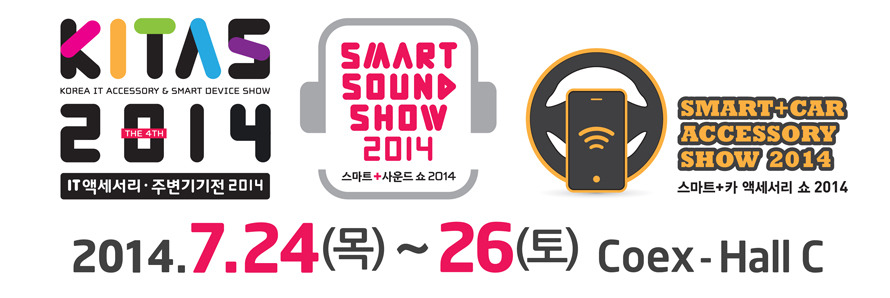
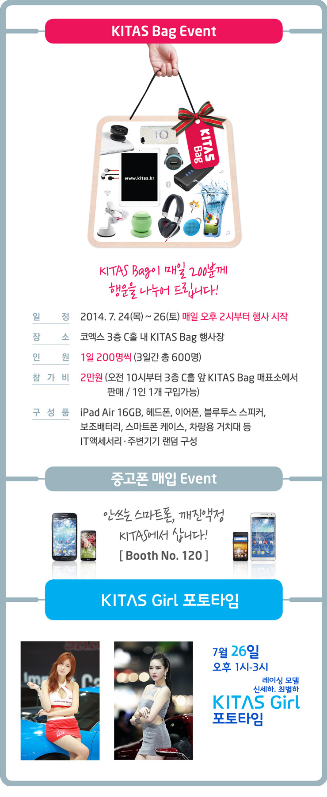
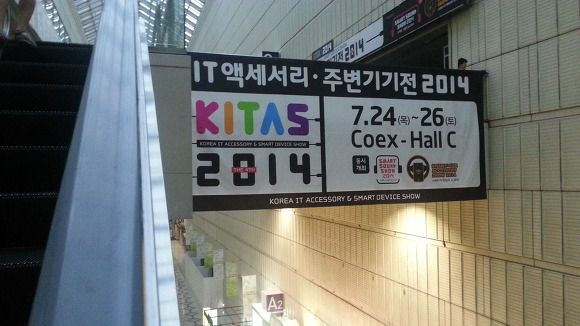
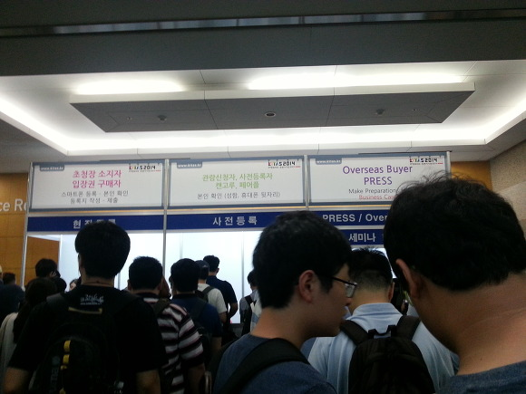
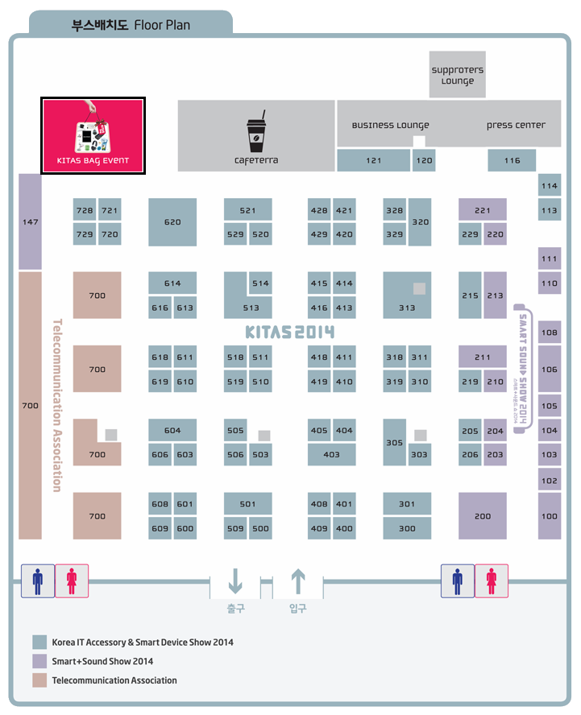
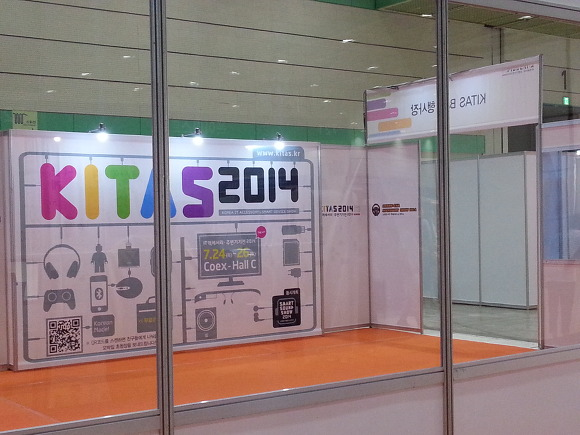
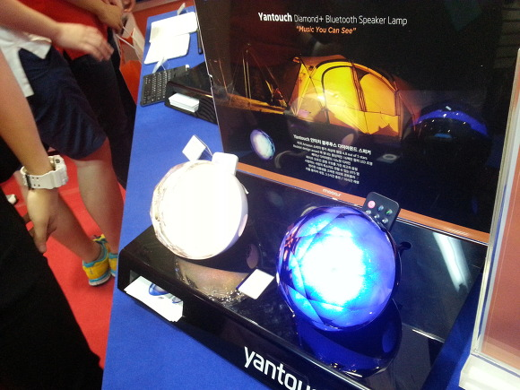
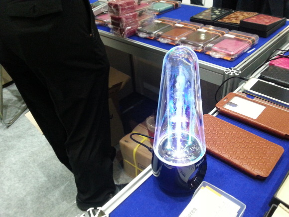
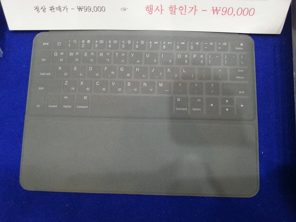

오늘은 2014년 열리는 키타스 전시회의 첫날입니다.

작년에 2013 키타스 놓쳐서 매우 아쉬웠는데요. 그래서 올해도 갔습니다.

올해는 키타스백이 200명이더라고요.

그래서 6시에 가면 그래도 180명정도 있으시겠지 생각했는대..

6시에 만나서 도착하니 7시 20분? 30분? 그정도 되더라고요.

그런대 200명 초과.. 250명정도 오셨더라고요;

키타스백은 날라갔습니다..;; ㅜㅜ

디벨로이드 카페글을 보니 자정 00:07분에 1등으로 오신분도 계시고..;;

다들 잠이 없으시네요;

아 혹시 키타스백 모르시는분을 위해 공식 사이트에서 이미지 가져왔습니다.

위에 있는 안내문에는 안적혀 있지만 선착순 200명입니다.

그래서 다들 일찍 오시는데요.

오늘 7시 30분 도착했는데 250명이니.. 좀 일찍 가셔야 할 거예요.

7시 10분인가 20분인가 그정도에 200분 모두 차셨다고 ....

코엑스에 들어오시면 저런 현수막을 볼수 있습니다.

A가 1층 B가 2층 C가 3층이므로 에스컬레이터 타셔서 위로 올라가셔야 되요.

7시 30분부터 10시까지 시간보내는 거 정말 힘듭니다..

입장권은 9시 30분부터 받을수 있다고 합니다.

전 사전 예약을 했기때문에 가운데에 줄섰습니다.

사전 예약하신분은 이름이랑 폰 뒷자리 번호를 말씀드리면 명찰을 받을 수 있어요.

입장권 받고 바로 반대편에 입구가 있습니다.

KITAS BAG 추첨이 이루어 지는 곳은 입구부터 왼쪽 끝입니다.

아래에 지도도 첨부해 두겠습니다.

행사장도 가봤어요.

물론 제가 받을건 아니지만...

.jpg)

와 진짜 무선충전기같은거 있으면 매우매우매우매우매우매우ㅐ무애무ㅐ우ㅐ무ㅐ움 좋을텐데..

기회가 날라가서 ..; ㅠㅠ

키타스백은 그만 언급하고.. 구경하면서 신기한 것들 사진으로 찍어봤어요.

이건 스피커 인대 모양이 예뻐서 찍었어요.

아래는 분수 스키피인데, 음에 따라 물이 나왔다 안 나왔다 합니다.

아래는 아이패드 케이스인데요. 터치 키보드가 있는 아이패드 케이스래요.

작년에는 못간게 아쉽고,

올해에는 키타스백을 못 얻었다는게 아쉽네요.

이거 외에도 스마트폰 카메라를 현미경처럼 만들어 주는거 라던가,

셀카를 쉽게 찍게 해주는 도구라던가,

따로 케이스 안끼고 배터리 커버를 바꿔끼우는 무선 충전기 → 아 이거 2만 5천원정도라고 하셨는데 진짜 사고싶었어요.

지름신 참는것도 정말 힘드네요;
