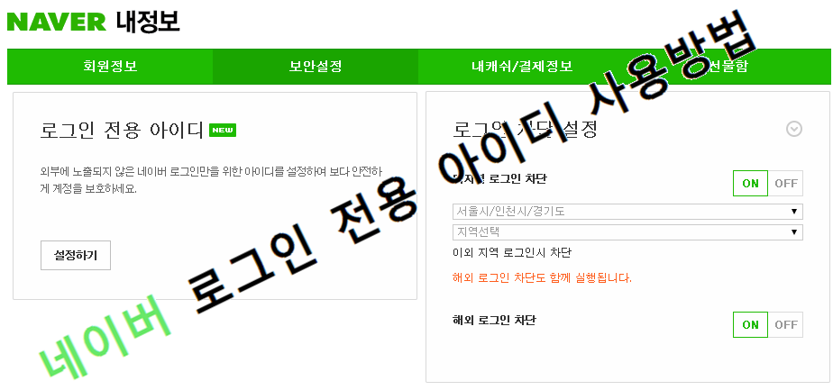
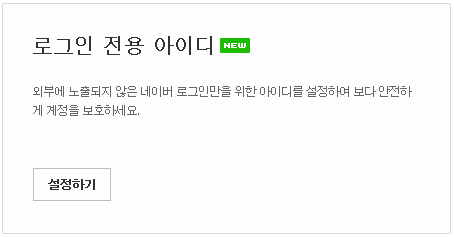
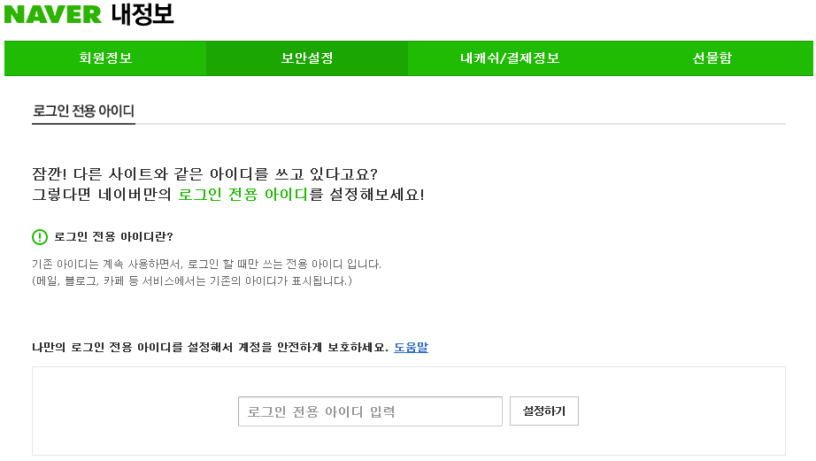
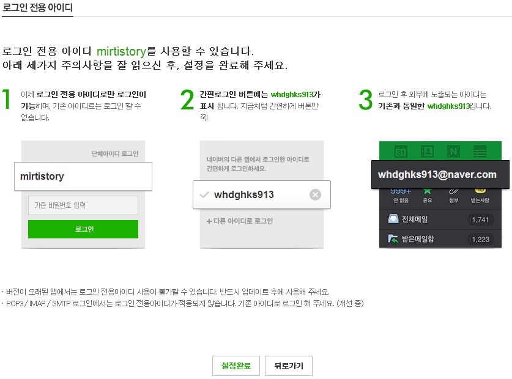

최근에 개인정보 유출 사건이 자주 일어나고 있습니다.

그에따라 기업에서도 회원들의 개인정보를 안전하게 유지하고 해킹 당하지 않도록 많은 대비를 하는 움직임을 보이고 있습니다.

네이버에서 로그인 전용 아이디를 설정하여 더욱더 안전하게 네이버를 사용할 수 있도록 해봅시다.

**네이버 로그인 전용 아이디 설정하기** <https://nid.naver.com/user2/help/myInfo.nhn?m=viewSecurity&menu=security>

위 사이트에 접속한뒤 왼쪽 스크린샷과 같은 모습의 상자를 찾아주세요

로그인 전용 아이디말고도 OTP 로그인, 로그인 차단 설정과 같이 많은 보안 설정들이 보입니다

로그인 차단 설정도 한번 구경하신다음 우리가 목표로 하는 로그인 전용 아이디를 찾아 들어가 주시면 됩니다

로그인 전용 아이디를 설정하게 되면 **네이버 로그인을 로그인 전용 아이디로만 가능**합니다.

**기존 아이디로는 로그인이 불가능**하며, 간편 로그인에는 기존 아이디가 표시됩니다.

**로그인 전용 아이디는 말그대로 "오로지 로그인만" 쓰이는 ID**이고,

로그인 후에는 기존 아이디가 표시됩니다.

블로그, 메일, 카페등 모든 네이버 서비스에서는 기존 아이디가 사용됩니다.

들어가시면 아래 스크린샷과 같은 화면이 나타나는데요.

아래 박스에 원하시는 ID를 입력하신후 "설정하기"를 눌러주세요.

로그인 전용 아이디는 오로지 본인만 알고 있는 ID로 설정하시는게 좋습니다.

ID 생성 할때처럼 다른사람과 중복되면 안되고, 기존 ID와도 중복되면 안됩니다.

원하는 ID입력하고 설정하기를 누르면 마지막 확인 화면이 표시됩니다.

로그인 전용 아이디를 설정했을때의 주의점을 설명하고 있습니다.

이해가 안 되실 수 있는부분이 있는데요.

위에서도 설명했지만 로그인 전용 아이디는 로그인에만 쓰이는 아이디 입니다.

네이버 메일, 카페, 블로그등의 모든 네이버 서비스에서는 기존 아이디가 사용되니 이점에 유의하시기 바랍니다!

다른 사람에게는 기존 아이디를 알려주시고, 로그인은 로그인 전용 아이디로만 하시는거죠. ㅎㅎ

이 전용 아이디를 설정하는게 네이버 아이디(블로그 주소등에서 얻을수 있다)가 유출됬을때의 해킹을 막는 것 이므로

다른 사람에게 알려주시면 안되는 아이디 입니다.

이렇게 네이버의 로그인 전용 아이디에 대해 알아봤습니다.
