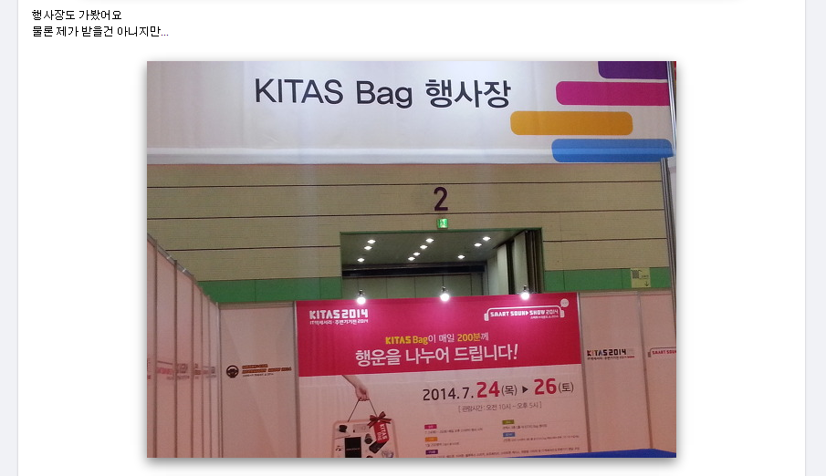
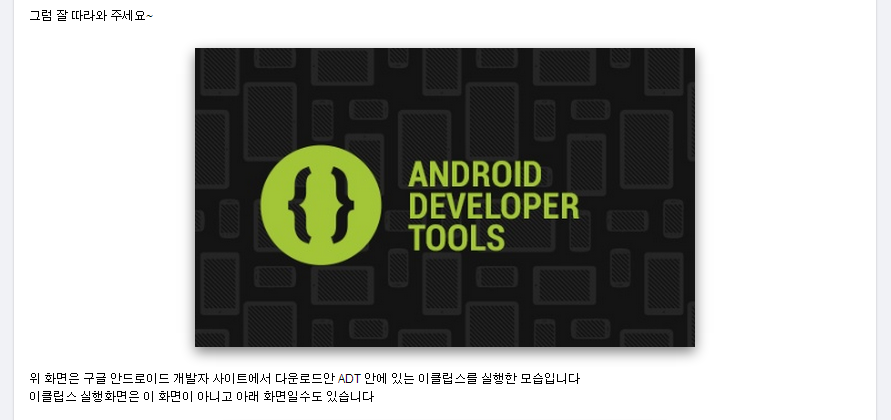
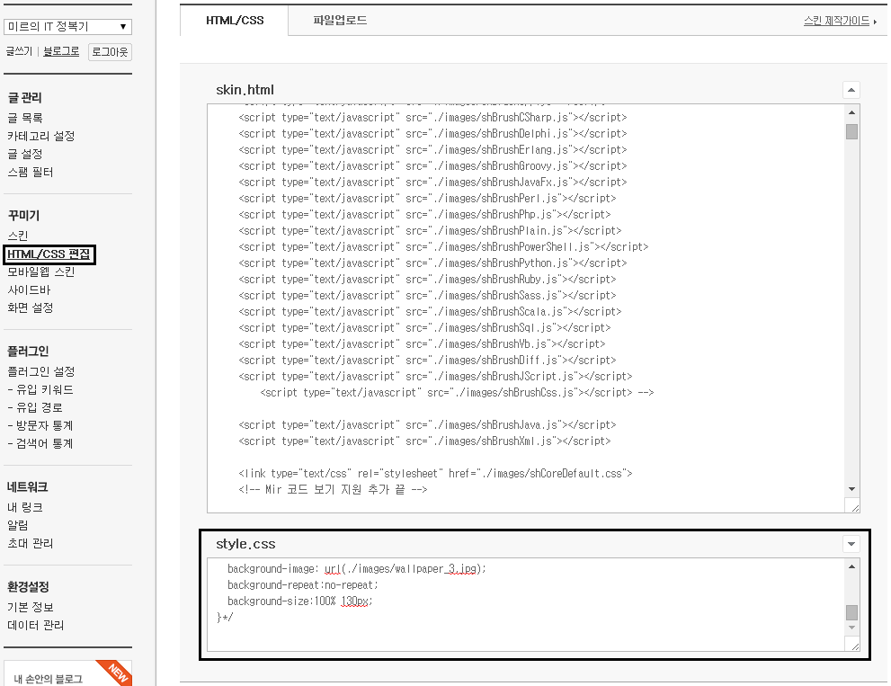
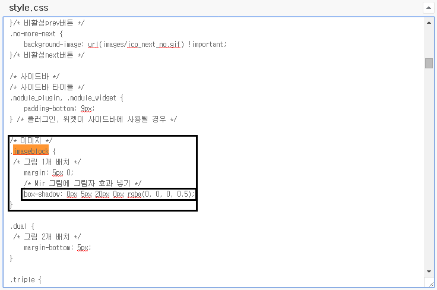
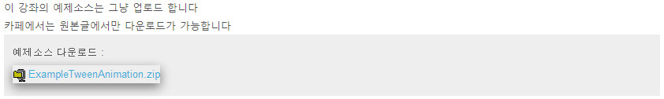

안녕하세요~

이번에 처음으로 트랙백이라는걸 해보는데요 잘되는지 모르겠네요. ㅋㅋ

이글에서는 티스토리 이미지에 그림자 효과를 넣어보려고 합니다.

그림을 강조하기 위해 그림자 효과를 넣는데요.

지금부터 이 효과를 넣으면 나타나는 효과와, 그 방법을 알아보겠습니다.

### 이미지에 그림자 효과를 넣으면 어떻게 되나요?

따라하시기 전에 어떻게 하면 어떻게 될지 한 번 살펴보겠습니다.

두 개의 사진을 가져왔어요.

(뭘 예시로 들까 생각하다가 그냥 아무거나 선택어요. ㅋㅋ)

사진을 보시면 이미지 주변에 검은 띠가 생긴것을 확인할 수 있습니다.

이렇게 사진을 강조하기 위해 사용합니다.

티스토리는 html/css에서의 자유도가 매우 높으므로 이런 효과도 넣을수 있지요. ㅋㅋ

### 그림자 효과를 넣어봅시다

이 방법은 매우 위험하지는 않지만 그래도 잘못하면 공들어 꾸민 스킨이 날라갈 수 있으므로 꼭 작업 전에 스킨을 저장해서 백업하시기를 바랍니다.

티스토리 관리자 페이지 - HTML/CSS 편집에서 아래에 있는 style.css를 손봐줍시다.

블로그 설정 - html/css편집 - style.css에 들어가 주세요

style.css파일에서 .imageblock 을 찾아주세요.

그다음 중괄호 { } 안에 아래 구문을 넣어주시면 됩니다.

두번째는 첫번째 줄 코드 설명입니다.

box-shadow: 0px 5px 20px 0px rgba(0, 0, 0, 0.5);

0px x축 그림자의 길이 입니다. (양수는 오른쪽 음수는 왼쪽입니다)

5px y축 그림자의 길이 입니다. (양수는 오른쪽 음수는 왼쪽입니다)

20px 그림자가 흐린 정도 입니다.

0px 효과가 퍼지는 정도 입니다.

rgba(0, 0, 0, 0.5) 그림자의 색이며, (R, G, B, A)의 순입니다.

inset rgba다음에 inset을 추가로 넣어주시면 박스 안쪽에 그림자가 생깁니다.

이 코드를 넣어주시면 됩니다.

### .imageblock 안에 어떻게 코드를 넣어야 할까요?

css를 잘 모르시는 분들을 위해 기존 코드와 수정한 코드를 비교해서 올려드리도록 하겠습니다.

[기존 코드]

.imageblock {

    margin: 5px 0;

}

[수정된 코드]

.imageblock {

    margin: 5px 0;

**box-shadow: 0px 5px 20px 0px rgba(0, 0, 0, 0.5);**

}

중괄호 안에 위에서 올려드린 코드 한 줄만 추가해주시면 됩니다.

기존 코드는 스킨마다 다를수 있으므로 자신의 스킨을 기준으로 적용하시면 됩니다.

이렇게 추가해주시고 저장해 주시면 완료입니다. ㅎㅎ

### 이미지에 효과를 넣고 문제가 생겼어요

효과를 적용하고 문제점이 하나 발견되었습니다.

첨부파일에도 효과가 나타납니다;

이렇게 첨부파일 다운로드 링크에도 그림자 효과가 적용됩니다;

다른점은 모두 마음에 드는대 이 부분이 치명적으로 보기 안좋아서 저는 다시 원상태로 복구하였습니다..

나중에 첨부파일에 그림자가 적용되지 않는 방법을 찾고 다시 적용할 생각입니다.

### 마무리

이번 포스팅 어떠셨나요?

지금까지 다른 유명하고 깔끔한 블로그에서 배운 방법들과 트랙백을 처음으로 사용한 글이었습니다.

앞으로도 방문자의 입장에서 더욱더 가독성 좋고 깔끔한 글을 쓰기 위해 노력하겠습니다. :D
