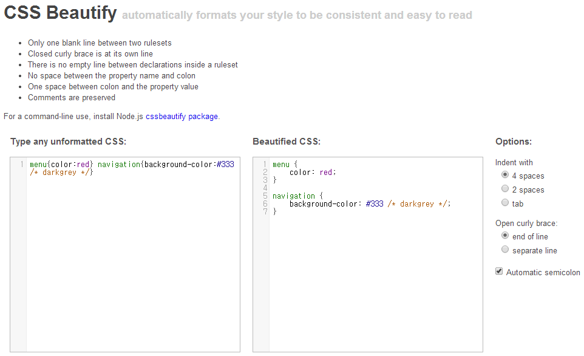
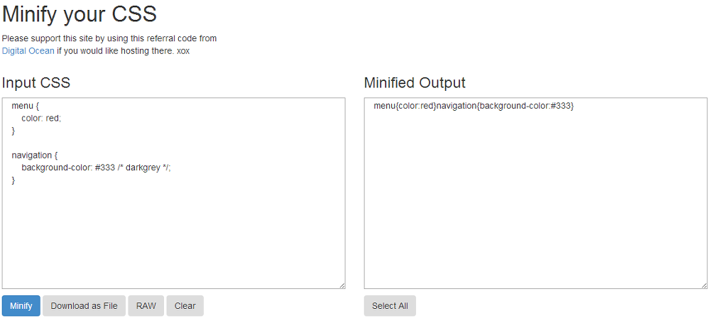

티스토리 스킨을 변경할 때, 또는 html과 css를 살펴볼 일이 있을 때,

html 소스가 한 줄로 있을 때가 존재합니다.

코드가 한 줄로 되어 있어서 가독성이 매우 떨어지고 읽기도 불편합니다.

이럴 때 사용하는 유용한 사이트가 있어 소개합니다.

### 1. CSS Beautify

한 줄로 되어 있는 코드를 정렬해서, 가독성을 향상시켜주는 사이트입니다.

> <http://cssbeautify.com/>

Type any unformatted CSS에 정렬을 원하는 소스를 집어넣으시면, 오른쪽 화면에 소스가 보기 좋게 변경되서 나타납니다.

다시 소스를 한 줄로 변경할때는 아래 사이트를 사용합니다.

### 2. CSS Minifier

소스를 한 줄로 변경해주는 사이트입니다.

> <http://cssminifier.com/>

왼쪽에 소스를 입력하시고 파란 버튼을 누르시면 오른쪽에 Out put이 나옵니다.

css의 경우 입력한 /\* \*/ 주석이 지워지니 참고해주세요.
