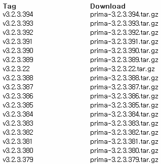

이번 시간에는 prima wlan을 다운받아 커널소스에 추가해서 빌드해 보겠습니다.

prima는 wifi모듈입니다.

이게 라이센스 문제로 커널소스에 포함되지 않고 직접 받고 추가해야 하더라고요.

(그런대 Hour님 말로는 추가되어 있는대 이상한게 되어 있다고...)

커널소스에 없기 때문에 그냥 추가 없이 커널 소스를 받고 빌드한 다음 바로 적용하면 WIFI 모듈이 달라 정상적으로 무선 wifi가 안됩니다.

그래서 prima\_wlan을 추가해서 빌드하는 방법을 알아보겠습니다.

### 코드 오로라에서 소스 다운로드 하기

prima wlan 소스는 코드 오로라에 존재합니다.

<https://www.codeaurora.org/cgit/external/wlan/prima/refs/>

위 링크로 들어가신 다음 스크롤을 조금 내리시면 Tag Download 부분이 보입니다.

버전은 상관 없다고 하지만 알 수 있다면 원래 순정 커널에 있는 버전과 같은 버전의 소스를 다운로드 해서 추가해 줍시다.

(아무거나 해도 상관은 없다고 합니다.)

다운 받은 파일을 압축 풀어 /drivers/staging/prima 폴더에 넣어주세요.

### 컴파일에 필요한 구문을 추가하자

먼저 /drivers/staging/Kconfig파일을 수정해 줍시다.

source "drivers/staging/ozwpan/Kconfig"

**source "drivers/staging/prima/Kconfig"**

endif # STAGING

endif위에 밑줄친 한줄을 추가해 주세요.

/drivers/staging/Makefile

obj-$(CONFIG\_PRIMA\_WLAN) += prima/

이제 defconfig에 추가해줘야 합니다.

menuconfig에 들어가서 아래 경로로 들어가 주세요.

device drivers - staging drivers - Qualcomm Athernos Prima Wlan Module

저 항목을 "m"으로 설정해 주시면 됩니다.

또는 직접 defconfig을 수정해도 됩니다.

#

# Qualcomm Atheros Prima WLAN module

#

CONFIG\_PRIMA\_WLAN=m

### 모듈 용량 줄이기

컴파일후 나온 모듈의 용량은 매우 큽니다.

이 큰 용량을 툴체인에 있는 strip을 이용하면 작게 만들 수 있습니다.

이 파일은 arm-eabi-4.6/arm-eabi/bin/ 에 들어있습니다.

./strip --strip-unneeded "./drivers/staging/prima/wlan.ko"

파일도 따로 올려드립니다.

[strip](https://github.com/itmir913/archive/releases/download/itmir-attachments/strip)

### 필요한 파일들

**/system/lib/modules/prima**

(컴파일된 모듈) wlan.ko, cfg80211.ko

**/system/etc/firmware/wlan/prima**

(커널소스파일) /drivers/staging/prima/firmware\_bin/WCNSS\_cfg.dat

(커널소스파일) /drivers/staging/prima/firmware\_bin/WCNSS\_qcom\_nv.bin

### Thanks to

NewWorld님

그리고 요즘 포스팅할 거리가 없었는데 이걸 생각나게 해준 Hour님

추가 방법이 기록된 Commit : <https://github.com/itmir913/android_kernel_pantech_ef47s/commit/ef1b190f4a6626b8d8efc03d800044468e7a5438>

---

## 첨부파일

- [strip](https://github.com/itmir913/archive/releases/download/itmir-attachments/strip) `787 KB`
