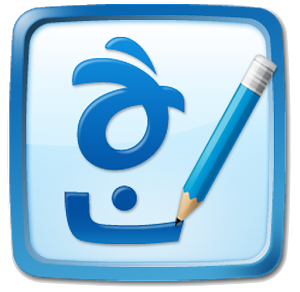
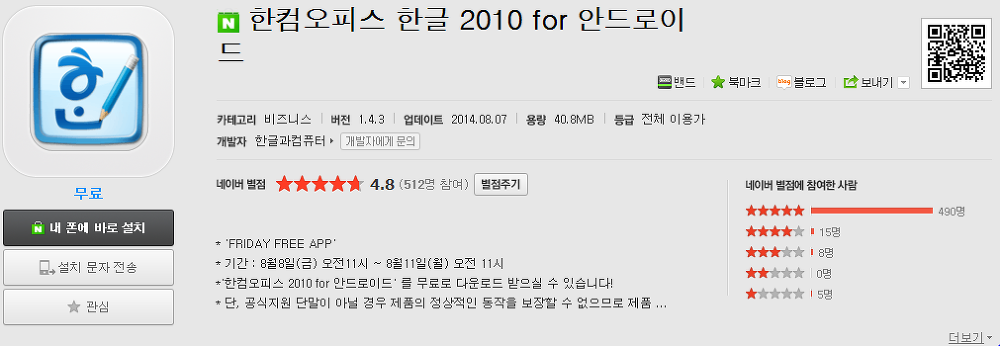
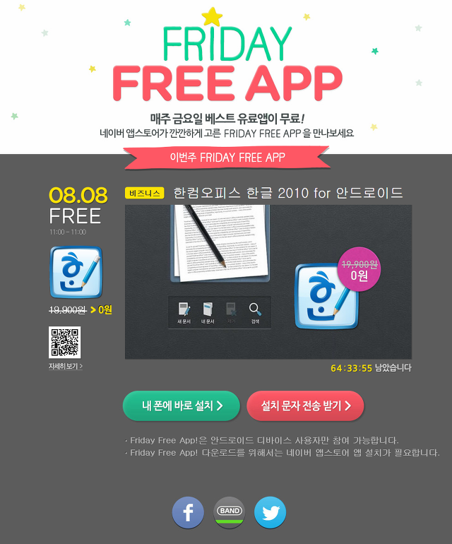

한컴 오피스 한글이 정식 어플로 출시된건 오래전이지만 그 가격이 너무 비싸서 사용을 못해봤습니다

그런대 오늘부터 네이버 N스토어에서 한컴 오피스 한글을 무료로 파는 이벤트를 하고 있습니다~

오늘부터 8월 11일 11시까지만 다운로드 할수 있으므로 구매기록이라도 만들어 두시길 바랍니다

### 한컴 오피스를 다운로드 할수 있는 주소는?

지금 무료로 풀린곳은 "구글 플레이 스토어"가 아니라 "네이버 N스토어"입니다

네이버 아이디가 있으시면 N스토어 어플을 다운로드 하신다음 한컴 오피스를 다운로드 하시면 됩니다

<http://nstore.naver.com/appstore/web/detail.nhn?productNo=1584869>

아래는 PC에서 스크린샷 찍은 사진 입니다

### FRIDAY FREE APP 이벤트

예전에도 N스토어에서 매일매일 유료앱을 무료로 풀때가 있었는대 요즘도 금요일마다 앱을 무료로 풀고 있나봐요

FRIDAY FREE APP라는 이벤트로 8월8일(금) 오전11시 ~ 8월11일(월) 오전 11시까지만 다운로드 할수 있다고 합니다

아래는 이벤트 사이트 입니다

<http://nstore.naver.com/event/fridayFreeApp.nhn>

N스토어가 IOS에는 없으므로.. 안드로이드만 이벤트 참가가 가능하며

네이버 앱스토어 설치가 필요합니다

한글 어플 설치후 앱스토어 앱을 지우시면 실행이 불가능 합니다

그런대 네이버 돈이 많나봐요? 아니면 한글이 참가하는걸까요?

이벤트 사이트 아래에 보면 개발사가 참가하는 링크가 있던대 한컴 오피스에서 참가하는걸수도 있겠습니다

19,900원이나 되는 앱을 꽁짜로 받아서 좋네요 ㅋㅋ
