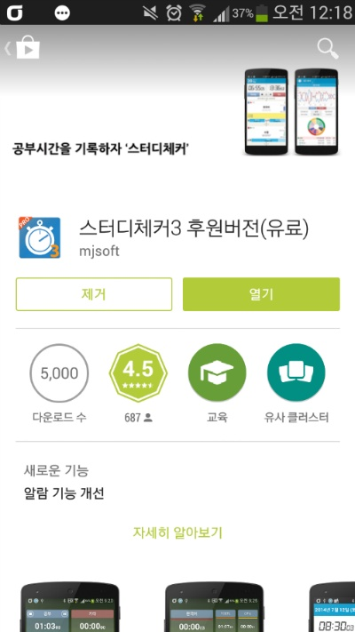
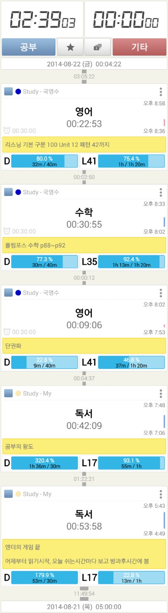
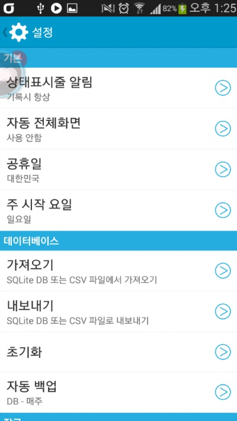
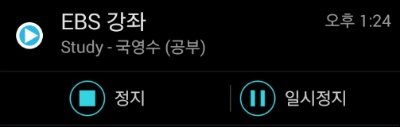

공부 시간을 기록할때 스터디 체커만한게 없더라고요

3버전이 나온지는 조금 되었지만 그동안 추가된 기능도 있고 해서 구매했습니다

가격이 조금 부담되긴 했어요

약 5달러(4.7)입니다

저번에는 3달러였던거 같은대 올랐나봐요

그래도 큰맘먹고 구매했습니다

(구매하자마자 그냥 있을걸 후회하긴 했지만;)

그래도 5천원 값 하는 어플인거 같아요

SC2때보다 UI가 확실히 많이 달라져서 해깔리고 설정 화면에서 건들수 있는 부분을 다른대로 옮기고 그래서 처음엔 적응이 안됩니다

좀 지나니 좋더라고요

위 사진처럼 메인화면 전체를 캡쳐할수 있습니다

메인 화면에 있는 공유 버튼을 누르면 /sdcard/에 jpg가 생성되더라고요

아래는 설정 화면입니다

그리고 상단바에서 바로 정지, 일시정지가 되요

이거 편하더라고요 ㅋㅋ

다만.. SC2버전에서는 통계에서 원 그래프에 막대기가 있었는대 사라졌고

메인 화면에서 과목 색을 찾아볼수 없다는점이 매우 아쉽네요

업데이트 하면서 뒤떨어진 어플이 된 느낌도 있습니다

UI공사에만 너무 치중한거 같기도 하네요

이제부터 좀 공부좀 해야 되는대 말이죠

이걸로 작정하고 해야 겠습니다
