이번 강좌는 전에 Preference강좌와 이어지는 내용입니다

먼저 읽으시기 전에 아래 강좌를 한번 읽어보시는것을 강력 추천드립니다

[[Development/App] - #21 Preference(프리퍼런스)](/archive/itmir/2013/393)

그리고 이번 글부터 글양식을 조금 바꿔봤어요 ㅋㅋ 아마 원본글이 아니면 깨질수도 있을거 같아요

티스토리에서 봐주시면 감사드리겠습니다

한달만의 글 잘 감상해 주세요~

### PreferenceActivity란?

저번 시간에 데이터를 저장하는 가장 간단한 방법인 프리퍼런스를 알아보았습니다

그런대 이를 더 편하게 사용할수 있는 방법이 있는데요

환경설정 어플의 모습도 이 프리퍼런스를 사용한 모습입니다

일반적으로 Preference는 Editor를 사용해서 데이터를 넣고 지우는데요

이과정을 보기좋게 UI로도 제공하고, 일일히 commit()할 필요도 없는 1석2조의 효과를 볼수 있습니다

그대신 레이아웃을 지정하는대 조금 복잡함이 있습니다

지금부터 환경설정 레이아웃을 짜보도록 하겠습니다

### 레이아웃인대 res/layout이 아니네요?

위에서 레이아웃을 짠다고 했는대 무슨 소리냐고 물어보시는 분들이 많을거 같아요

그렇지만 사실입니다

PreferenceActivity는 Activity가 들어있지만 res/layout에 xml을 저장하지 않습니다

res/xml폴더에 파일이 들어가 있습니다

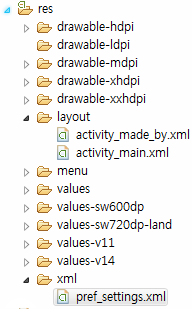

그런대 res/xml폴더는 앱을 처음 만들면 없는 폴더입니다

drawable만들때처럼 new-folder으로 만들어 주시면 됩니다

xml파일을 만드는 방법은 아래와 같습니다

New - Android XML File

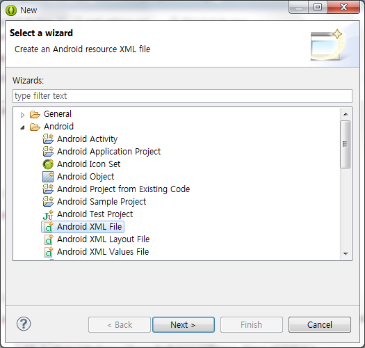

Resource Type을 Preference로 바꿔준다음 PreferenceScreen을 선택해주세요

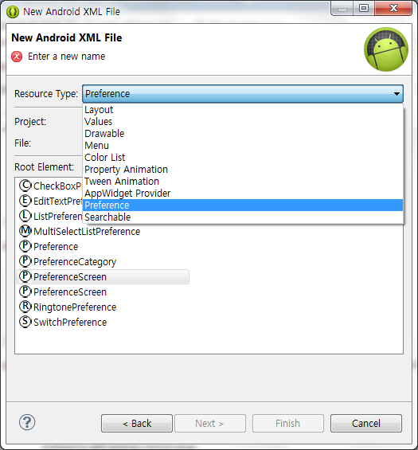

그러면 아래와 같은 xml파일이 만들어 집니다

```xml
<?xml version="1.0" encoding="utf-8"?>
<PreferenceScreen xmlns:android="http://schemas.android.com/apk/res/android" >

</PreferenceScreen>
```

기본적으로 <PreferenceScreen>가 밖에 있습니다

뭐뭐를 추가할수 있는지 확인해 봅시다

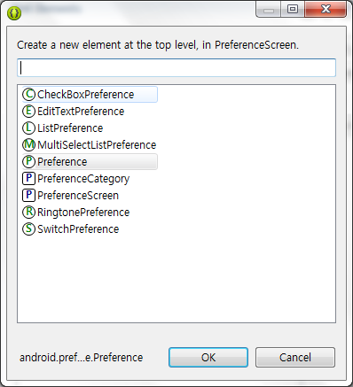

9가지나 되는 Preference를 추가할수 있네요~

여기서 이번 강좌에서는 MultiSelectList~빼고 다 살펴볼겁니다

(아직 도입부인대도 기네요; 너무길면 1편 2편으로 할생각이예요)

일단 만들기 전에 어떤 어플을 만들까 생각해 봅시다

전 이글 쓰기전에 이미 예제를 만들었는데요 스크린샷을 한번 보겠습니다

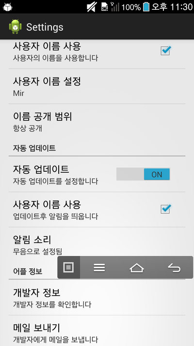

우리는 체크박스, 스위치, 벨소리 설정, EditText, List, 그다음 맨 아래의 메일보내기까지 모두 구현할수 있습니다!

그럼 첫번째로 사용자 이름에 관련된, 위에서 3개를 배워보도록 하겠습니다

### 사용자 이름 설정하기

저 3개의 xml코드는 아래와 같습니다

```xml
<CheckBoxPreference
    android:defaultValue="false"
    android:key="useUserName"
    android:summaryOff="사용자의 이름을 사용하지 않습니다"
    android:summaryOn="사용자의 이름을 사용합니다"
    android:title="사용자 이름 사용" />

<EditTextPreference
    android:defaultValue="Mir"
    android:dependency="useUserName"
    android:key="userName"
    android:maxLines="1"
    android:selectAllOnFocus="true"
    android:singleLine="true"
    android:title="사용자 이름 설정" />

<ListPreference
    android:defaultValue="0"
    android:dependency="useUserName"
    android:entries="@array/userNameOpen"
    android:entryValues="@array/userNameOpen_values"
    android:key="userNameOpen"
    android:negativeButtonText="@null"
    android:positiveButtonText="@null"
    android:title="이름 공개 범위" />
```

- android:defaultValue : 기본값입니다 이건 boolean이 될수도 있고 String이 될수도 있습니다 각각의 프리퍼런스마다 다릅니다
- android:key : 일반 프리퍼런스를 쓸때는 getString("이름", "기본값");의 형식으로 사용했었습니다, 이때 "이름"에 해당하는것이 android:key입니다
- android:summaryOff : 주로 On Off를 할수 있는 프리퍼런스에서 사용합니다, Off상태의 부가설명 입니다
- android:summaryOn : 위와 마찬가지로, On상태의 부가설명 입니다
- android:dependency : 이건 다른 프리퍼런스의 android:key값을 집어넣어주는데요 그 프리퍼런스가 비활성화면 나도 비활성화, 활성화면 나도 활성화..

기본적으로 속성을 알아봤어요

스크린샷으로 확인도 해보겠습니다

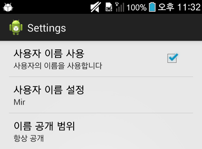
   
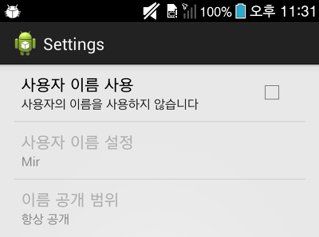

이 사진으로 2가지를 알수 있어요

체크박스에 따라 summaryOn, summaryOff의 글자가 번갈아 가며 표시됩니다

참고로 on, off를 안쓰로 그냥 summary도 있습니다 좀있다 나올때 다시 설명하겠습니다

그리고 android:dependency="useUserName"에 의해 비활성화 됬을때 나머지 두개도 같이 비활성화 되는 모습을 살펴볼수 있습니다

일부 예제는 setEnable(boolean)메소드를 이용해 컨트롤 하기도 하는대 이게 가장 쉬운 방법입니다

위에서 ListPreference의 두가지 속성을 설명하지 않았습니다 이어서 보도록 하겠습니다

android:negativeButtonText="@null"

android:positiveButtonText="@null"

이 두개의 속성은 딱 보면 알수 있어서 넘어가겠습니다

- android:entries="@array/userNameOpen" : 리스트에 표시될 값
- android:entryValues="@array/userNameOpen_values" : 실제로 프리퍼런스에 저장될 값

이 두놈이 좀 수상하지 않나요?

array는 커스텀 알림때 배운 내용입니다

실제 values/array.xml을 보겠습니다

파일 만들어 주세요

<string-array name="userNameOpen">

    <item>항상 공개</item>

    <item>친구에게만</item>

    <item>비공개</item>

</string-array>

<string-array name="userNameOpen_values">

    <item>1</item>

    <item>0</item>

    <item>-1</item>

</string-array>

위에서 써둔대로 android:entries는 리스트에 표시될 값을 말합니다

하나를 선택하면 선택한 index를 따져서 android:entryValues에 지정한 index의 값이 저장됩니다

스샷을 보면서 말씀드리는게 좋을것 같습니다

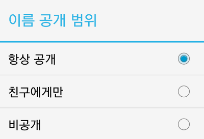

제가 항상 공개를 선택하면 android:entryValues에 있는 첫번째 값인 1이 저장되고

친구에게만을 선택하면 0이, 비공개를 선택하면 -1이 저장되는 원리입니다

EditTextPreference의 일부 속성도 살펴보진 않았지만 이름만 보면 바로 알수 있어 스크린샷만 확인후 넘어가도록 하겠습니다

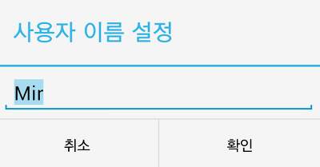

### 자동 업데이트 설정하기

스크린샷에서 자동 업데이트 부분은 스위치로 되어 있었습니다

그리고 구분 탭이 있었는데요 먼저 구분 탭부터 살짝 보겠습니다

구분탭은 PreferenceCategory입니다

그냥 아무런 설정없이 일반 레이아웃처럼 카테고리로 다른 프리퍼런스를 묶어주시면 됩니다

```java
<PreferenceCategory android:title="자동 업데이트" >

    <SwitchPreference
        android:defaultValue="false"
        android:key="autoUpdate"
        android:summary="자동 업데이트를 설정합니다"
        android:switchTextOff="OFF"
        android:switchTextOn="ON"
        android:title="자동 업데이트" />

    <CheckBoxPreference
        android:defaultValue="false"
        android:dependency="autoUpdate"
        android:key="useUpdateNofiti"
        android:summary="업데이트후 알림을 띄웁니다"
        android:title="알림 사용" />

    <RingtonePreference
        android:defaultValue="content://settings/system/notification_sound"
        android:dependency="useUpdateNofiti"
        android:key="autoUpdate_ringtone"
        android:ringtoneType="notification"
        android:showSilent="true"
        android:title="알림 소리" />

</PreferenceCategory>
```

스위치부터 알아보겠습니다

- android:switchTextOff="OFF" : 스위치가 꺼졌을떄 스위치에 OFF라는 글자를 설정합니다
- android:switchTextOn="ON" : 스위치가 켜졌을때 스위치에 ON이라는 글자를 설정합니다

이게 끝입니다 ㅋㅋ

다음은 벨소리 설정입니다

RingtonePreference는 실제 어플에서는 잘 안쓰지만 알림음을 설정할때 쓰므로 한번 살펴보겠습니다

- android:defaultValue="content://settings/system/notification_sound" : 위에서 한번 본 기본 값입니다, RingtonePreference는 신기하게 저걸 쓰네요
- android:ringtoneType="notification" : 표시할 소리 종류 입니다, all, ringtone, notification, alarm을 집어넣을수 있습니다
- android:showSilent="true" : "무음" 표시 여부 입니다

이렇게 자동 업데이트 부분을 끝냈습니다

스크린샷으로 확인하고 다음으로 넘어가겠습니다

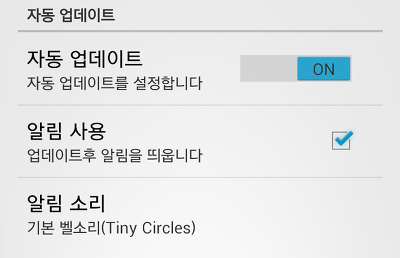
    
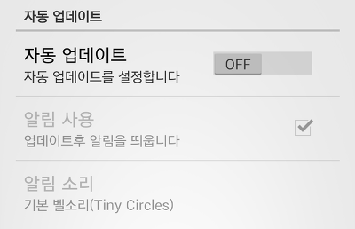

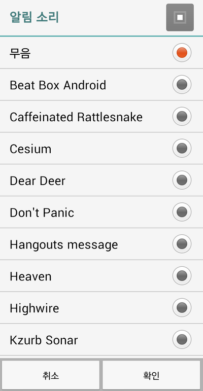

아 자동업데이트부분에서 알고 넘어갈게 하나 더 있습니다

여기서 저는 android:dependency을 단계별로 주었습니다

자동 업데이트가 켜져야 알림사용이 켜지고

알림사용이 켜져야 알림 소리가 켜집니다

잘 파악해두세요!

### 어플 정보 부분

이부분은 위에서 나온 프리퍼런스를 사용하지 않고 "그냥" 프리퍼런스를 사용합니다

스크린샷에 나온대로 xml을 사용해서 개발자 정보(새로운 액티비티 열기)와 메일 보내기(Url)을 할수 있습니다

```xml
<PreferenceCategory android:title="어플 정보" >

    <Preference
        android:summary="개발자 정보를 확인합니다"
        android:title="개발자 정보" >
        <intent
            android:targetClass="whdghks913.tistory.examplepreferenceactivity.MadeByActivity"
            android:targetPackage="whdghks913.tistory.examplepreferenceactivity" />
    </Preference>
    <Preference
        android:summary="개발자에게 메일을 보냅니다"
        android:title="메일 보내기" >
        <intent
            android:action="android.intent.action.SENDTO"
            android:data="mailto:whdghks913@naver.com" />
    </Preference>

</PreferenceCategory>
```

위에서 본거보다는 코드구성이 쉽습니다

<Preference>안에 <intent>가 있는데요

이는 각각

startActivity(new Intent(this, MadeBy.class));

Uri uri = Uri.parse("mailto:whdghks913@naver.com");

Intent it = new Intent(Intent.ACTION_SENDTO, uri);

startActivity(it);

였습니다

잘 보시면 공통점을 찾을수 있습니다~

### xml코드가 끝났습니다.. 그러나

드디어 xml코드를 정복했습니다!

그런대 한가지 빼먹은게 있는데요 바로 액티비티를 만들지 않았습니다

지금 만든 xml을 불러들일 액티비티를 하나 만들어 봅시다

이름은 SettingsActivity.java로하고  내용은 아래와 같습니다

```java
public class SettingsActivity extends PreferenceActivity {

    @Override
    protected void onCreate(Bundle savedInstanceState) {
        super.onCreate(savedInstanceState);

        addPreferencesFromResource(R.xml.pref_settings);
    }
}
```

SettingActivity를 이클립스를 통해 만들면 onCreate()가 아니라 onPostCreate()를 사용하더라고요

두개의 차이점은 모르겠습니다

익숙한 onCreate로 바꿔도 문제는 없는것 같습니다

자, 사실상 액티비티는 저정도만 작성해줘도 됩니다

왜냐하면 값의 저장은 클릭하자 마자 android:key로 저장이 됩니다

갑자기 생각나서 추가합니다

액티비티를 java파일만 만드신 분은 없겠죠..?

아래는 기본적으로 추가해주시면 됩니다

<activity

    android:name="whdghks913.tistory.examplepreferenceactivity.SettingsActivity"

android:label="@string/action_settings" >

</activity>

<item

    android:id="@+id/action_settings"

    android:orderInCategory="100"

    android:showAsAction="ifRoom"

    android:icon="@android:drawable/ic_menu_manage"

    android:title="@string/action_settings"/>

@Override

public boolean onOptionsItemSelected(MenuItem item) {

int itemId = item.getItemId();

    if (itemId == R.id.action_settings) {

        Intent SettingActivity = new Intent(this, SettingsActivity.class);

        startActivity(SettingActivity);

    }

    return super.onOptionsItemSelected(item);

}

### 최근 앱의 설정에는 선택한 항목이 Summary에 표시되요

이게 java에서 다뤄야할 가장 어려운 난제입니다

그래도 선택한 항목이 표시되면 좋으니 도전해 보겠습니다

일단 프리퍼런스도 일반 View처럼 클릭 리스너를 받을수 있습니다

Preference.OnPreferenceClickListener

또한 프리퍼런스 특성에 맞춰 값이 변경될때마다 리스너를 받을수도 있습니다

Preference.OnPreferenceChangeListener

이를 이용해 값이 변경될때마다 Summary를 수정해주는것이 원리입니다

클릭 리스너는 개인적으로 사용해 보시고 이글에선 아래걸 사용해 보겠습니다

```java
private Preference.OnPreferenceChangeListener onPreferenceChangeListener = new Preference.OnPreferenceChangeListener() {

    @Override
    public boolean onPreferenceChange(Preference preference, Object newValue) {
        return true;
    }

};
```

기본 리스너의 골격입니다 리턴값이 false면 값이 변경되지 않는걸로 확인햇습니다

구석에다 추가해 주시고...

이 리스너를 Summary가 변경되어야할 프리퍼런스에 연결해줘야 합니다

setOnPreferenceChangeListener으로 연결해 줄수 있습니다

아래 메소드를 하나 추가해 주세요

```java
private void setOnPreferenceChange(Preference mPreference) {
    mPreference.setOnPreferenceChangeListener(onPreferenceChangeListener);

    onPreferenceChangeListener.onPreferenceChange(mPreference,
        PreferenceManager.getDefaultSharedPreferences(mPreference.getContext()).getString(mPreference.getKey(), ""));
}
```

이 메소드를 이용해 각각의 프리퍼런스에 리스너를 연결해 줄겁니다

2번째 줄 소스가 리스너를 연결해 주고 있고,

4~5번째 줄에서 리스너의 onPreferenceChange()메소드를 호출하고 있습니다

(왜 onPreferenceChange()를 호출하냐면 초기 Summary를 설정하기 위함입니다)

마지막으로 프리퍼런스를 저 메소드에 집어넣어줘야 하는데요

PreferenceActivity에서는 findPreference(String)으로 Preference를 찾을수 있습니다

addPreferencesFromResource(R.xml.pref_settings);

아래에 아래 3개의 코드를 넣어주세요

```java
setOnPreferenceChange(findPreference("userName"));
setOnPreferenceChange(findPreference("userNameOpen"));
setOnPreferenceChange(findPreference("autoUpdate_ringtone"));
```

이제... 얼마 안남았어요 진짜 힘드네요;

다시 onPreferenceChange리스너로 돌아와 주세요

리스너에 연결한 Preference는 EditTextPreference, ListPreference, RingtonePreference 총 3가지 입니다

이 3개를 각각 구분해서 Summary를 지정해 줘야 합니다

```java
String stringValue = newValue.toString();

if (preference instanceof EditTextPreference) {
    preference.setSummary(stringValue);

} else if (preference instanceof ListPreference) {

    ListPreference listPreference = (ListPreference) preference;
    int index = listPreference.findIndexOfValue(stringValue);

    preference
            .setSummary(index >= 0 ? listPreference.getEntries()[index]
                    : null);

} else if (preference instanceof RingtonePreference) {

    if (TextUtils.isEmpty(stringValue)) {
        preference.setSummary("무음으로 설정됨");

    } else {
        Ringtone ringtone = RingtoneManager.getRingtone(
                preference.getContext(), Uri.parse(stringValue));

        if (ringtone == null) {
            preference.setSummary(null);

        } else {
            String name = ringtone
                    .getTitle(preference.getContext());
            preference.setSummary(name);
        }
    }
}
```

리스너 안에 이 if문을 넣어주시면 됩니다

간단히 설명하자면 public boolean onPreferenceChange(Preference preference, Object newValue)에서

앞이 값이 변경된 Preference이고 Object가 변경된 값입니다

이를 이용해 어떤 Preference에서 값변동이 일어났는지 확인하고, 3가지 경우에 따라 선택한 값을 띄워야 합니다

EditTextPreference는 newValue가 변경된 값이지만

ListPreference는 android:entryValues의 값으로 newValue가 옵니다

RingtonePreference도 content://media/internal/audio/media/xxxx의 형식으로 오기 때문에 (무음은 ""으로 옵니다)

이런 형식의 String을 변환해서 선택한 값으로 바꿔줘야 합니다

바꿔주는 코드가 if문안 내용물들 입니다

### SettingActivity.java를 끝냈습니다

정말 힘듭니다 글쓰는거..; 한달에 한번 쓰는대 왜이리 힘든지..

그런대도 좀더 남았습니다

스크롤 압박 엄청 심할듯 하네요 아마 제일 긴 강좌가 되지 않을지..

저장된 값을 일반 Activity에서 불러올때는 어떻게 할까요?

그래서 MainActivity.java로 만들어 봤습니다

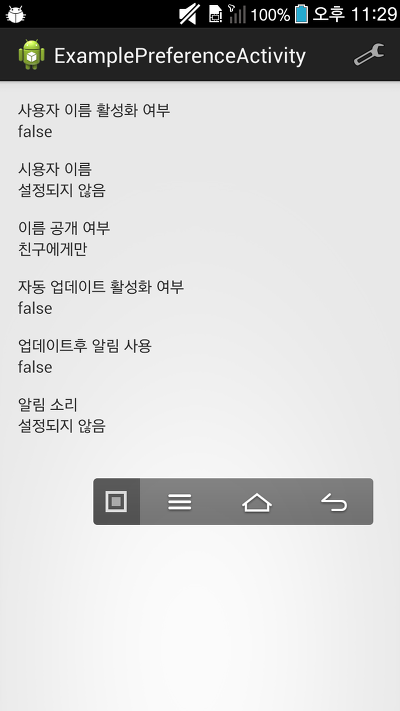
    
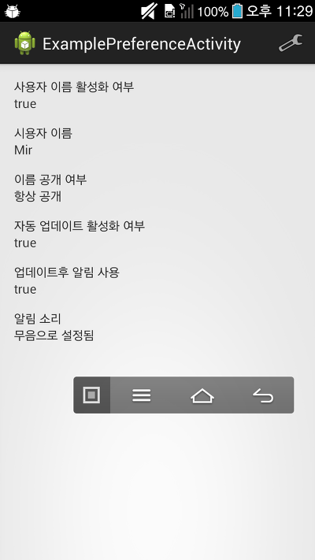

메인 액티비티에서 설정된 값을 읽어와서 TextView에 뿌려주는 모습입니다

아 매우 중요한 내용을 까먹을뻔 했네요

PreferenceActivity의 addPreferencesFromResource()는 만들어지는 xml의 이름을 지정하지 못합니다

원래는 getSharedPreferences("String name", int mode) 이걸로 사용했었는데요

PreferenceActivity에서 저장된 값은 PerferenceManager.getDefaultSharedPreferences(Context context)을 통해 가져와야 합니다

(깨알같이 전 #21강좌에 올라와 있네요 ㅋㅋ)

xml파일이 저장되는 위치는 다들 아시겠지만

/data/data/(패키지명)/shared_prefs/(패지키명)_preferences.xml

입니다

예를들면 이 예제앱은 /data/data/whdghks913.tistory.examplepreferenceactivity/shared_prefs/whdghks913.tistory.examplepreferenceactivity_preferences.xml 입니다

### 다른 액티비티는 예제앱 소스를 참고해 주세요

불러오는 방법 및 위에서 개발자 정보 할때 나온 MadeByActivity.java같은부분은 스크롤이 너무 길어져 생략하겠습니다

앞으로 글 올라오는 주기가 한달 이상 될거 같아 예제앱을 바로 올려두겠습니다

### 마치며

오늘 10시부터 작업한거 같은대 벌서 2시가 다되어 가네요

몇시간을 한건지..;

PreferenceActivity에 관한 자세한 정보가 많이 부족한거 같아 정리해 봤습니다

글이 워낙 길고 사진도 많아 한번 들어와 봤는대 데이터가 엄청 나갔다면 죄송합니다;

제가 졸린상태에서 치다보니까 오타가 많이 나올거 같아요 이해해 주세요...;

감사합니다~

### 예제소스 다운로드

[ExamplePreferenceActivity.zip](https://github.com/itmir913/archive/releases/download/itmir-attachments/ExamplePreferenceActivity.zip)

---

## 첨부파일

- [ExamplePreferenceActivity.zip](https://github.com/itmir913/archive/releases/download/itmir-attachments/ExamplePreferenceActivity.zip) `647 KB`