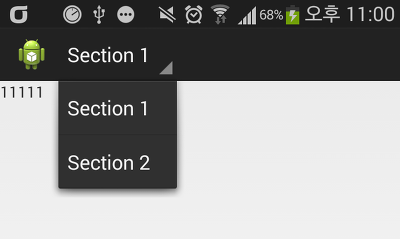
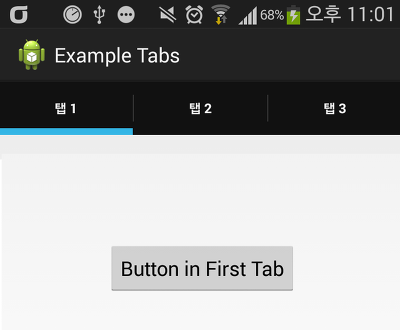
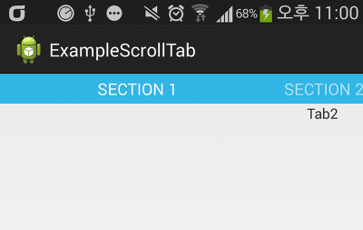

Dropdown, FixedTabs + Swipe, Scroll Tab 3개의 예제를 만들었습니다

저번에 탭관련 강좌를 쓴적이 있습니다

[[Development/App] - 안드로이드 탭을 구현해 보자, Fragment](/archive/itmir/2013/283)

이 글에서 다루지 못했던 나머지 두개의 탭까지 올려드립니다

### ExampleDropdown

[ExampleDropdown.zip](https://github.com/itmir913/archive/releases/download/itmir-attachments/ExampleDropdown.zip)

메뉴를 선택할수 있는 예제입니다

### ExampleFixedTabsSwipe

[ExampleFixedTabsSwipe.zip](https://github.com/itmir913/archive/releases/download/itmir-attachments/ExampleFixedTabsSwipe.zip)

탭이 존재하는 예제입니다

탭을 아래로 내리는 문제를 질문하셨던 분께서 계셨는대 이 탭은 저도 잘 모릅니다..

### ExampleScrollTab

[ExampleScrollTab.zip](https://github.com/itmir913/archive/releases/download/itmir-attachments/ExampleScrollTab.zip)

좌우 스크롤이 가능한 예제입니다

저기있는 파란 SECTION 1부분을 아래로 내리려면

activity\_main.xml에서

<android.support.v4.view.PagerTitleStrip>의

android:layout\_gravity="top"

를 변경해 주시면 됩니다

---

## 첨부파일

- [ExampleDropdown.zip](https://github.com/itmir913/archive/releases/download/itmir-attachments/ExampleDropdown.zip) `640 KB`
- [ExampleFixedTabsSwipe.zip](https://github.com/itmir913/archive/releases/download/itmir-attachments/ExampleFixedTabsSwipe.zip) `535 KB`
- [ExampleScrollTab.zip](https://github.com/itmir913/archive/releases/download/itmir-attachments/ExampleScrollTab.zip) `642 KB`