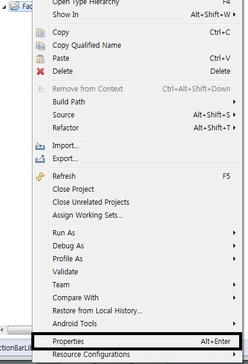
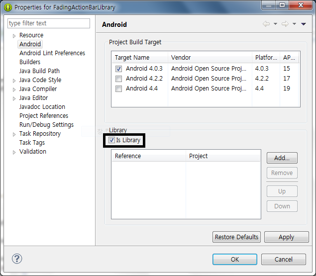
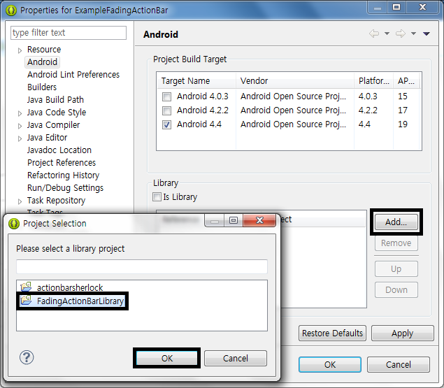
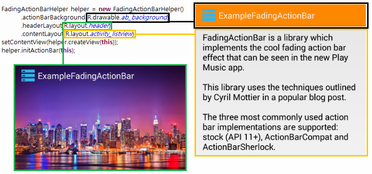
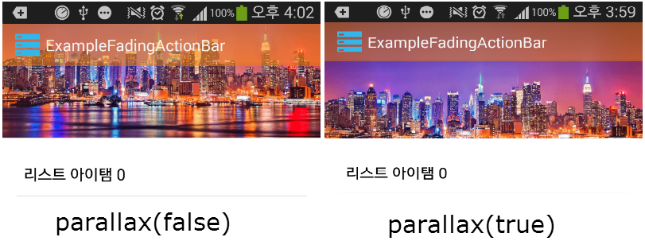
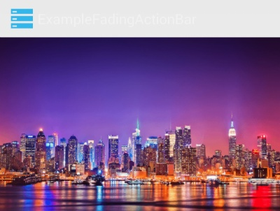

안녕하세요

오늘은 추석 전날이네요~ 모두 차 안막히고 빨리 가시기를..

그래서 오늘은 FadingActionBar에 대해 알아보겠습니다

### 구글 마켓에서 찾은 FadingActionBar

이게 뭔지 모르시는 분이 계실까봐 예시 사진을 가져왔어요

구글 Play Store의 UI가 바로 FadingActionBar입니다


    


아래로 스크롤을 내리면 액션바 부분이 불투명해집니다 이부분을 FadingActionBar으로 구현할수 있습니다

### 오픈소스 라이브러리 다운로드

FadingActionBar는 github에 소스가 올라와 있습니다

링크 접속해서 다운받아 주시거나, 아래 첨부된 파일의 압축을 풀어주세요 그다음 이클립스에서 import해주세요

https://github.com/ManuelPeinado/FadingActionBar

[FadingActionBarLibrary.zip](https://github.com/itmir913/archive/releases/download/itmir-attachments/FadingActionBarLibrary.zip)

gitbub에서 받으신경우 필수적으로 필요한 폴더는 library입니다

### 라이브러리 추가하기

FadingActionBar를 압축풀어보시면 .jar파일이 아닙니다

어떻게 라이브러리에 추가해야 할까요?

추가한 FadingActionBar 프로젝트 마우스 오른쪽 - Properties에 들어가 주세요



그다음 Library탭의 Is Library를 클릭해 주세요

이미 체크되있는경우 패스합니다



이제 FadingActionBar를 추가하고자 하는 프로젝트로 돌아온다음 위에서는 is Library를 체크했지만 지금은 Add - (추가한 프로젝트)를 클릭합니다



### 라이브러리 사용방법

github에 함께 올라와있는 samples-stock폴더를 확인해 보시면 더 자세한 사용방법을 확인해 보실수 있습니다

아래 apk파일은 samples-stock폴더를 빌드한 어플입니다

설치하신다음 살펴보시고 보시면 더 이해가 잘되실겁니다

[SampleFadingActionBar.apk](https://github.com/itmir913/archive/releases/download/itmir-attachments/SampleFadingActionBar.apk)

FadingActionBar는 FadingActionBarHelper를 이용합니다

```java
FadingActionBarHelper helper = new FadingActionBarHelper()
    .actionBarBackground(R.drawable.ab_background)
    .headerLayout(R.layout.header)
    .contentLayout(R.layout.activity_listview);
setContentView(helper.createView(this));
helper.initActionBar(this);
```

- actionBarBackground : 스크롤이 내려가면 나타날 액션바의 색상, 또는 이미지를 결정합니다
- headerLayout : 액션바의 헤더부분의 레이아웃을 설정합니다
- contentLayout : 기존 레이아웃을 설정합니다

기존에는 setContentView(R.layout.xxx)를 이용했지만 Fading을 이용하면 조금 방식이 달라진다는점을 확인해 볼수 있습니다

사진으로 비교해 보겠습니다



색을 구분하여 알아보기 쉽도록 만들었습니다

여기서 한가지 팁을 드리자면..

actionBarBackground는 리소스아이디(R.drawable.xx)를 받을수도 있고 그냥 이미지(Drawable)도 받을수 있습니다

원하는 컬러가 있는대 이미지는 없다면 ColorDrawable를 이용해 보세요

.actionBarBackground(new ColorDrawable(Color.parseColor("#ffffff")))

또한 위 코드에는 없지만 parallax(true)이라는 속성도 있습니다



이 옵션이 false라면 스크롤시 위부터 사라지지만 true라면 중앙으로 압축(?)되며 사라집니다

기본은 true입니다

이제 header.xml을 살펴보겠습니다

```xml
<?xml version="1.0" encoding="utf-8"?>
<ImageView xmlns:android="http://schemas.android.com/apk/res/android"
    android:id="@+id/image_header"
    android:layout_width="match_parent"
    android:layout_height="wrap_content"
    android:adjustViewBounds="true"
    android:scaleType="centerCrop"
    android:src="@drawable/ny" />
```

간단하게 이미지뷰만 있군요

헤더부분에 다른 뷰를 추가해도 됩니다 그런대 무슨짓을 해도 터치이벤트를 받지 못하더군요;

플레이스토어를 보면 동영상을 터치하면 유튜브로 넘어가던대 혹시 아시는분께서는 덧글 남겨주시면 감사드리겠습니다

마지막으로 contentLayout부분을 보시면 원래 레이아웃을 넣어주고 있습니다

특이하게도 리스트뷰는 android:id="@android:id/list"((ListView) findViewById(android.R.id.list);)를 사용해야 됩니다

이부분도 이유를 정확하게 알고있는 부분이 아니므로.. 아시는분께서는 덧글로 남겨주시면 감사드리겠습니다

이제 앱을 실행해 보시면 조금 이상하게 나타날겁니다



탭이랑 header부분이랑 합쳐지지 못했기 때문인대요

이를 해결하기위해 테마설정을 해주어야 합니다

style.xml에 아래 코드를 입력해 주세요

AppTheme이 중복이라고 경고가 뜨면 기존 코드는 삭제해 주세요

```xml
<style name="Widget" />
<style name="Widget.ActionBar" parent="@android:style/Widget.Holo.Light.ActionBar.Solid.Inverse" />
<style name="Widget.Light" />
<style name="Widget.Light.ActionBar" parent="@android:style/Widget.Holo.Light.ActionBar.Solid" />
<style name="Widget.ActionBar.Transparent">
    <item name="android:background">@android:color/transparent</item>
</style>
<style name="Widget.Light.ActionBar.Transparent">
    <item name="android:background">@android:color/transparent</item>
</style>

<style name="AppTheme" parent="@android:style/Theme.Holo.Light.DarkActionBar">
    <item name="android:actionBarStyle">@style/Widget.ActionBar</item>
</style>
<style name="AppTheme.TranslucentActionBar">
    <item name="android:actionBarStyle">@style/Widget.ActionBar.Transparent</item>
    <item name="android:windowActionBarOverlay">true</item>
    <item name="android:windowContentOverlay">@null</item>
</style>
<style name="AppTheme.Light.TranslucentActionBar" parent="@android:style/Theme.Holo.Light">
    <item name="android:actionBarStyle">@style/Widget.Light.ActionBar.Transparent</item>
    <item name="android:windowActionBarOverlay">true</item>
    <item name="android:windowContentOverlay">@null</item>
</style>
```

그다음 AndroidManifest.xml에 아래 코드를 넣어주세요

android:theme="@style/AppTheme.TranslucentActionBar"

android:theme="@style/AppTheme.Light.TranslucentActionBar"

두개중 하나 넣어주시면 됩니다

이제 Run해보시면 아름다운 FadingAcrionbar가 나타납니다 ㅎㅎ


### 마치며..

안드로이드 L 프리뷰 버전이 공개된후 구글에서 많은 UI수정이 있었던것 같습니다

개발자들이 풀어야 하는 숙제가 하나더 생긴거 같네요...

저는 디자인을 정말 못하므로... 공부좀 해야겠습니다

그리고 시간 될때마다 오픈소스 라이브러리 하나씩 소개하도록 할께요 ㅎ

이 글을 쓰기위해 만든 예제입니다

github예제보다 떨어지므로 다운로드를 권하지 않습니다

[ExampleFadingActionBar.zip](https://github.com/itmir913/archive/releases/download/itmir-attachments/ExampleFadingActionBar.zip)

---

## 첨부파일

- [ExampleFadingActionBar.zip](https://github.com/itmir913/archive/releases/download/itmir-attachments/ExampleFadingActionBar.zip) `809 KB`
- [FadingActionBarLibrary.zip](https://github.com/itmir913/archive/releases/download/itmir-attachments/FadingActionBarLibrary.zip) `14 KB`
- [SampleFadingActionBar.apk](https://github.com/itmir913/archive/releases/download/itmir-attachments/SampleFadingActionBar.apk) `1.9 MB`
