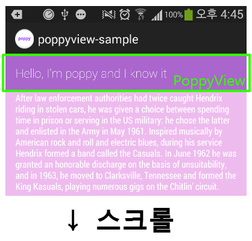

안녕하세요~

이번 포스팅에서는 PoppyView에 대해 알아볼까 합니다

잘 사용하면 정말 유용한 라이브러리 이므로 꼭 정독해 주세요~

### PoppyView란?

혹시 아래로 스크롤을 하면 사라지고, 위로 스크롤을 하면 나타나는 문구를 보신적이 계신가요?

PoppyView는 이런 작업을 매우 쉽게 구현할수 있는 라이브러리 입니다

github에 있는 샘플 프로젝트를 실행해본 스크린샷을 봐주세요


   


아래로 스크롤을 할때 PoppyView가 표시되었지만 위로 스크롤을 하면 PoppyView가 사라집니다

이것이 PoppyView입니다

### 라이브러리 다운로드

github에 공개되어 있습니다

<https://github.com/flavienlaurent/poppyview>

[poppyview-master.zip

다운로드](./file/poppyview-master.zip)

poppyview-library폴더를 import해주신다음 is Library해주세요

IsLibrary를 모르시는 분께서는 [[Development/App] - FadingActionBar를 사용해 보자 - Play Store UI](http://itmir.tistory.com/526) 글 중간부분에 설명이 나와있습니다

아래 apk파일은 샘플 프로젝트 입니다 한번 설치해서 구경해 보세요

[poppyview-sample.apk

다운로드](./file/poppyview-sample.apk)

### 라이브러리 사용하기

먼저 스크롤마다 나타나고, 사라질 View를 만들어야 합니다

이글에서는 샘플 프로젝트의 xml을 사용하겠습니다

```xml
<?xml version="1.0" encoding="utf-8"?>
<TextView xmlns:android="http://schemas.android.com/apk/res/android"
    android:layout_width="match_parent"
    android:layout_height="wrap_content"
    android:background="@drawable/selector_poppyview"
    android:clickable="true"
    android:fontFamily="sans-serif-thin"
    android:padding="15dp"
    android:text="Hello, I&apos;m poppy and I know it"
    android:textColor="@android:color/white"
    android:textSize="18sp" />
```

그냥 추가하시면 android:background="@drawable/selector\_poppyview"부분이 오류가 뜰탠대 샘플프로젝트의 @drawable까지 첨부하기엔 너무 길어지므로 패스하겠습니다

그다음 PoppyView가 필요한 java파일로 넘어와 주세요

스크롤이 가능한 스크롤뷰와 리스트뷰를 정식 지원하는것 같습니다

PoppyViewHelper mPoppyViewHelper = new PoppyViewHelper(this, PoppyViewPosition.TOP);

View poppyView = mPoppyViewHelper.createPoppyViewOnScrollView(R.id.(View의 ID), R.layout.(poppyview가 정의된 xml이름);

이렇게 두줄을 작성해 주시면 됩니다

잠시 첫번째 줄을 말씀드리면

mPoppyViewHelper = new PoppyViewHelper(this, PoppyViewPosition.TOP);

이줄에서 PoppyViewPosition.TOP은 넣어줘도 되고 없어도 됩니다

즉 mPoppyViewHelper = new PoppyViewHelper(this);도 가능합니다 (이경우 Poppyview는 아래에 존재)

또한 createPoppyViewOnListView에 onScrollListener를 걸어 줄수도 있습니다

이부분은 new AbsListView.OnScrollListener()를 사용합니다

나머지 부분은 앱 개발자분께서 자유자재로 사용해 주시면 됩니다

---

## 첨부파일

- [poppyview-master.zip](https://github.com/itmir913/archive/releases/download/itmir-attachments/poppyview-master.zip) `976 KB`
- [poppyview-sample.apk](https://github.com/itmir913/archive/releases/download/itmir-attachments/poppyview-sample.apk) `620 KB`
