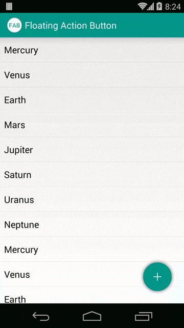
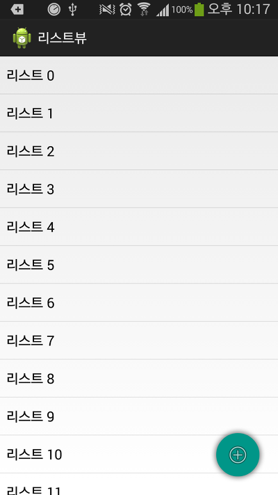
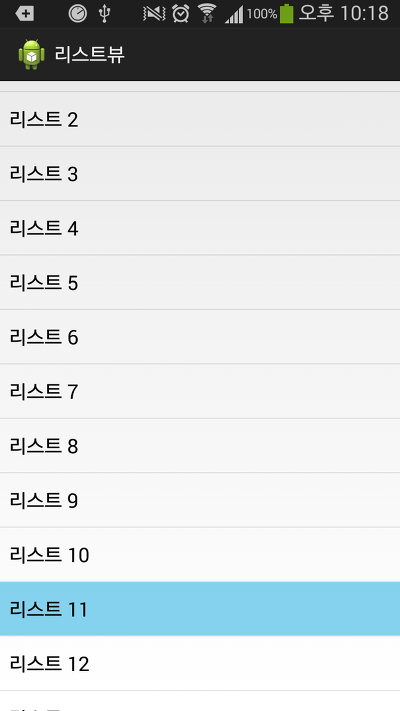
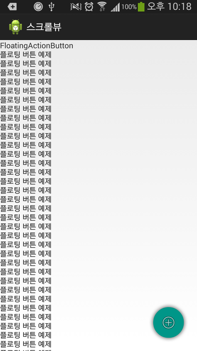
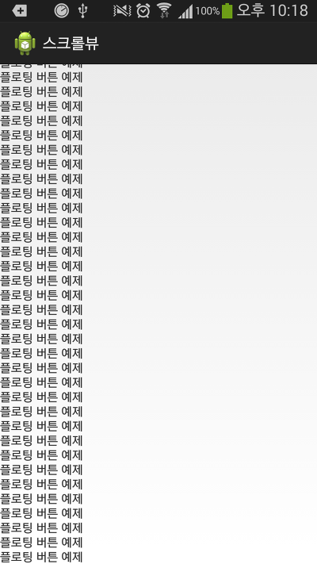

이 라이브러리를 사용하지 마시고 공개된 com.android.support.design을 사용하세요

안녕하세요

이글에서는 몇달전에 공개된 Android L의 Floating Action Button을 구현해보도록 하겠습니다

다른 프로젝트에 몇가지 소스만 넣어주면 바로 구현이 가능합니다

### Floating Action Button란?

말그대로 떠다니는 버튼입니다

(네이버에서도 이런 버튼이 생긴 업데이트가 있었는대 비슷해 보이지는 않나요는 기분탓)

아래 Demo 스크린샷을 확인해 보시면 어떤 기능인지 아실겁니다



### 시작하기전에

이 글에 사용된 FloatingActionButton은 필자가 입맛대로 수정하고 기능을 추가/개선한 버전입니다

기본 베이스는 <https://github.com/makovkastar/FloatingActionButton> 입니다

위에서 받은 베이스에 <https://github.com/FaizMalkani/FloatingActionButton> 의 일부를 참조했습니다

<http://forum.xda-developers.com/tools/programming/library-floating-action-button-android-t2804145>을 참고했습니다

기존에는 ListView만 지원했지만 제가 ScrollView까지 지원하도록 기능을 추가했습니다

그러나 ScrollView의경우 버그가 존재합니다

- 스크롤을 빠르게 위로 올리면 버튼이 사라짐

- 스크롤을 빠르게 내리면 버튼이 생김 (이 현상은 나중에 맨 아래로 내렸을때 그냥 버튼이 보이도록 수정할까도 생각중입니다, 그냥 보이는게 더 자연스러운거 같아서요)

### 라이브러리 다운로드

위에서 말씀드린대로 이글에서 사용할 FloatingActionButton은 필자가 수정한 파일입니다

아래 박스에서 라이브러리 겸 예제 프로젝트를 다운로드 해주세요

v1.0 2014-09-07

[FloatingActionButton.zip](https://github.com/itmir913/archive/releases/download/itmir-attachments/FloatingActionButton.zip)

압축을 풀으신다음 아래 목록의 파일들을 버튼을 추가하고자 하는 프로젝트에 추가하세요

- src/whdghks913/tistory/floatingactionbutton 폴더 전체

- res/drawable-(모든폴더) 속 각각의 shadow.png

- res/values/attrs.xml : <declare-styleable name="FloatingActionButton">부분

- res/values/dimens.xml : <!-- FloatingActionButton --> 아래부분

### How To Use?

FloatingActionButton은 다른 View처럼 레이아웃에 정의한다음 java소스에서 불러옵니다

추가하고자 하는 레이아웃의 xmlns:android밑에 아래 한줄을 추가하세요

xmlns:fab="http://schemas.android.com/apk/res-auto"

그다음 Button을 추가하세요

```xml
<whdghks913.tistory.floatingactionbutton.FloatingActionButton
    android:id="@+id/mFloatingActionButton"
    android:layout_width="wrap_content"
    android:layout_height="wrap_content"
    android:layout_gravity="bottom|right"
    android:layout_margin="16dp"
    android:src="@android:drawable/ic_menu_add"
    fab:fab_colorNormal="#009688"
    fab:fab_colorPressed="#26a69a" />
```

그다음 java로 넘어오신다음 코드를 작성해 주시면 됩니다

```java
ListView mListView = (ListView) findViewById(R.id.mListView);

FloatingActionButton mFloatingButton = (FloatingActionButton) findViewById(R.id.mFloatingActionButton);
mFloatingButton.attachToListView(mListView);
```

두줄추가후 프로젝트를 Run하면 리스트를 스크롤할때 나타나거나 사라집니다

이외에도 많은 설정이 가능합니다

아래의 더보기를 눌러 전체 API를 확인해 보세요

API 사용방법 열기

**필수로 설정해야 하는 코드**

- mFloatingButton.attachToListView(listView) : 스크롤에 반응할 리스트뷰를 설정합니다
- mFloatingButton.attachToScrollView(mScrollView) : 스크롤에 반응할 스크롤뷰를

위 두개는 중복 설정이 불가능 합니다

**선택적으로 설정할수 있는 코드**

- mFloatingButton.setAnimationEnable(setAnimation) : true로 설정하면 나타나고 사라지는 애니메이션이 나타나며, false는 바로 사라집니다
- mFloatingButton.setAlwaysOnTop(alwaysOnTop) : true로 설정하면 ActionButton이 항상 표시되고 false로 설정하면 스크롤시 사라집니다
- mFloatingButton.setColorNormal(color) : 기본 색을 지정합니다
- mFloatingButton.setColorNormalResId(colorResId) : 기본 색을 지정합니다, R.color.xxx를 사용하는 메소드입니다
- mFloatingButton.setColorPressed(color) : 버튼을 누를때 색을 지정합니다
- mFloatingButton.setColorPressedResId(colorResId) : 버튼을 누를때 색을 지정합니다, R.color.xxx를 사용하는 메소드입니다
- mFloatingButton.setImageResource(resId) : 버튼의 이미지를 변경합니다
- mFloatingButton.setType(type) : FloatingActionButton.TYPE\_MINI와 FloatingActionButton.TYPE\_NORMAL이 가능하며, 크기를 지정합니다, 크기는 res/dimen.xml에 정의되어 있습니다
- mFloatingButton.setShadow(shadow) : true일경우 그림자를 표시하며, false일경우 표시하지 않습니다
- mFloatingButton.setDuration(Duration) : 애니메이션의 시간이며 줄이면 애니메이션이 빨라지고 커지면 느려집니다, 기본값은 200입니다

**ActionButton을 표시하거나 숨길때 사용하는 메소드**

- mFloatingButton.hide()
- mFloatingButton.hide(animate) : true일경우 애니메이션도 표시하며, false일경우 애니메이션을 표시하지 않습니다
- mFloatingButton.show()
- mFloatingButton.show(animate) : true일경우 애니메이션도 표시하며, false일경우 애니메이션을 표시하지 않습니다

**반환하는 메소드**

- mFloatingButton.getColorNormal() : 현재 기본 색상값을 반환합니다
- mFloatingButton.getColorPressed() : 현재 선택시 색상값을 반환합니다
- mFloatingButton.getIsAnimation() : 현재 애니메이션을 표시하는지 여부를 반환합니다
- mFloatingButton.hasShadow() : 현재 그림자가 표시되는지 여부를 반환합니다

**사용할수 있는 상수**

public static final int Color\_BLUE = -13388315;

public static final int Color\_PURPLE = -5609780;

public static final int Color\_GREEN = -6697984;

public static final int Color\_ORANGE = -17613;

public static final int Color\_RED = -48060;

각각 색상값을 의미하며, FloatingActionButton.Color\_XX로 사용가능합니다

setColorNormal()등에 사용합니다

### 작동 스크린샷

스크린샷으로 작동을 확인해보도록 하겠습니다


    



    


스크롤을 하면 오른쪽 아래 버튼이 사라지고/나타나는 모습을 볼수 있습니다

그리고 스크린샷을 더 찍지는 못했지만 버튼을 클릭/Long클릭 하면 토스트 메세지가 나오는 모습도 볼수 있습니다

---

## 첨부파일

- [FloatingActionButton.zip](https://github.com/itmir913/archive/releases/download/itmir-attachments/FloatingActionButton.zip) `2.0 MB`
