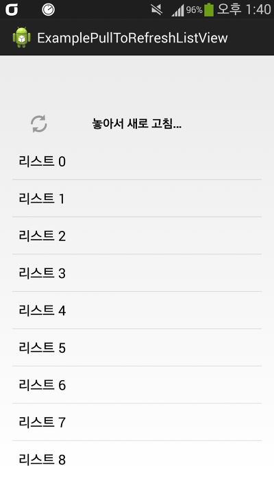
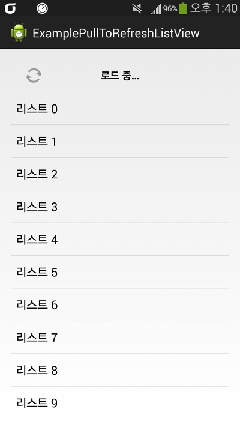
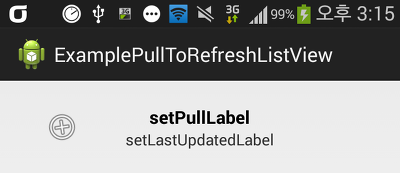
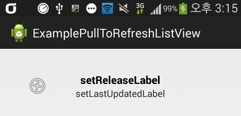

안녕하세요

이번에는 PullToRefresh에 대해 알아보겠습니다

요즘 대표적인 어플들은 리스트뷰 또는 스크롤뷰등을 위로 당기면 새로고침 되는 기능이 포함되어 있습니다

이 라이브러리를 사용해서 이 기능을 구현할수 있습니다

참고로 이 글에서 소개하는 라이브러리는 현재 지원이 중단된 Android-PullToRefresh 라이브러리 이며 같은 개발자가 공개한 ActionBar-PullToRefresh도 있습니다

ActionBar-PullToRefresh에 대해서는 다음에 기회가 있다면 살펴보겠습니다

<http://kmshack.tistory.com/397>을 살펴보면 구현방식이 달라져서 스크롤 되는 뷰와 의존적이지 않고 layout을 감싸 사용하기 때문에 커스텀 하기 더 쉬워졌습니다

여유가 되신다면 ActionBar-PullToRefresh를 사용해 주시길 바랍니다

<https://github.com/chrisbanes/ActionBar-PullToRefresh>

### 오픈소스 다운로드

다른 오픈소스 라이브러리와 마찬가지로 이 라이브러리도 github에서 다운로드가 가능합니다

<https://github.com/chrisbanes/Android-PullToRefresh>

압축풀으신다음 Android-PullToRefresh-master/library 폴더를 이클립스로 import해주세요

그뒤 import한 프로젝트를 IsLibrary 해주시면 됩니다

IsLibrary를 모르신다면 [[Development/App] - FadingActionBar를 사용해 보자 - Play Store UI](http://itmir.tistory.com/526) 글을 참고해 주세요

### 예제 프로젝트 다운로드

제가 이 글을 작성하기 전에 만들어본 예제 어플입니다

이 프로젝트에는 리스트뷰 예제만 들어있으므로 다른 그리드뷰등은 github에 공개되어 있는 샘플 프로젝트를 참고해 주세요

[ExamplePullToRefreshListView.zip

다운로드](./file/ExamplePullToRefreshListView.zip)

### 라이브러리 사용하기

먼저 xml 레이아웃에 PullToRefreshListView를 추가해야 합니다

```xml
<com.handmark.pulltorefresh.library.PullToRefreshListView
    android:id="@+id/pull_refresh_list"
    android:layout_width="fill_parent"
    android:layout_height="fill_parent"
    android:fadingEdge="none"
    android:fastScrollEnabled="false"
    android:footerDividersEnabled="false"
    android:headerDividersEnabled="false"
    android:smoothScrollbar="true" />
```

리스트뷰의 속성을 그대로 사용할수 있는것으로 보입니다

높이, 너비 밑에있는 속성들이 궁금하시면 네이버 검색으로 참고해 주시면 감사드리겠습니다

xml에서는 이렇게 작성해 주시면 끝입니다

스크롤뷰같은경우도 <ScrollView 태그 대신에 com.handmark.~.PullToRefreshScrollView일겁니다 이렇게 추가해 주시면 됩니다

이글에서는 위에서 말씀드린대로 리스트뷰만 살펴볼 예정이므로 다른 뷰의경우는 샘플 프로젝트를 참고해 주세요

.java에서 사용하는 소스도 얼마 없습니다

일반 리스트뷰처럼 id를 연결해서 사용할수도 있고, 그냥 xml만 작성하고 java에서 속성을 지정하지 않을수도 있습니다

그러나 리스트뷰의경우는 어뎁터가 필요하기 때문에 java에서의 소스가 꼭 필요합니다

```java
private PullToRefreshListView mPullRefreshListView;
private String[] items;

중략

mPullRefreshListView = (PullToRefreshListView) findViewById(R.id.pull_refresh_list);
mPullRefreshListView.setOnRefreshListener(new OnRefreshListener<ListView>() {
    @Override
    public void onRefresh(
        PullToRefreshBase<ListView> refreshView) {
            new ProcessTask().execute();=
        }
    });

items = new String[31];
for (int index = 0; index <= 30; index++) {
    items[index] = "리스트 " + index;
}
mPullRefreshListView.setAdapter(new ArrayAdapter<String>(this,
    android.R.layout.simple_list_item_1, items));

중략

public class ProcessTask extends AsyncTask<String, Integer, Long> {

    @Override
    protected void onPreExecute() {
        super.onPreExecute();
    }

    @Override
    protected Long doInBackground(String... params) {
        try {
            Thread.sleep(2000);
            Toast.makeText(getApplicationContext(), "dddd",
                    Toast.LENGTH_SHORT).show();
        } catch (Exception e) {
            return 0l;
        }
        return 1l;
    }

    @Override
    protected void onPostExecute(Long result) {
        super.onPostExecute(result);

        mPullRefreshListView.onRefreshComplete();
    }
}
```

MainActivity.java를 모두 첨부하기에는 글이 너무 길어지므로 필요없는 부분은 생략했습니다

한번 위 코드를 읽어보신다음 아래 API설명을 읽어주세요

위에서는 AsyncTask를 이용해서 새로고침을 하는척을 하고 있습니다 ㅋㅋㅋ

- mPullRefreshListView.setOnRefreshListener : 아래로 리스트뷰를 당겨 새로고침을 하게 됬을때 호출되는 리스너 입니다, 이곳에 새로고침 코드를 넣어주세요
- mPullRefreshListView.onRefreshComplete(); : 새로고침이 끝났을때 이 메소드를 호출해야 합니다

위에서 알수있는 API는 이것이 끝입니다

사실 제가 찾아본결과 설정할수 있는 값이 매우많습니다

많은 API를 살펴보기 전에 지금까지의 작동 스크린샷을 살펴보겠습니다


   


기본적으로 PullToRefresh 라이브러리 프로젝트의 string.xml에 놓아서 새로고침 / 로드 중 ... 이런 글자가 포함되어 있어 아무런 설정을 하지 않을경우 기본 글자가 나타납니다

그럼 놓아서 새로고침, 로드 중..., 왼쪽의 아이콘부터 변경해 보겠습니다

- mPullRefreshListView.getLoadingLayoutProxy() : 오버스크롤시 나타나는 로딩중 Layout을 ILoadingLayout으로 반환합니다

EX) ILoadingLayout loadingLayout = mPullRefreshListView.getLoadingLayoutProxy();

ILoadingLayout을 수정해서 아이콘, 로딩중 String을 변경할수 있습니다

- setLoadingDrawable : 아이콘을 변경합니다
- setLastUpdatedLabel : 최근 업데이트 글자를 변경합니다, 설정하지 않으면 보이지 않습니다
- setPullLabel : 조금 당길때 글자를 설정합니다, 이때는 손을 놓아도 새로고침 되지 않습니다
- setRefreshingLabel : 새로고침중일때 글자를 변경합니다
- setReleaseLabel : 많이 당길때 글자를 설정합니다, 이때 손을 놓으면 새로고침 됩니다

아래에 스크린샷을 첨부해 두겠습니다


  


getLoadingLayoutProxy()말고 deprecated된 메소드도 있어요

업데이트로 ILoadingLayout loadingLayout = mPullRefreshListView.getLoadingLayoutProxy(); 를 사용해서 글자를 변경하도록 수정되었지만

바로 설정이 가능한 메소드도 지원하고 있었습니다

@deprecated된 메소드이므로 참고만 하시고 위에서 설명드린 방법을 사용하시길 바랍니다

mPullRefreshListView.setLoadingDrawable(drawable);

mPullRefreshListView.setLoadingDrawable(drawable, mode);

mPullRefreshListView.setLastUpdatedLabel(label);

mPullRefreshListView.setPullLabel(pullLabel);

mPullRefreshListView.setPullLabel(pullLabel, mode);

mPullRefreshListView.setRefreshingLabel(refreshingLabel);

mPullRefreshListView.setRefreshingLabel(refreshingLabel, mode);

mPullRefreshListView.setReleaseLabel(releaseLabel);

mPullRefreshListView.setReleaseLabel(releaseLabel, mode);

그런대요 새로고침을 위에서만 할수 있을까요?

이 라이브러리는 잘 짜여진 라이브러리라 아래로도 가능하고 둘다 가능하게 설정할수도 있습니다

- mPullRefreshListView.setMode(mode);
- Mode.BOTH : 위 아래 둘다 사용
- Mode.PULL\_FROM\_START : 위만 사용
- Mode.PULL\_FROM\_END : 아래만 사용

마지막으로 사용가능한 다양한 API를 살펴보도록 하겠습니다

- mPullRefreshListView.setScrollingWhileRefreshingEnabled(enable); : 새로고침중에 스크롤을 허용할지 여부를 결정합니다
- mPullRefreshListView.setEmptyView(EmptyView); : 리스트 아이탬이 하나도 없을때 표시할 View를 지정합니다
- mPullRefreshListView.setOnLastItemVisibleListener(listener); : 아이탬의 맨 아래로 갔을때 호출되는 리스너를 설정합니다
- mPullRefreshListView.setOnPullEventListener(listener); : 스크롤할때 호출되는 리스너를 설정합니다
- mPullRefreshListView.setOnRefreshListener(listener); : 새로고침 리스너를 설정합니다
- mPullRefreshListView.setRefreshing(); : 새로고침 애니메이션을 표시합니다 (실제로 새로고침은 안되는듯 합니다)
- mPullRefreshListView.demo(); : 이렇게 스크롤이 가능합니다(?) 애니메이션을 표시합니다

이렇게 PullToRefresh 라이브러리에 대해 살펴보았습니다

잘 사용하면 정말 멋진 어플을 만들수 있는 라이브러리이므로 한번 살펴보시는것도 나쁘지 않은 선택입니다

---

## 첨부파일

- [ExamplePullToRefreshListView.zip](https://github.com/itmir913/archive/releases/download/itmir-attachments/ExamplePullToRefreshListView.zip) `1.5 MB`
