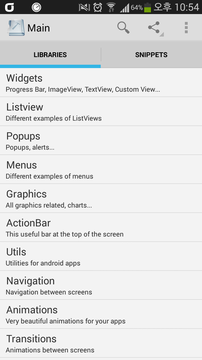
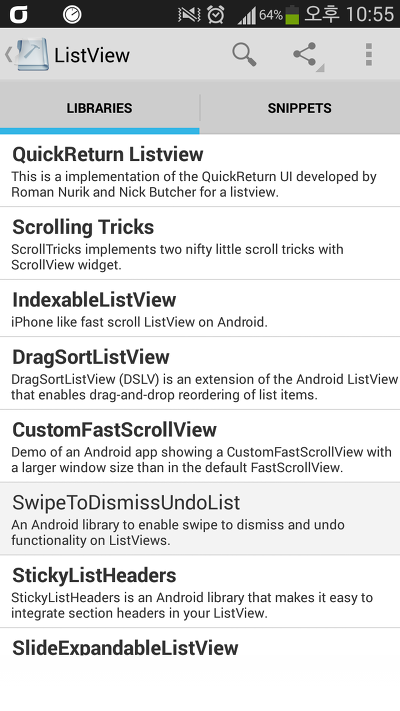
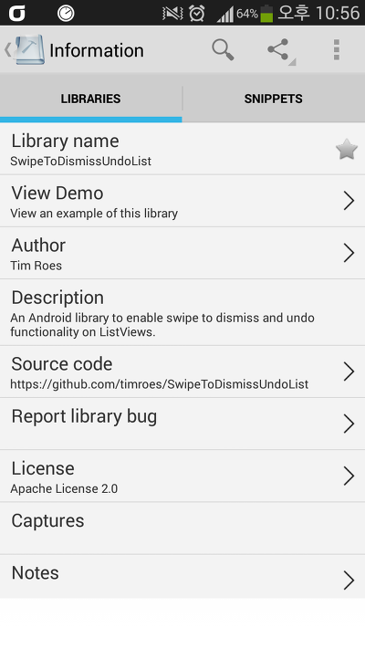
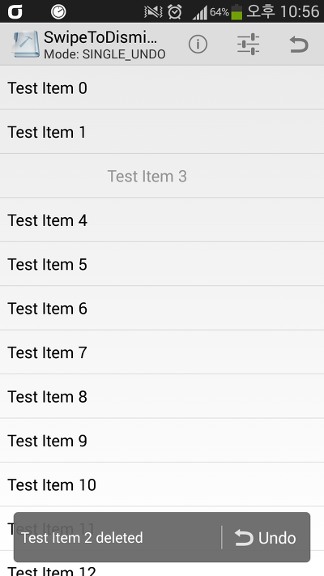
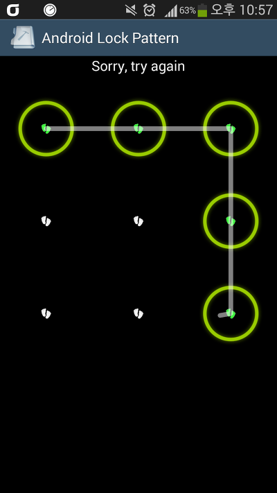
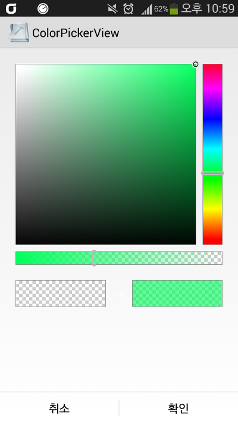
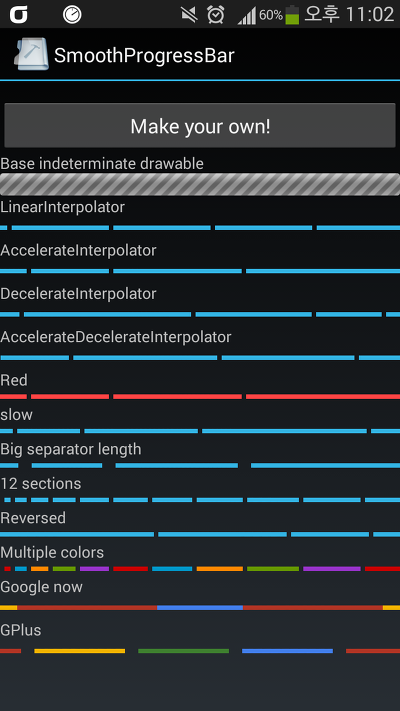
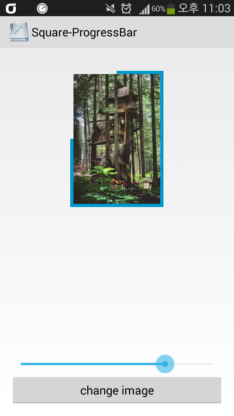

앱을 만들다 보면 더 좋은 기능과 디자인을 위해 오픈되어 있는 라이브러리를 찾아봐야 할때가 있습니다

이때 Libraries for developers라는 어플을 이용해서 라이브러리를 살펴볼수 있고, Demo도 실행해볼수 있습니다

<https://play.google.com/store/apps/details?id=com.desarrollodroide.repos>

80가지 이상의 라이브러리가 포함되어 있어 앱용량도 큽니다 ㅋㅋ

아래 더보기를 누르시면 2014-09-12 기준 앱 설명에 나와있는 포함된 오픈소스 라이브러리 목록이 나옵니다

더보기

Libraries included:

-------------------

\* "Done and Discard" by Roman Nurik

\* "ActionBarSherlock" by Jake Wharton

\* "ListViewAnimations" by nhaarman

\* "FlipImageView" by Antoine Merle

\* "PropertyAnimation" by wminiboy

\* "ChartView" by nadavfima

\* "QuickReturn Listview" by Lars Werkman

\* "Scrolling Tricks" by Roman Nurik

\* "IndexableListView" by Daniel Nam

\* "DragSortListView" by Carl A. Bauer

\* "CustomFastScrollView" by Nolan Lawson

\* "RibbonMenu" by David Scott

\* "ArcMenu" frombydaCapricorn

\* "Radial Menu Widget" by Arindam Nath

\* "MenuDrawer" by Gokhan Akkurt

\* "SimpleSideDrawer" by adamrocker

\* "Android-fb-like-slideout-navigation" by Alex Korovyansky

\* "ActionsContentView" by Steven Rudenko

\* "NewPopupMenu" frombyu1aryz

\* "UndoBar" by Liao Kai

\* "PopupDemo" by Nolan Lawson

\* "Popup Custom" by unparallellogical

\* "PopupwindowDemo" by MichaelYe

\* "NewQuickAction" by Lorensius W. L. T

\* "Android Custom Tabs" by Lawrence D'Oliveiro

\* "Jazzy ViewPager" by Jeremy Feinstein

\* "Android-flip" by OpenAphid-Engine

\* "Android Lock Pattern" by Hai Bison

\* "Swipe-To-Dismiss" by Roman Nurik

\* "Android-Validator" by Benjamin Besse

\* "Universal-Image-Loader" by Gokhan Akkurt

\* "PinEntry" by webile-android

\* "UrlImageViewHelper" by Koushik Dutta

\* "ParallaxScrollView" by Christopher Jenkins

\* "LazyList" by Fedor Vlasov

\* "HoloCircularProgressBar" by passsy

\* "TimesSquare" by Square

\* "RoundedImage" by makeramen

\* "IconicTextView" by Artur Termenji

\* "AutoScaleTextView" by Andreas Krings

\* "PinProgress" by Roman Nurik

\* "Wheel widget" by Alessandro Crugnola

\* "View Badger" by Jeff Gilfelt

\* "PagerSlidingTabStrip" by Andreas Stutz

\* "SlideMenu" by TangKe

\* "Android-ProgressFragment" by Evgeny Shishkin

\* "GlowPadView" by nadavfima

\* "HoloColorPicker" by Lars Werkman

\* "TabCarouselLib" by Andrew Neal

\* "StickyListHeaders" by Emil Sjolander

\* "AndroidSideMenu" by Dmitry Zaitsev

\* "PhotoView" by Chris Banes

\* "SlideExpandableListView" by Tjerk Wolterink

\* "aFileChooser" by Paul Burke

\* "PinnedSectionListView" by Sergej Shafarenka

\* "PinnedHeaderListView" by mldeng

\* "SugaredListAnimations" by cuub

\* "JazzyListView" by Two Toasters

\* "TwoWayGridView" by Jess Anders

\* "AnyTextView" by Hans Petter Eide

\* "Crouton" by Benjamin Weiss

- "RoboDemo" by stephanenicolas

- "PullToRefresh" by Chris Banes

- "Android Form EditText" by Andrea Baccega

- "Hansel and Gretel" by Jake Wharton

- "NumericPageIndicator" by Manuel Peinado

- "RichEditText" by Mark Murphy

- "RefreshActionItem" by Manuel Peinado

- "colorPicker" by biboune

- "HoloGraphLibrary" by Daniel Nadeau

- "MessageBar" by Simon Vig

- "Square-ProgressBar" by Ted Halcyon

- "Showcase View" (Utils) by mhama.

- "Progress Wheel" by Todd Davies

- "colorPicker" by Daniel Nilsson

- "StyledDialogs for Android" by Inmite s.r.o.

- "FadingActionBar" by Manuel Peinado

- "PinterestListView" by oasis2008

- "PanesLibrary" by Mapsaurus

- "ATableView" by Diego Acosta

- "Satellite Menu" by Siyamed SINIR

- "GlassActionBar" (ActionBar) by Manuel Peinado

- "xButton" (Widgets) by WenDong

... and more

### 메인 화면 & 라이브러리 선택화면

아래는 앱을 실행하면 나오는 메인 화면과 라이브러리 선택 화면입니다

   

생각보다 오픈소스 라이브러리가 많더라고요

이글을 조금만 더 내리시면 제가 본 오픈소스 라이브러리중 인상깊은 Demo 스크린샷을 확인할 있습니다

라이브러리의 Demo를 선택할수도 있고 오픈소스 사이트에 접속할수도 있습니다

### 인상깊었던 오픈소스 라이브러리

아래는 제가 인상깊었던 오픈소스 입니다

   

   

신기한 소스들이 많이 있더라고요

그중에는 진짜 필요한 소스도 많았습니다

시간내서 꼭 사용해봐야 겠습니다

이 앱은 http://basicit.tistory.com/16 글을 보고 알게되었습니다
