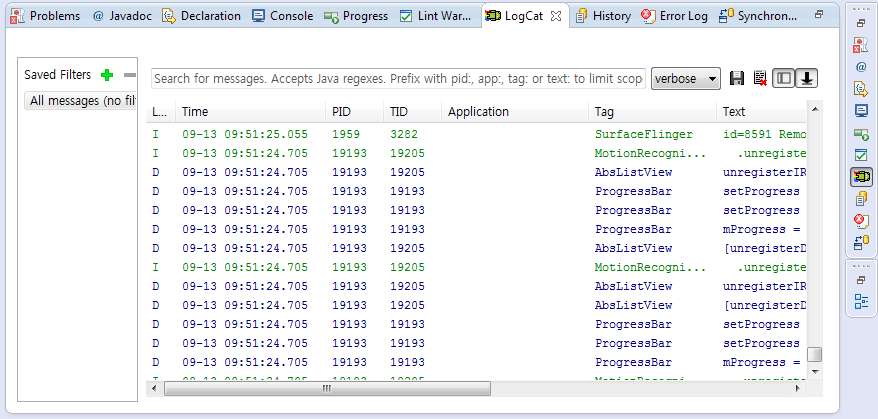
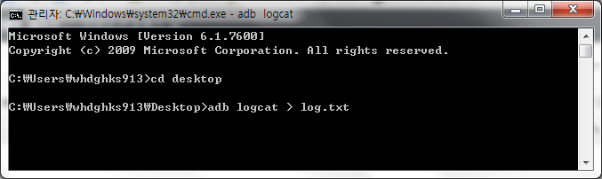
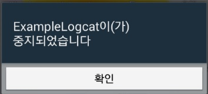
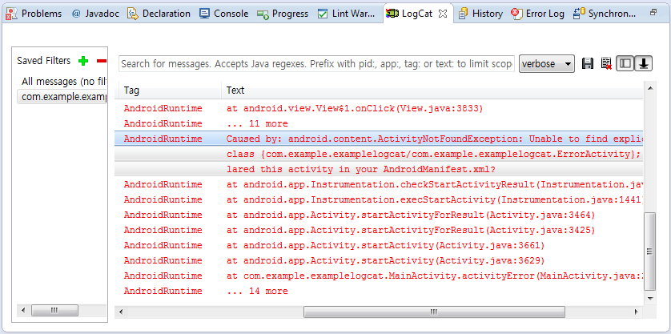
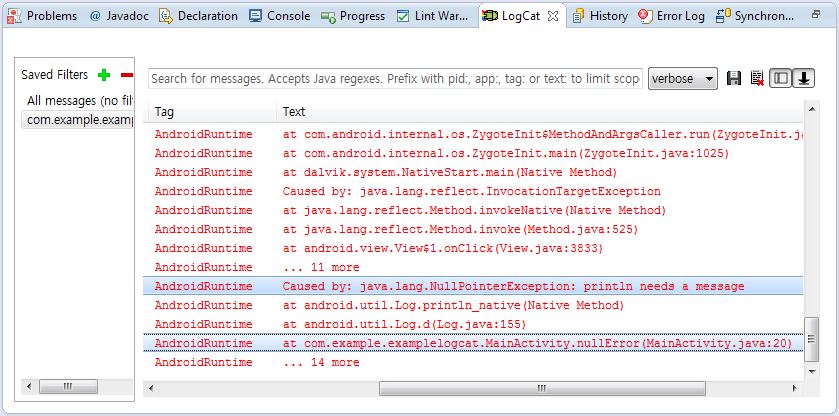

---
title: "Logcat(로그켓)에 대한 모든 것"
date: "2014-09-13T10:22:57+09:00"
category: "SmartPhone/Android"
tags: []
description: "어플 개발자가 되기 위해서는 몇가지 정보를 알고 있어야 훌륭한 어플을 만들수 있습니다"
draft: false
original_url: "https://itmir.tistory.com/532"
---

어플 개발자가 되기 위해서는 몇가지 정보를 알고 있어야 훌륭한 어플을 만들수 있습니다

그중 필수적으로 알고 있어야 하는 정보가 바로 로그켓 입니다

이 로그켓을 이용해서 디버깅 하고 오류를 추적하므로 앱 개발자가 가장 자주 보는 화면이 바로 로그켓 화면인대요

지금부터 이 Logcat에 대해 알아보겠습니다

### Logcat이란?

로그켓은 안드로이드의 디버깅에 사용되는 방법입니다

일반 C나 자바에서는 printf();나 System.out.println();등을 사용하는대 이것과 마찬가지로 정보를 출력해 주는 역할을 합니다

다만 전자는 console창에, logcat은 Logcat창에 뜨는겁니다

안드로이드 앱 개발자의 영원한 친구입니다 로크겟은

꼭 알아두세요

### 이클립스와 cmd에서 로그켓 확인방법

로그켓은 이클립스와 cmd창에서 adb를 이용해서 얻을수 있습니다

아래 스크린샷은 이클립스에 있는 LogCat 화면 입니다



위 화면은 필터를 사용하지 않아서 모든 앱이 내보내는 로그가 표시됩니다

어마어마한 길이입니다 ㅋㅋ

cmd에서도 얻을수 있는대요

adb라는 프로그램이 필요합니다

adb에 대해서와 다운로드는 아래 링크에서 얻을수 있습니다

[[SmartPhone] - 안드로이드의 LOG을 확인하자 - adb logcat / LogcatFilter.exe](/archive/itmir/2013/61)

```
adb logcat
```

이런 명령어를 입력하면 로크켓이 cmd창에 나타납니다

이를 txt파일에 저장하려면 >를 이용해서 가능합니다

```
adb logcat > log.txt
```

아래는 스크린샷 입니다



바탕화면의 log.txt라는 파일에 로그켓이 저장됩니다

### 어플의 오류를 추척하는 Logcat(로그켓)

위에서 로그켓으로 앱을 디버깅 할수 있다 했습니다

이떻게 가능한가..?

어플이 강제종료가 되게 되면 알림이 나타납니다



이때 왜 강제종료가 일어났는지에 대해 AndroidRuntime이 그 원인을 로그켓에 표시합니다

이클립스를 통해 확인한 강제종료 원인입니다



이 오류는 startActivity()사용할때 새로운 액티비티를 AndroidManifest.xml에 등록하지 않아서 생긴 문제입니다



요건 null이 떠서 생긴 문제입니다

이렇게 java파일의 어느부분에서 오류가 뜨는지, 그 원인은 무엇인지도 알수 있습니다

adb logcat > log.txt로 저장하면 어떻게 뜨는지 봅시다

```
E/AndroidRuntime(26805): FATAL EXCEPTION: main

E/AndroidRuntime(26805): java.lang.IllegalStateException: Could not execute method of the activity

E/AndroidRuntime(26805): at android.view.View$1.onClick(View.java:3838)

E/AndroidRuntime(26805): at android.view.View.performClick(View.java:4475)

E/AndroidRuntime(26805): at android.view.View$PerformClick.run(View.java:18786)

E/AndroidRuntime(26805): at android.os.Handler.handleCallback(Handler.java:730)

E/AndroidRuntime(26805): at android.os.Handler.dispatchMessage(Handler.java:92)

E/AndroidRuntime(26805): at android.os.Looper.loop(Looper.java:176)

E/AndroidRuntime(26805): at android.app.ActivityThread.main(ActivityThread.java:5455)

E/AndroidRuntime(26805): at java.lang.reflect.Method.invokeNative(Native Method)

E/AndroidRuntime(26805): at java.lang.reflect.Method.invoke(Method.java:525)

E/AndroidRuntime(26805): at com.android.internal.os.ZygoteInit$MethodAndArgsCaller.run(ZygoteInit.java:1209)

E/AndroidRuntime(26805): at com.android.internal.os.ZygoteInit.main(ZygoteInit.java:1025)

E/AndroidRuntime(26805): at dalvik.system.NativeStart.main(Native Method)

E/AndroidRuntime(26805): Caused by: java.lang.reflect.InvocationTargetException

E/AndroidRuntime(26805): at java.lang.reflect.Method.invokeNative(Native Method)

E/AndroidRuntime(26805): at java.lang.reflect.Method.invoke(Method.java:525)

E/AndroidRuntime(26805): at android.view.View$1.onClick(View.java:3833)

E/AndroidRuntime(26805): ... 11 more

E/AndroidRuntime(26805): Caused by: android.content.ActivityNotFoundException: Unable to find explicit activity class {com.example.examplelogcat/com.example.examplelogcat.ErrorActivity}; have you declared this activity in your AndroidManifest.xml?

E/AndroidRuntime(26805): at android.app.Instrumentation.checkStartActivityResult(Instrumentation.java:1645)

E/AndroidRuntime(26805): at android.app.Instrumentation.execStartActivity(Instrumentation.java:1441)

E/AndroidRuntime(26805): at android.app.Activity.startActivityForResult(Activity.java:3464)

E/AndroidRuntime(26805): at android.app.Activity.startActivityForResult(Activity.java:3425)

E/AndroidRuntime(26805): at android.app.Activity.startActivity(Activity.java:3661)

E/AndroidRuntime(26805): at android.app.Activity.startActivity(Activity.java:3629)

E/AndroidRuntime(26805): at com.example.examplelogcat.MainActivity.activityError(MainActivity.java:24)

E/AndroidRuntime(26805): ... 14 more

E/AndroidRuntime(26330): FATAL EXCEPTION: main

E/AndroidRuntime(26330): java.lang.IllegalStateException: Could not execute method of the activity

E/AndroidRuntime(26330): at android.view.View$1.onClick(View.java:3838)

E/AndroidRuntime(26330): at android.view.View.performClick(View.java:4475)

E/AndroidRuntime(26330): at android.view.View$PerformClick.run(View.java:18786)

E/AndroidRuntime(26330): at android.os.Handler.handleCallback(Handler.java:730)

E/AndroidRuntime(26330): at android.os.Handler.dispatchMessage(Handler.java:92)

E/AndroidRuntime(26330): at android.os.Looper.loop(Looper.java:176)

E/AndroidRuntime(26330): at android.app.ActivityThread.main(ActivityThread.java:5455)

E/AndroidRuntime(26330): at java.lang.reflect.Method.invokeNative(Native Method)

E/AndroidRuntime(26330): at java.lang.reflect.Method.invoke(Method.java:525)

E/AndroidRuntime(26330): at com.android.internal.os.ZygoteInit$MethodAndArgsCaller.run(ZygoteInit.java:1209)

E/AndroidRuntime(26330): at com.android.internal.os.ZygoteInit.main(ZygoteInit.java:1025)

E/AndroidRuntime(26330): at dalvik.system.NativeStart.main(Native Method)

E/AndroidRuntime(26330): Caused by: java.lang.reflect.InvocationTargetException

E/AndroidRuntime(26330): at java.lang.reflect.Method.invokeNative(Native Method)

E/AndroidRuntime(26330): at java.lang.reflect.Method.invoke(Method.java:525)

E/AndroidRuntime(26330): at android.view.View$1.onClick(View.java:3833)

E/AndroidRuntime(26330): ... 11 more

E/AndroidRuntime(26330): Caused by: java.lang.NullPointerException: println needs a message

E/AndroidRuntime(26330): at android.util.Log.println_native(Native Method)

E/AndroidRuntime(26330): at android.util.Log.d(Log.java:155)

E/AndroidRuntime(26330): at com.example.examplelogcat.MainActivity.nullError(MainActivity.java:20)

E/AndroidRuntime(26330): ... 14 more
```

이클립스와 비슷한 모양을 하고 있고, 원인을 알수 있습니다

어플이 강제종료 오류가 떴을떄 E/AndroidRuntime부분의 로그켓을 확인한다면 원인과 위치를 알수 있고 해결방법을 검색해서 찾을수 있습니다

정말 유용한 디버그입니다 꼭 숙지해 주세요