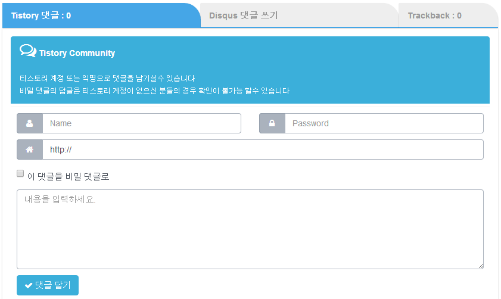
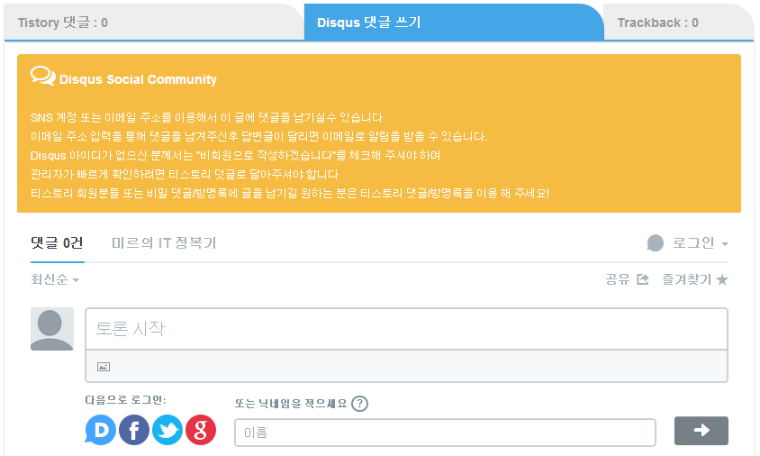
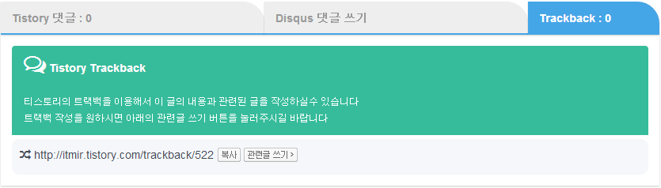

전에 눈 여겨 보았던 기능이 하나 있는데요.

어떤 티스토리 블로그에서 티스토리 댓글과 디스커스 댓글을 탭으로 구현하셨더라고요.

그래서 저도 적용하고 싶어서 찾아봤는데 안되서...

포기하고 버튼을 만들어 적용했었습니다.

관련 글: [[Tistory] - 소셜 댓글 서비스 디스커스(Disqus)를 추가했습니다](http://itmir.tistory.com/509)

그런대!! 오늘 원본 블로그를 발견해서 저도 제 블로그에 탭을 적용할 수 있었습니다.

지금 보니 그 블로그 주인분께서도 저와 같은 fastboot 스킨을 쓰시는거 같더군요. ㅋㅋ

원본 블로그는 <http://nubiz.tistory.com/499>입니다.

<http://nubiz.tistory.com/442>도 참고해 주세요.

스크린샷을 확인해 보세요~

티스토리 댓글입니다.

아래는 디스커스 댓글입니다.

디스커스는 탭을 클릭하면 로딩이 됩니다.

<http://nubiz.tistory.com/442>글을 참고해서 스크립트를 사용해서 탭을 클릭할때 로딩되도록 구성했습니다.

마지막으로 트랙백입니다.

저번에도 적용했던 안내 문구도 버리지않고 추가했습니다~

그리고 모바일에서 고정 탭을 부활시키고, 알파 값도 추가해서 반투명으로 설정했습니다.

블로그가 더 깔끔해진 거 같네요. ㅋㅋ
