드디어 갤럭시 S3의 킷켓 업데이트가 이루어 졌습니다!

몇달동안 기다린건지 모르겠습니다 ㅋㅋ

SK KT LG 3통신사 모두 동시배포이고, OTA로 업데이트 되지 않고 삼성 키스에 연결하면 업데이트가 뜹니다

배터리가 50% 이상이어야만 업데이트 가능하니 참고해 주세요

삼성 Kies에 S3를 연결하면 펌웨어 업그레이드 창이 뜹니다

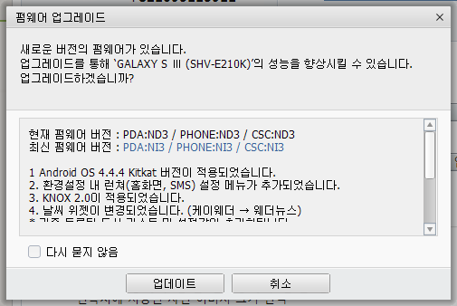

안드로이드 버전은 4.4.4 K입니다

그리고 Knox 2.0이 적용되었다고 나와있는대 이거 좋습니다 아래에서 다시 언급해보겠습니다

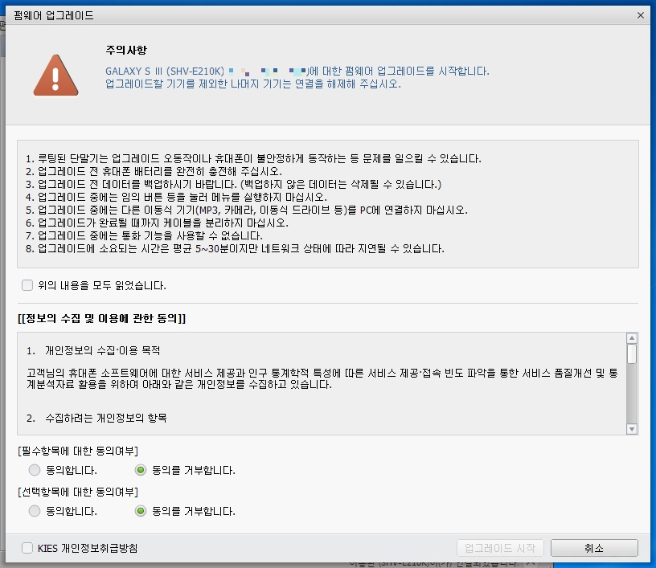

저는 필수 항목은 동의하지만 선택의 경우는 거부하는 습관이 있어서..ㅋㅋ

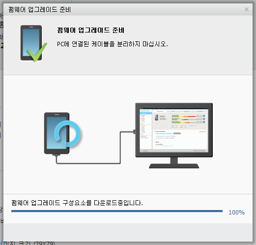

먼저 펌웨어 파일을 다운로드 한다음 유효성 검사후...

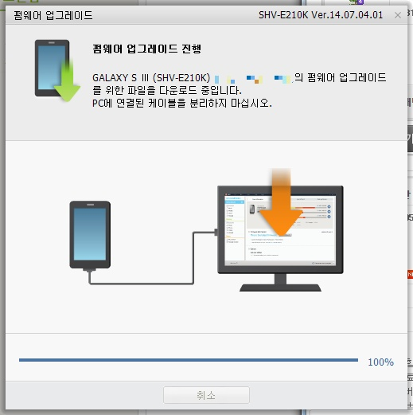

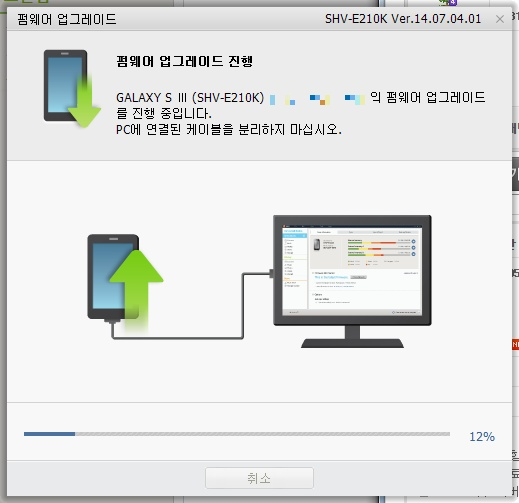

위 화면이 뜨면 폰 화면에 업데이트 화면이 뜹니다

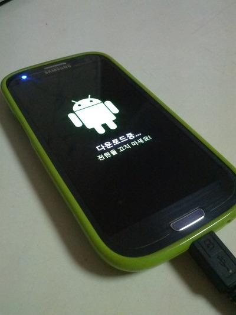

다운로드 중...

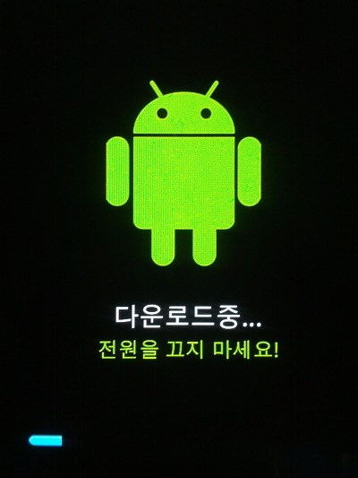

저 퍼센트가 다 차면 리커버리로 진입되고... 그다음 끝납니다

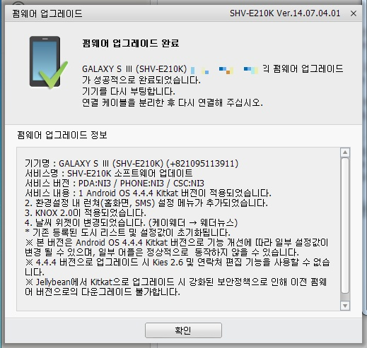

업데이트 완료!

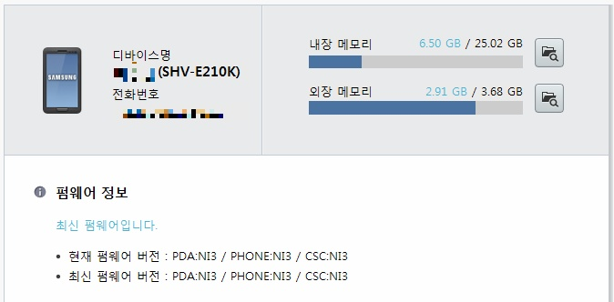

최신 펌웨어 랍니다

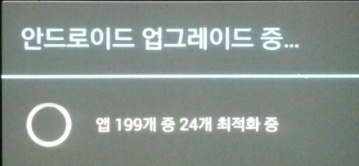

안드로이드 OS가 변경되면 항상 하는 달빅캐쉬 생성작업...

S3가 KK먹으면서 달라진점은 딱히 찾기 힘들더라고요 UI적으로는..

가장 달라진건 녹스입니다

저는 녹스 2.0 마음에 듭니다

시스탬에 내장되어 있는지 인터넷에서 파일을 다운하는 과정이 없었습니다

그리고 패턴도 생겼습니다

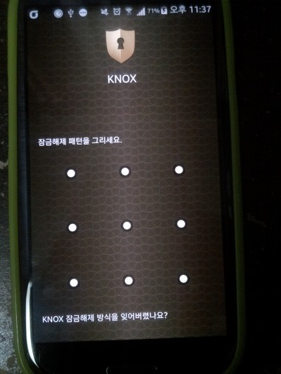
    
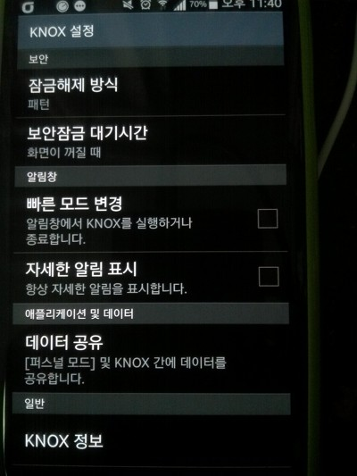

패턴, Pin, 비밀번호를 선택할수 있습니다

그다음 녹스에서 사용가능한 앱이 늘어났습니다

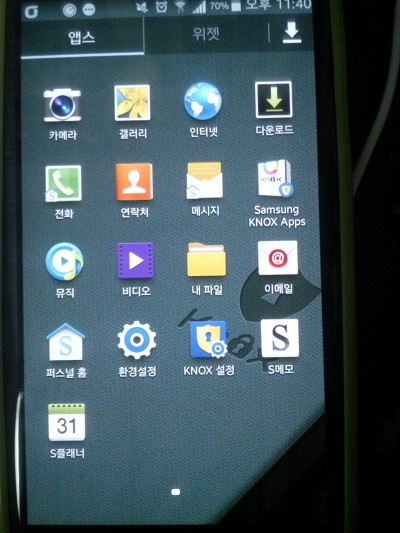

음악, 비티오, 전화, 메시지가 생겼는대요

저기있는 전화랑 메세지는 녹스/일반으로 완벽 구분되지 않는것 같습니다

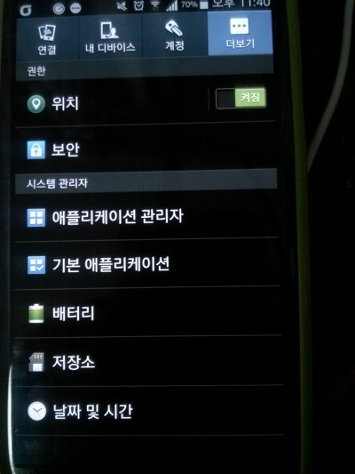

녹스안에 또 환경설정이 존재합니다

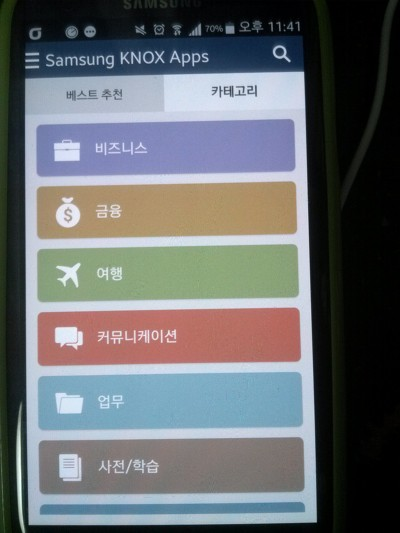

녹스 지원앱이 많아졌습니다

저번 녹스는 앱이 없어서 무용지물이었는대 지금은 좋습니다 ㅎㅎ

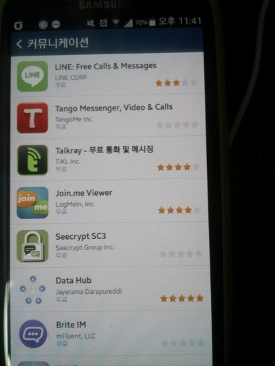

라인도 녹스에서 설치할수 있습니다

이렇게 S3 KK 업데이트에 대해 알아봤습니다

ㅠㅠ S3의 수명도 이제 끝인가요??;
