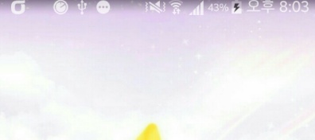
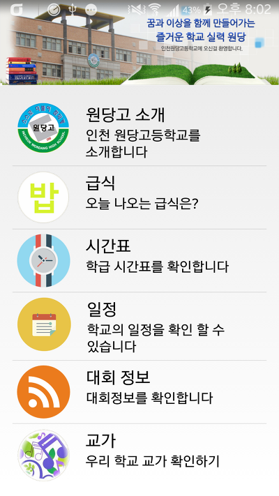
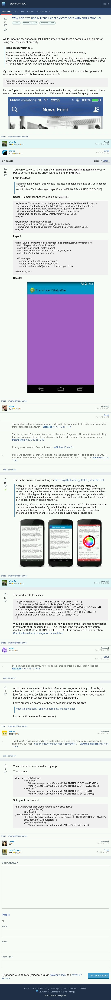

KitKat에서 어플안에서 상단바 투명 기능을 지원하게 되었습니다

그래서 어플 마다 상단바 색을 투명으로 바꿀수 있는대요

아직 많이 알려지지 않아서 저도 잘 몰랐습니다;;

기본적으로는 전에 알려드린 FadingActionBar랑 비슷합니다

[[Development/App] - FadingActionBar를 사용해 보자 - Play Store UI](http://itmir.tistory.com/526)

차이점은 이 방법은 StatusBar의 색이 투명으로 되는것이고 ActionBar는 액션바 자체에서 적용하는겁니다

처음 S3업데이트시 논란이된 터치위즈 상단바 투명화를 준비했어요

이렇게 투명하게 만들수 있습니다

아래 스샷은 제 학교앱에 적용한다음 스크린샷을 찍었습니다

상단바 부분과 액티비티 부분이 합쳐져서 나옵니다

참고로 킷켓에서만 사용가능합니다

Theme\_Holo\_Light\_NoActionBar\_TranslucentDecor

AndroidManifest.xml이나 values/style.xml등에서 적용해주시면 되는대요

위 Holo\_Light가 아니더라도 TranslucentDecor가 있는것을 선택하시면 됩니다

xml에서는 @android:style/Theme.Holo.Light.NoActionBar.TranslucentDecor

java에서는 setTheme(android.R.style.Theme\_Holo\_Light\_NoActionBar\_TranslucentDecor)

이렇게 적용해 주시면 될듯합니다

참고로 setTheme은 setContentView()전에 실행되어야 하는 코드입니다

+ 2014.10.27 추가

베이직 스터더님 사랑해요 ★★

http://stackoverflow.com/questions/19746943/why-cant-we-use-a-translucent-system-bars-with-and-actionbar

액션바를 사용하면서, 상단바를 투명화 시키는 제가 원하는 방법을 알려주셨습니다~~

링크가 삭제되었을경우

