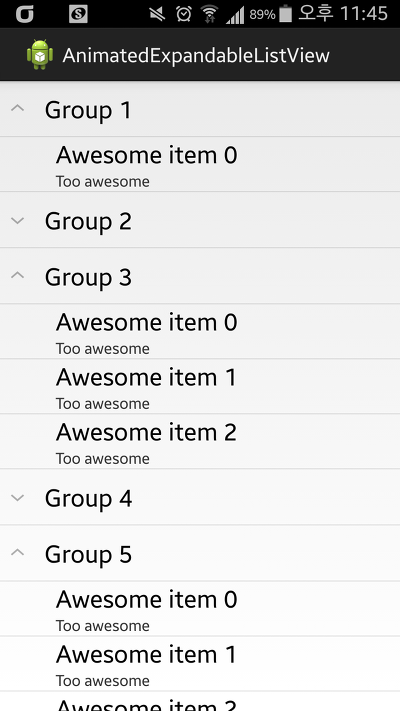

다양한 리스트뷰 라이브러리를 검색하다 AnimatedExpandableListView라는 라이브러리를 발견했습니다

기본적으로 ExpandableListView를 상속해서 구현되어 있는듯 보이며 애니메이션 효과가 포함되어 있습니다

> <https://github.com/idunnololz/AnimatedExpandableListView>

github의 예제(라고 하고 라이브러리 소스라고 함)를 보시면 아시겠지만

GroupView와 ChildView로 나눠져있는대요

예제 소스에는 GroupView를 생성하는 for문안에 ChildView를 생성하는 for가 이중으로 겹쳐 있습니다

어렵지 않은 구조이니 적용하시는대 무리가 없으실거라 생각됩니다

한가지 버그가 있다면.. 가끔 애니메이션이 씹히네요;

이부분이 가끔이긴 해도 너무 부자연스러워서 저는 아에 애니메이션을 제거해 버렸습니다(그럼 이 라이브러리를 쓰는 이유가 ㅋㅋ)

다른 신기한것도 써봐야 겠어요
