약 10월 5일부터 (각주: http://cafe.naver.com/develoid/462494 글을 참고해 주세요) 만들고 있던 어플입니다 ㅋㅋ

오늘까지 보름정도 지났는대 많이 달라진것도 있지만 변화가 눈에 띄지 않네요 ㅠㅠ

제가 6개월 전부터 구상"만" 하고 있던 어플이 뭐냐면..

배터리 구루처럼 사용자의 학습을 학습하고 그 정보를 바탕으로 원하는 동작을 실행해주는 앱이었습니다

이게 좀처럼 어렵더라고요.............

이번 시험기간에 필받아서 조금 구현했습니다

아래 스크린샷은 초기 도움말과 메인 화면 입니다

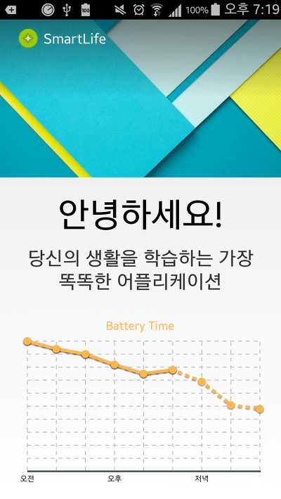
   
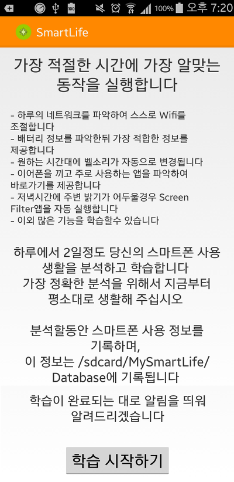

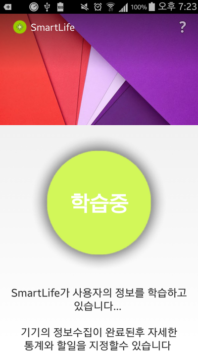

이 화면은 학습이 끝나면 안뜨도록 설정하려고요

유저가 폰을 사용하면, 그 행동을 DB에 기록합니다

아래는 그 기록의 일부입니다

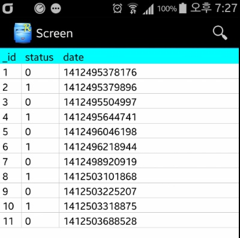
    
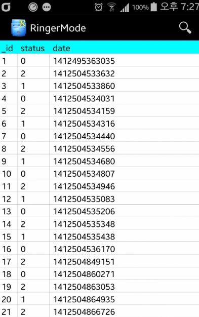

저 0, 1, 2는 저도 잘 몰라요 ㅋㅋ 코드와 대조해 봐야 합니다 ㅋㅋ

여기까지는 저번 <http://cafe.naver.com/develoid/462494> 글에 풀었던 스크린샷입니다 ㅎㅎ

지금부터 주말동안에 무슨 뻘짓을 했는지 보여드릴께요

모니터링한 정보를 입력하려면 일단 프로필(언제 실행할지)과 작업(무엇을 실행할지)이 정해져야 한다고 생각해서

이부분을 구현해봤습니다

물론 전부구현한건 아니고 극히 일부분이죠...

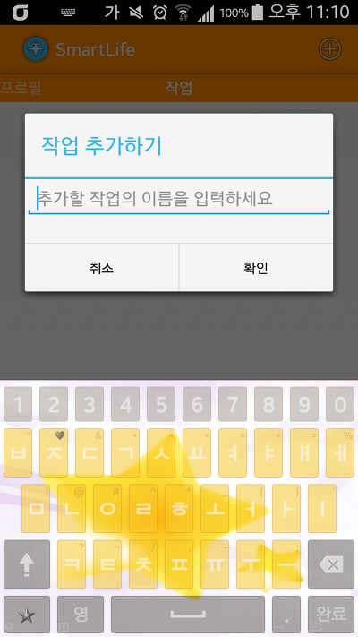
    
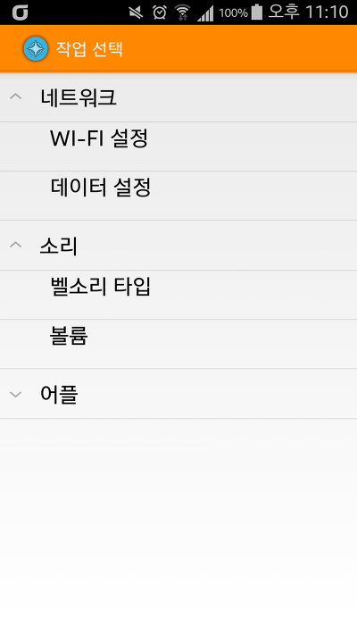

액션바의 +를 누르면 이름 입력이 뜨고, 거기서 또 +를 누르면 오른쪽(또는 아래)사진이 뜹니다

작업을 선택하면... 자세한 설정이 가능해요

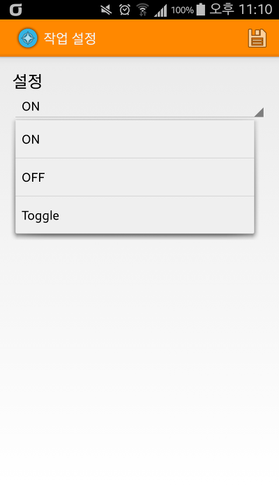
    
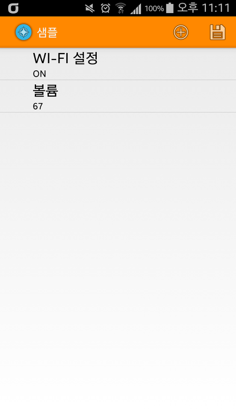

여러개의 작업을 추가하고 저장하면 DB에 기록되는거죠

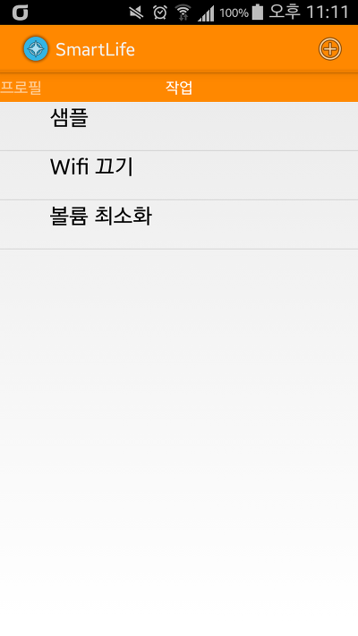

아; 여기까지 구현하는대 2틀걸렸네요 ㅋㅋ;;

만들면서 테스커 앱 개발자가 정말 존경스러웠고.. 열받아서 프로젝트 지워버릴까 하는 생각도 들었습니다

그래도 10% 구현한게 어디예요 ㅋㅋ

장기 프로젝트로 가봐야 겠어요

마지막으로 아래 스샷은 한번도 안풀었던 설정 스샷이예요

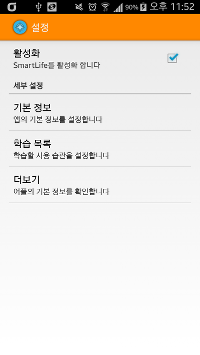

언제 완성될지.. 완성은 될지도 모르겠지만 ㅋㅋ

언젠가는 되겠죠??

긴글 읽어주셔서 감사합니다
