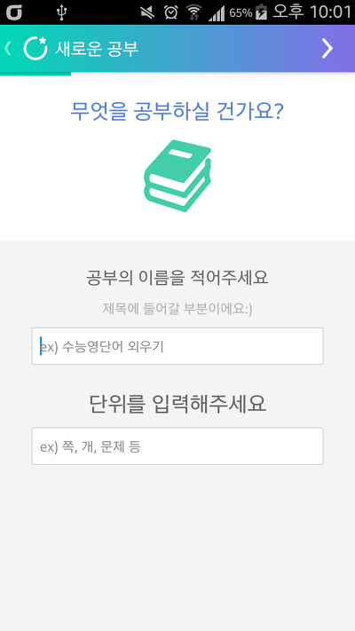
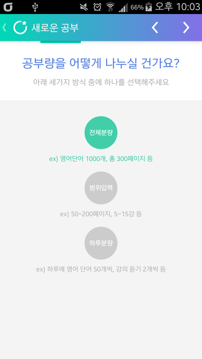
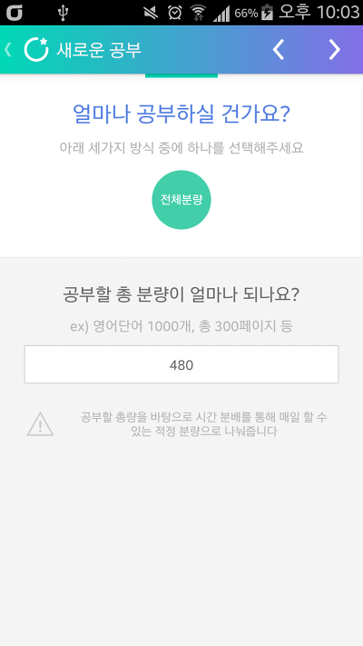
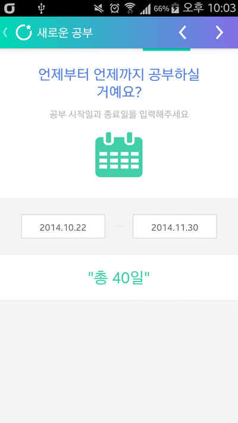
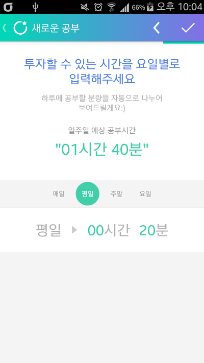
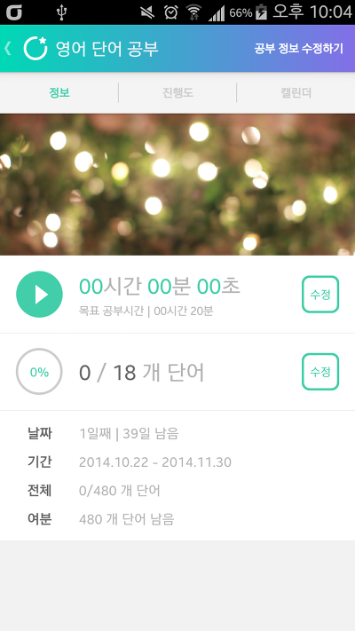
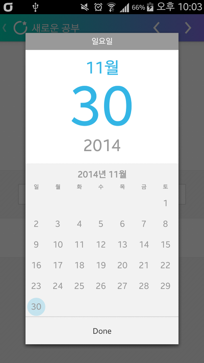

저번에 공부 관련 어플로 스터디 체커에 대해 포스팅한적이 있는데요

마켓에서 더 많은 어플을 살펴보다 Todait 이라는 어플을 발견해서 사용해보려 합니다

사실 스터디 체커같은경우 아직 업데이트가 이루어 지지 않았지만 그냥 시간 체커기능만 있는것 같거든요

뭔가 체계적으로 공부하고 싶은대 그걸 위해서는 직접 제가 짜야되니 짜는대 소요되는 시간도 많이 낭비되더라고요

그런대 이 투데잇은 하루의 공부량을 자동으로 계산해준다고 합니다 ㅎㅎ

이번 영어시험이 정말 와.. 대박이었는데요

지금부터 노력한다면 기말때는 잘할수 있을거예요 ㅎㅎ...

(사실 앱만들고 블로그 관리하는 노력의 반만 해도 잘할탠대 말이예요 ㅋㅋㅋㅋㅋ)

그래서 영단어 외울려고 공부 추가해 봤어요

   

무엇을 어떻게 공부할건지 정할수 있어서 좋네요 ㅎㅎ

   

11월 30일까지 480개의 단어를 암기해보려고요

   

학습 시간까지 입력하면 오늘의 목표량과 학습 시간까지 모두 나타납니다 ㅎㅎ

스터디체커를 돈주고 사서 조금 배아픈대.. 체커 개발자분께 죄송하지만 이 앱도 쓸만 하네요 ㅎㅎ

두개를 동시에 사용하고 싶은대..

스터디체커는 테스커로 브로드캐스트를 날려서 하는게 있던대 이 투데잇은 이런 기능이 있는지 궁금하네요

테스커를 이용해서 이어폰 버튼을 누르면 과목 선택 화면이 나타나도록 만들었는대 이것도 이런 기능이 있었으면 하네요

여기까지는 일반 사용자로써 사용평이고..

아래는 앱만드는 뻘짓 사람으로써 부러운 점이었는데요

아아아아아 저 시간 선택 라이브러리 사용해 보고 싶어서 다운받아서 import했는대 fontFamily부분이랑 등등에서 자꾸 error가 뜨네요;

이점은 부럽네요 ㅎㅎ..

글이 너무 길어진것 같네요..

오늘부터 체계적으로 공부할수 있을것 같습니다
