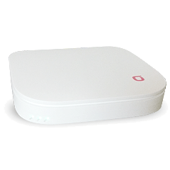
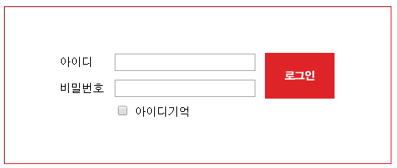
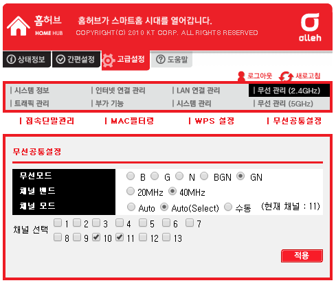
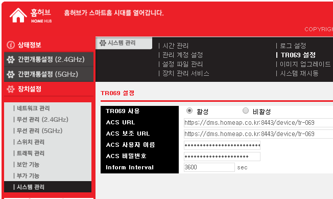
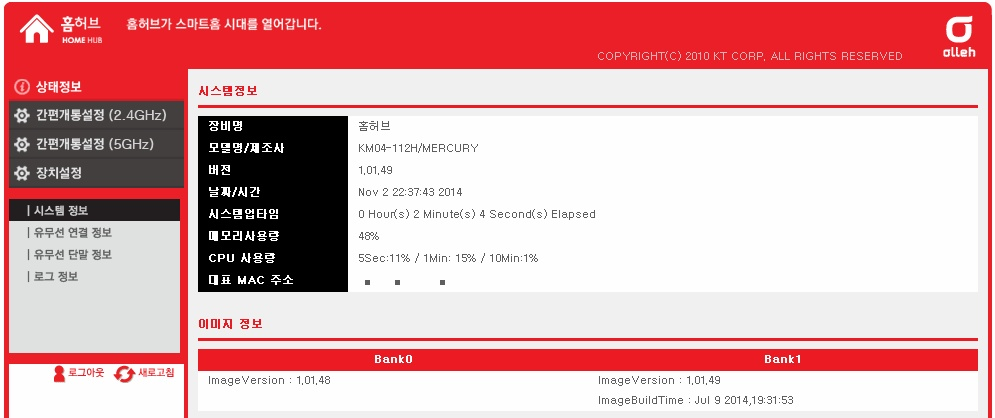

KT에서 인터넷 집전화를 신청하면 홈허브(구 쿡허브)도 함께 제공하는 이벤트를 한적이 있었습니다.

저희 집도 이 홈허브를 사용하고 있는데요.

언제부터인가 홈허브의 관리자 페이지의 비밀번호가 일괄 변경되었습니다.

인터넷에서 검색해본 결과 중국의 바이러스 해킹 공격으로 KT에서 일괄 변경했다고 합니다.

100번에 전화해서 문의해도 고객에게 절대로 알려줄수 없고, 수리기사를 불러서 해결해야 한다고 합니다.

(http://lunarr.me/m/post/15, http://blog.iamghost.kr/post/96161897803/give-life-back-to-ktroot-nespot)

사실 홈허브 공유기가 그닥 좋은 공유기는 아닙니다.

공유기 설치 장소에서 제방까지 얼마 안되고 문을 열어둬도 전파가 안 닿는곳도 있고..

그리고 가끔 지혼자서 꺼지기도 합니다.

그런대 KT에서 몹쓸짓을 또 하나 하네요;

공유기 아래에 바코드가 있던데 거기에 기기 고유 정보가 있는거 같더라고요.

이런 정보를 이용해서 관리자 비밀번호를 만들던가..

자동으로 3600초마다 서버와 통신해서 강제 수정되도록 설정되어 있으므로..

업뎃을 막을 방법이 없었던것 처럼 보였습니다

그렇지만 몇가지 편법이 존재합니다

KT에서 알경우 막힐수도 있는 방법이므로 안된다고 저를 탓하지 말아주세요..

+ 2014-11-19 기준 모든 방법이 막힌듯 보입니다.

제 블로그에서 알려드린 관리자 창에 진입하는 2번째 방법까지 막혔습니다.

그렇지만 다행히 KT에서 욕을 많이 먹었는지 사용자 관리 페이지에 기능을 추가하였습니다.

이제 채널 밴드 설정등을 사용자 관리 페이지에서도 설정할 수 있도록 변경되었습니다.

로그인 화면도 변경되었습니다.

고급설정의 무선관리 탭의 무선 공통 설정을 보시면 채널 밴드설정이 포함된것을 볼수 있습니다.

DMZ도 설정할 수 있더군요.

*(욕 많이 먹었나봐요)*

1. 펌웨어 초기화

<http://blog.iamghost.kr/post/96161897803/give-life-back-to-ktroot-nespot> 블로그에서 알려주시는 방법입니다.

1. 펌웨어를 초기화 합니다 (공유기 뒤에 있는 버튼)
2. 인터넷 선을 빼서 업데이트를 막은 뒤
3. 관리자 페이지로 접속합니다 ( <http://homehub.olleh.com/new/admin_main.asp> / ktroot / nespot )
4. 시스템 관리 - TR069 설정으로 접속해서 ACS URL을 http://127.0.0.1으로, 보조 URL을 빈칸으로 하거나, 비활성 체크
5. 관리자 비밀번호를 ktroot nespot에서 다른것으로 변경

그리고 혹시 모르니 이미지 업그레이드 서버 주소도 조작해 봅시다.

그렇지만 제경우, 이미 펌웨어가 업데이트 되었는지...

이방법이 통하지 않았습니다.

2. User 권한으로 관리자 홈페이지 접속

이것은 <http://www.clien.net/cs2/bbs/board.php?bo_table=lecture&wr_id=235722>에서 찾은 편법입니다.

제경우, 이 방법으로 관리자 UI에 접속 했습니다.

1. 유저 기본 설정 페이지로 접속합니다. ( <http://homehub.olleh.com/new/user_main.asp> / ktuser / megaap )
2. 로그인한뒤, 주소창에 관리자 페이지 주소를 입력하고 접속합니다. ( <http://homehub.olleh.com/new/admin_main.asp> )

접속 완료~~

펌웨어가 1.01.49버전인대 빌드 시간이 2014년 7월 9일이네요.

아무튼 오늘 느낀것은 빨리 홈허브 대신 다른 공유기를 사용했으면 좋겠네요.

중국 바이러스를 막기 위해서라지만..

갑자기 변경되니 당황스럽네요.

저는 제가 오타난줄알고 하나씩 확인하면서 로그인 시도 한...
