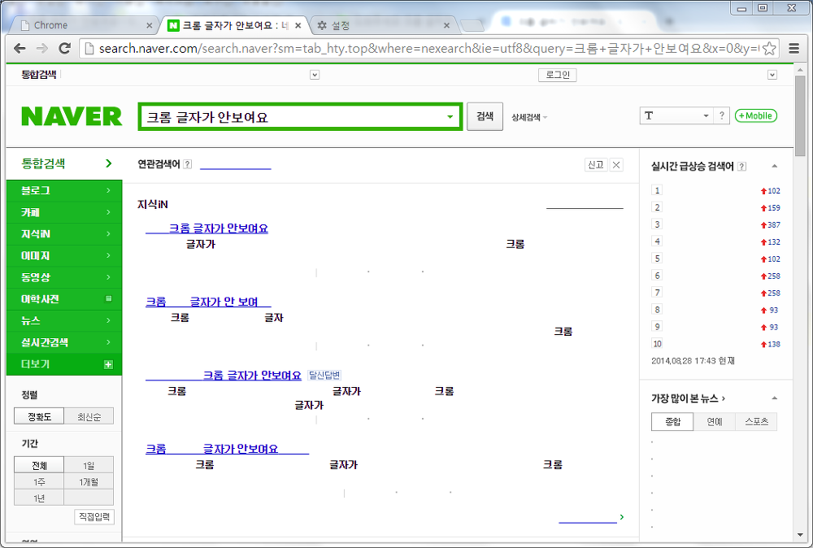
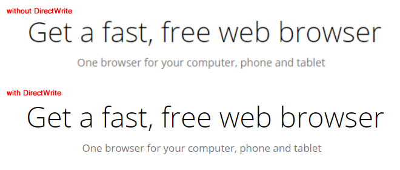
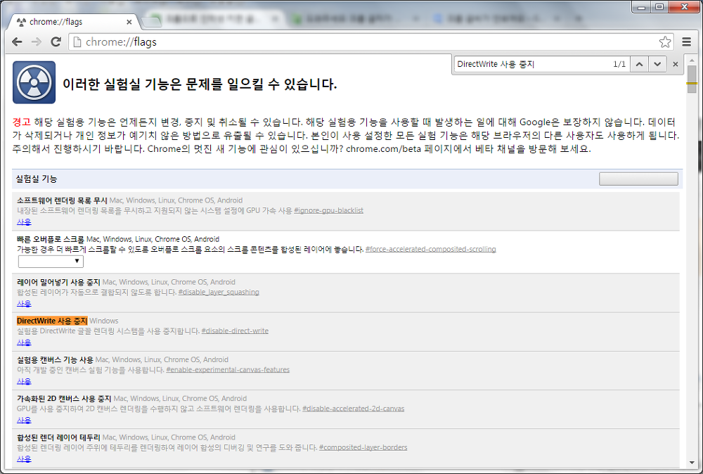

인터넷 브라우저로 크롬을 사용하는 분들이 많아졌습니다.

과거에 IE가 정말 쓸게 못 된다 라는 인식이 있었을때, 컴퓨터 조금 한다 라는 분들은 대부분 이 크롬을 사용하셨습니다.

저도 그 때 Chrome을 처음 접하고, 구글 동기화등의 편리함과 익숙함으로 아직도 이 브라우저를 못버리고 있습니다.

그런대 어느날 인터넷을 딱 키니까 한글이 안보입니다;

아래는 제가 경험한 스샷으로, 네이버에 크롬 글자가 안 보여요 라고 검색한 결과입니다.

헐.. 이거 어떻게 하나요?

원인은 크롬의 DirectWrite 기능 이라고 합니다.

DirectWrite이란?

크롬 37버전부터 적용된 새로운 글꼴 출력 방식인데요.

이전에는 크롬에서 GDI(Graphics Device Interface)이라는 방법으로 글씨를 표시했습니다.

참고로 IE에서는 IE9부터, Firefox에서는 4버전부터 DirectWrite가 사용되었다고 합니다.

왜 사용하냐면.. 사용 유무에 따라 글자 출력의 품질 차이가 있다 합니다.

DirectWrite가 품질이 더 높아 사용을 권장합니다. 하지만 글꼴이 안나오는 문제가 발생하면, 이 기능을 사용안함으로 설정해서 해결할 수 있습니다.

DirectWrite의 유무에 따른 품질 차이
http://thenextweb.com/google/2014/08/26/chrome-37-launches-directwrite-support-better-looking-fonts-windows-revamped-password-manager/

비활성화 하는 방법은 아래와 같습니다.

1. 크롬 주소창에 chrome://flags을 입력합니다.
2. DirectWrite를 찾아서 "사용"을 "사용 중지"로 변경합니다.
3. 크롬을 다시 시작 합니다.

문제가 해결되었습니다~

참고: 필자는 현재 크롬을 사용하지 않습니다. 엣지와 파이어폭스가 더 뛰어나기 때문입니다.
