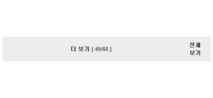
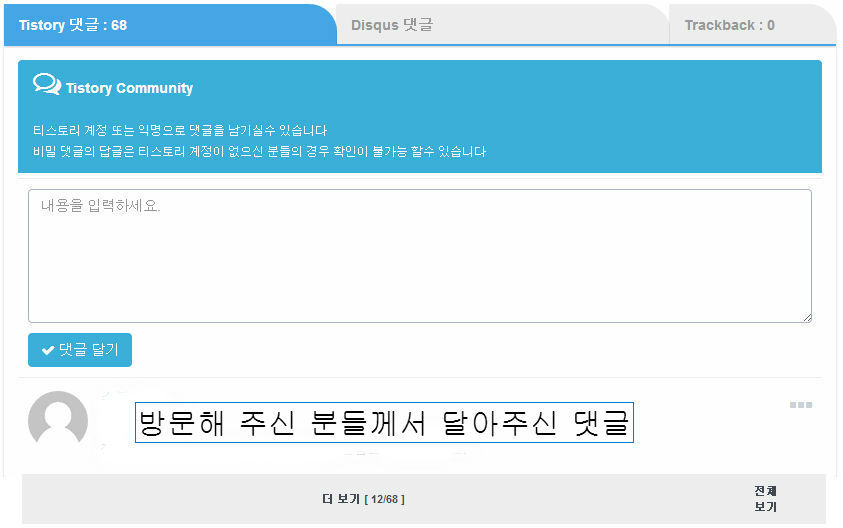

페이스북같은 SNS처럼 티스토리에서도 댓글 더보기 기능을 넣을 수 있습니다.

정말 잘 작동되네요~~

이 방법은 <http://nubiz.tistory.com/546> 글에서 알게된 방법입니다.

skin.html의 </body>위에 스크립트 넣어주시면 작동합니다.

특히 더 보기된 댓글이 애니메이션과 함께 나와서 한 눈에 알 수 있네요. ㅎㅎ

참고로 "오늘 2014년 11월 07일" 올리신 글입니다~

잘 작동하는군요. ㅎㅎ

스크립트를 txt로 첨부하였습니다.

[댓글 더보기.txt](./file/댓글 더보기.txt)

좋은 자료 공유해주신 뭐하라님께 감사드립니다~

---

## 첨부파일

- [댓글 더보기.txt](./files/댓글 더보기.txt)
