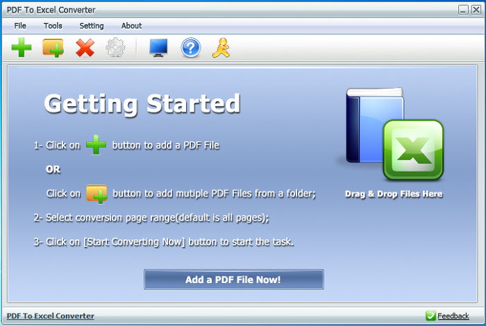
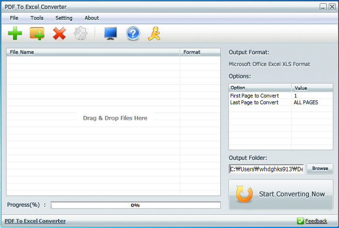

엑셀파일을 PDF로 변환하는 프로그램은 시중에 많이 찾아볼 수 있습니다

그런데 PDF파일을 엑셀파일로 변환하는 프로그램은 찾기 힘들더라고요

최근에 pdf파일의 표를 엑셀로 변환해야 하는 일이 생겨서 관련 프로그램을 몇일간 찾다 좋은 프로그램을 발견해서 알려드립니다

프로그램 이름은 PDF To Excel Converter 입니다

저는 아래 사이트에서 받았습니다

<http://www.kbench.com/software/?q=node/42389>

그럼 이만 글을 마치겠습니다
