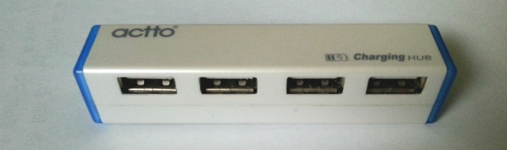
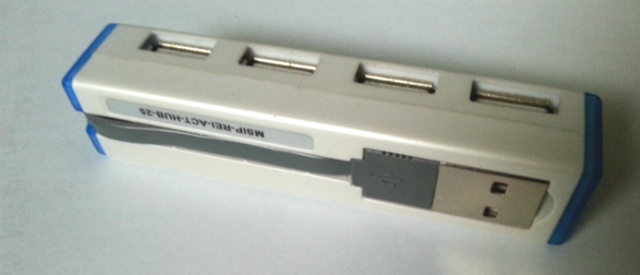
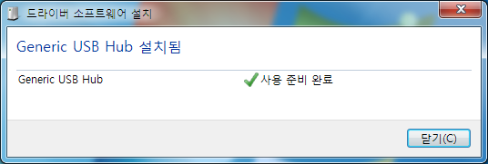
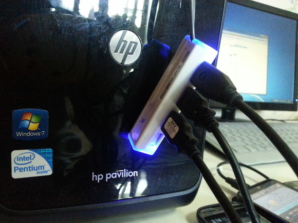
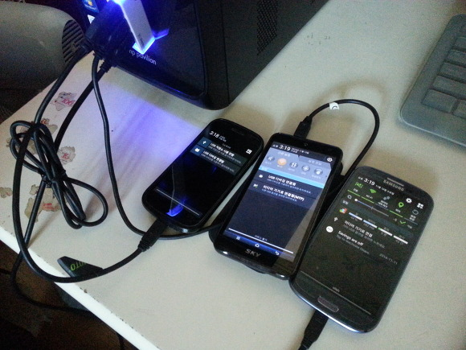
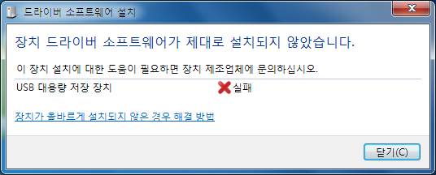
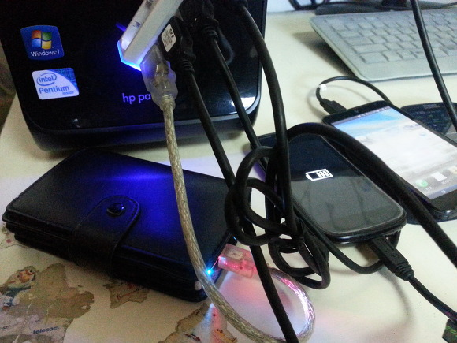

저번 11월 8일에 치즈포테이토님께서 진행하신 USB 허브 나눔에 당첨되어 오늘 택배로 usb허브가 왔습니다

우체국이라 그런지 생각보다 빨리온 기분이네요ㅋㅋ

USB허브란? 하나의 USB포트에 여러개의 USB기기를 꽂을수 있도록 만든 기기입니다

제가 나눔받은 허브는 USB포트가 4개가 있어 총 4개를 끼울수 있습니다

저 usb케이블을 컴퓨터에 꽂으면 인식됩니다

이제 저기에 usb를 끼면 되는데요

제가 가지고 있는 휴대폰 3개 모두 끼워보겠습니다

넥서스s, 베가레이서2, 갤럭시S3를 끼워봤습니다

4개 끼워보고 싶은데 외장하드처럼 전력 많이 필요한거 말고 다른게 없네요..

3개 모두 usb인식됩니다

저기에다가 외장 하드까지 끼워봤는데요

전력이 부족한지 인식에 실패했습니다

저렇게 나머지 스마트폰에 가는 전기가 하드로 다 빠져서 인식이 안되는 모습을 보이네요

OTG도 그렇고 외장하드는 전력이 많이 필요하나봐요

그리고 이 usb허브는 왼쪽에 충전 케이블을 꼽아서 여러개 기기를 충전할수도 있는거 같아요 ㅎ

좋은 나눔 해주신 치즈포테이토님께 감사드립니다~
