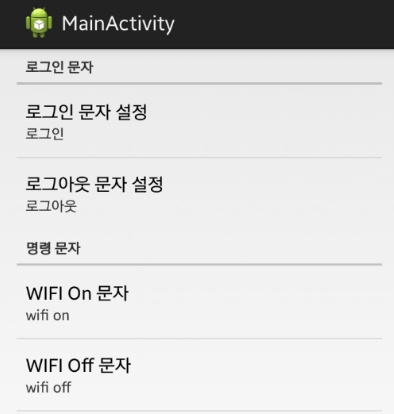
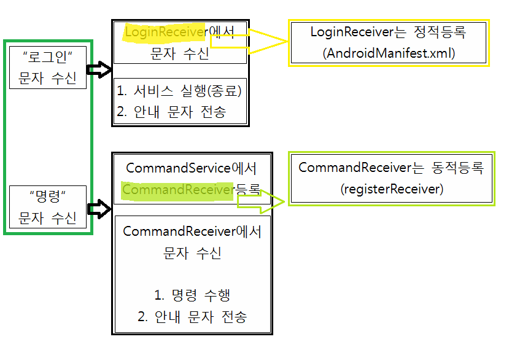
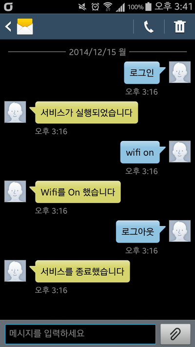
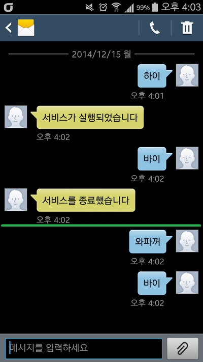

안녕하세요

LG의 기능중 하나가 내 폰과의 대화 라는 기능으로

이 기능은 문자로 스마트폰을 원격 조정할수 있고 아마 부재중 통화 개수까지 알수 있는 기능을 제공합니다

이와 관련해서 예제를 준비했습니다

이 포스팅은 언젠가 부터 올리고 있는 #붙은 강좌가 아니기때문에 자세한 코드 설명은 나와있지 않습니다만

맨 아래 보시면 이 예제에 포함된 요소 또는 강좌내용이 5개나 들어있습니다

복습용으로 정말 좋은 예제가 될것 같습니다

### 메인 화면

내 폰과의 대화처럼 내 스마트폰을 문자로 원격 조정 할수 있는 어플입니다

레이아웃은 간단한 프리퍼런스 액티비티로 구성했으며

문자 내용은 사용자가 편집할수 있도록 했습니다

### 동작 원리

로그인 이라는 문자를 받으면 서비스가 실행되고, 로그아웃이라는 문자를 받으면 종료됩니다

아래는 작동 원리에 대한 그림입니다

(그리기 힘드네요...)

초록색 박스는 사용자 문자이고

검은색 박스는 어플내에서 이루어 지는 작업입니다

나머지 색의 박스는 부연 설명 입니다

위 그림에는 없지만 한가지 더 말씀드리면

"명령"문자는 LoginReceiver에서 처리하지 않습니다

### 작동 화면

아래는 스크린샷 입니다

이렇게 원격 제어가 가능합니다

### 주의점

이러한 어플을 만들때 주의해야 할점이 있는데요

로그인 상태가 아닐경우 반응하지 말아야 합니다

저 녹색 선을 기준으로 아래부분은 로그아웃 상태이기 때문에 명령어에 반응하지 않는 모습을 확인할수 있습니다

위 스샷으로 명령어를 변경해도 작동이 되는것을 알수 있습니다

### 다운로드 및 안내

[TalkWithMyPhone.apk

다운로드](./file/TalkWithMyPhone.apk)

[TalkWithMyPhone.zip

다운로드](./file/TalkWithMyPhone.zip)

apk파일도 함께 첨부했습니다

궁금하신 분께서는 설치해서 꼭 실행하신다음, 테스트해보세요~

이 예제를 사용하여 상업적, 영리적 이용을 금합니다

유료로 판매하는 것 등등 모두 허용하지 않습니다

### 이 소스를 이해하기 위해 알아아할 기본 지식들

[[Development/App] - #21 Preference(프리퍼런스)](http://itmir.tistory.com/393)

[[Development/App] - #23 Service (서비스)에 대해 알아보자](http://itmir.tistory.com/414)

[[Development/App] - #24 Broadcast Receiver로 문자(SMS) 수신해보자](http://itmir.tistory.com/424)

[[Development/App] - #27 어플에서 SMS(문자) 전송 하기](http://itmir.tistory.com/458)

[[Development/App] - #31 PreferenceActivity를 사용하여 설정(Setting)을 만들어보자](http://itmir.tistory.com/523)

---

## 첨부파일

- [TalkWithMyPhone.apk](https://github.com/itmir913/archive/releases/download/itmir-attachments/TalkWithMyPhone.apk) `315 KB`
- [TalkWithMyPhone.zip](https://github.com/itmir913/archive/releases/download/itmir-attachments/TalkWithMyPhone.zip) `1.1 MB`
