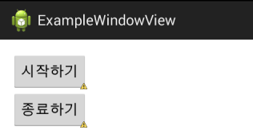
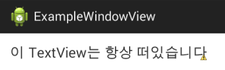
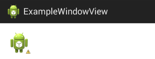
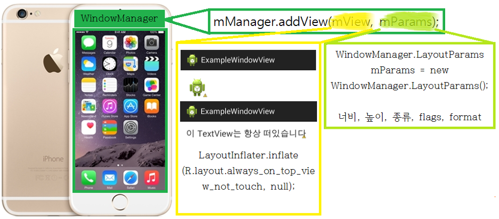
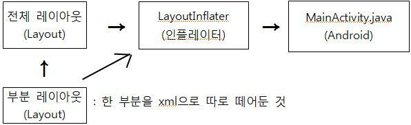
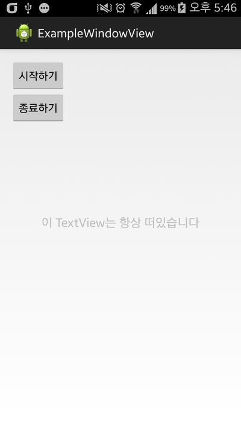
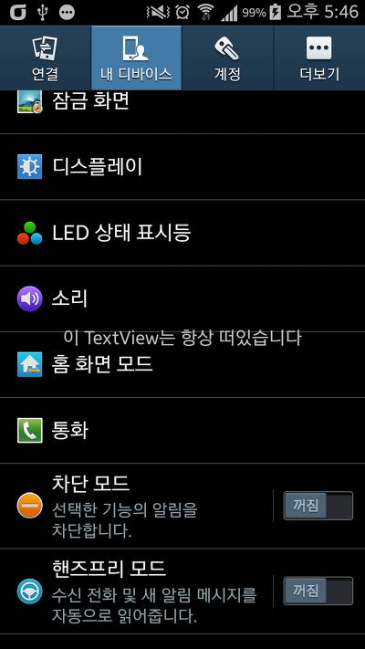
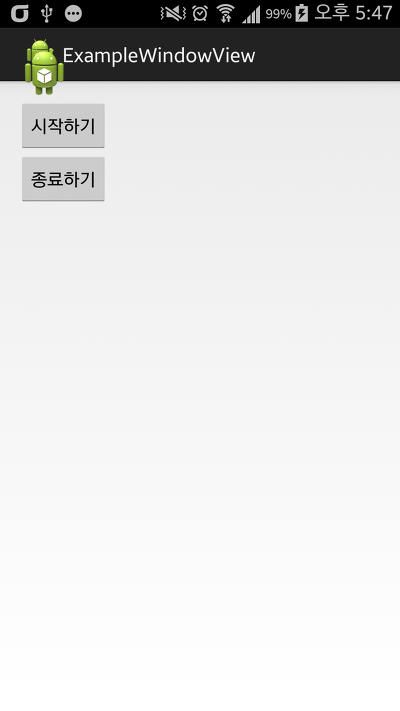
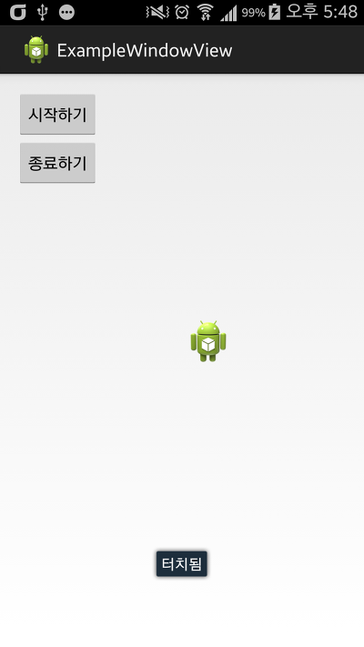

안녕하세요

몇달만이지 모르겠습니다만.. 이번에는 최상위에 떠 있는 뷰를 만들어 보겠습니다

최상위에 떠있는 뷰란.. Q슬라이드나 뭐 이런거 처럼 화면에 떠 있는 뷰를 뜻합니다

### 프로젝트 생성 및 레이아웃은?

최상위에 떠있는 뷰는 액티비티를 종료해도 화면 위에 남아야 합니다

그러므로 꼭 서비스를 이용해서 만들어야 합니다

메인 레이아웃은 서비스 시작/종료 버튼만 만들어 줍시다

(원래 시작/종료를 2개 만들어서 터치O서비스, 터치X서비스 이렇게 만들어야 하지만 코드의 간결성을 위해 하나만 했습니다, 아래에 언급할겁니다)



코드 보기

```xml
<LinearLayout xmlns:android="http://schemas.android.com/apk/res/android"
    xmlns:tools="http://schemas.android.com/tools"
    android:layout_width="match_parent"
    android:layout_height="match_parent"
    android:orientation="vertical"
    android:paddingBottom="@dimen/activity_vertical_margin"
    android:paddingLeft="@dimen/activity_horizontal_margin"
    android:paddingRight="@dimen/activity_horizontal_margin"
    android:paddingTop="@dimen/activity_vertical_margin"
    tools:context=".MainActivity" >

    <Button
        android:layout_width="wrap_content"
        android:layout_height="wrap_content"
        android:onClick="mStart"
        android:text="시작하기" />

    <Button
        android:layout_width="wrap_content"
        android:layout_height="wrap_content"
        android:onClick="mStop"
        android:text="종료하기" />
</LinearLayout>
```

그리고.. 최상위에 떠다니는 "뷰" 이므로 화면위에 있을 "뷰"를 만들어 줘야 하는데요

두가지로 나눌수 있습니다

하나는 터치가 되는 뷰, 나머지는 터치가 안되는 뷰

전자는 터치이벤트를 받을수 있어서 팝업 동영상등에, 뒤는 터치를 못받으므로 스크린필터? 이런 용도로 씁니다

물론 둘다 만들어 볼겁니다 ㅎㅎ

터치이벤트를 못받는 뷰와 관련된 레이아웃 파일 입니다

이름 : always\_on\_top\_view\_not\_touch.xml



코드 보기

```xml
<LinearLayout xmlns:android="http://schemas.android.com/apk/res/android"
    xmlns:tools="http://schemas.android.com/tools"
    android:layout_width="wrap_content"
    android:layout_height="wrap_content"
    android:orientation="vertical"
    android:paddingBottom="@dimen/activity_vertical_margin"
    android:paddingLeft="@dimen/activity_horizontal_margin"
    android:paddingRight="@dimen/activity_horizontal_margin"
    android:paddingTop="@dimen/activity_vertical_margin" >

    <TextView
        android:id="@+id/mTextView"
        android:layout_width="wrap_content"
        android:layout_height="wrap_content"
        android:text="이 TextView는 항상 떠있습니다"
        android:textSize="20sp" />

</LinearLayout>
```

간결하게 TextView 하나만 있습니다

이 TextView는 나중에 중앙에 항상 뜨도록 만들겠습니다

또하나는 터치를 받을수 있는 뷰인데요

간단하게 이미지뷰 하나만 뒀습니다

이름 : always\_on\_top\_view\_touch.xml



터치 이벤트를 받아서 뭐할건가.. 생각해봤는데요

그냥 움직여보겠습니다

### 최상단 액티비티를 띄우려면 권한이 필요해요

화면에 뷰를 추가하기 위한 권한을 추가해 줍시다

<uses-permission android:name="android.permission.SYSTEM\_ALERT\_WINDOW" />

### 서비스 생성하기

최상단 뷰를 만들기 위해 서비스를 사용해야 합니다

이 강좌에서는 터치가 되는것, 안되는것 두가지를 만들 예정이므로 서비스를 2개 생성해야 합니다

구체적인 생성법은 아래 링크를 참고해 주세요

[[Development/App] - #23 Service (서비스)에 대해 알아보자](http://itmir.tistory.com/414)

[java] : 파일 생성

AlwaysTopServiceTouch.java - 서비스 생성 (링크 참조해서 생성하세요)

AlwaysTopServiceNotTouch.java - 서비스 생성 (링크 참조해서 생성하세요)

[AndroidManifest.xml] : 코드 추가

<service android:name="itmir.tistory.examplewindowview.AlwaysTopServiceNotTouch" />

<service android:name="itmir.tistory.examplewindowview.AlwaysTopServiceTouch" />

[MainActivity.java] : 메소드 추가

public void mStart(View v) {

    startService(new Intent(this, AlwaysTopServiceNotTouch.class));

}

public void mStop(View v) {

    stopService(new Intent(this, AlwaysTopServiceNotTouch.class));

}

### AlwaysTopServiceNotTouch 서비스를 봐주세요

자....... 서비스까지 잘 생성하셨으리라 믿고 넘어가겠습니다

본격적으로 자바소스를 알아보기 전에 그림으로 알아볼까 합니다



모식도(?)입니다

private View mView;

private WindowManager mManager;

화면에 최상단 뷰를 추가하기 위해서 WindowMananger를 사용할겁니다

서비스의 onCreate()메소드 입니다

```java
@Override
public void onCreate() {
    super.onCreate();

    LayoutInflater mInflater = (LayoutInflater) getSystemService(Context.LAYOUT_INFLATER_SERVICE);
    mView = mInflater.inflate(R.layout.always_on_top_view_not_touch, null);

    WindowManager.LayoutParams mParams = new WindowManager.LayoutParams(
            WindowManager.LayoutParams.WRAP_CONTENT,
            WindowManager.LayoutParams.WRAP_CONTENT,

            WindowManager.LayoutParams.TYPE_SYSTEM_OVERLAY,

            WindowManager.LayoutParams.FLAG_WATCH_OUTSIDE_TOUCH,

            PixelFormat.TRANSLUCENT);

    mManager = (WindowManager) getSystemService(WINDOW_SERVICE);
    mManager.addView(mView, mParams);
}
```

하나씩 확인해 보겠습니다

5~6번은 전에 본적이 있으실겁니다

커스텀 알림때 배운 레이아웃 인플레이터입니다

[[Development/App] - #17 커스텀 알림(Alert) 띄우기](http://itmir.tistory.com/358)



(이제야 우려먹네요;)

19~20부분에서 뷰를 추가하는데요

그림이 뭐낙 잘만들어서(?) 이해하시는데 큰 어려움은 없을거라 믿고.....

8~17이 문제네요

API를 봅시다

WindowManager.LayoutParams mParams = new WindowManager.LayoutParams(w, h, \_type, \_flags, \_format)

저 순서대로 집어넣어 주는건데요

- WindowManager.LayoutParams.WRAP\_CONTENT

이건 WRAP\_CONTENT가 눈에 잘 들어오실탠대 생각하시는 그거 맞습니다

- WindowManager.LayoutParams.TYPE\_SYSTEM\_OVERLAY

이건 항상 최상위에 있도록 해주는 타입입니다

반대로 아래에서 사용하게될 WindowManager.LayoutParams.TYPE\_PHONE은 터치 이벤트도 받을수 있습니다

- WindowManager.LayoutParams.FLAG\_WATCH\_OUTSIDE\_TOUCH

이건 뷰를 제외한 나머지 부분의 터치를 가능하게 해준다...라고 알고있습니다

- PixelFormat.TRANSLUCENT

이건 API를 보면 \_format이라 되어있는데 dev.android.com찾아봐도 뭔지 모르겠네요

(아시는분 계시다면 덧글로 꼭 알려주세요!)

그럼.. 이제 터치 못받는건 마무리 해볼께요

아래는 스크린샷 입니다


   


### AlwaysTopServiceTouch 서비스를 봐주세요

중요한건 위에서 다 언급했기 때문에 바뀐 점만 언급하고 마치려 합니다

```java
mView.setOnTouchListener(mViewTouchListener);

mParams = new WindowManager.LayoutParams(
        WindowManager.LayoutParams.WRAP_CONTENT,
        WindowManager.LayoutParams.WRAP_CONTENT,
        WindowManager.LayoutParams.TYPE_PHONE,
        WindowManager.LayoutParams.FLAG_NOT_FOCUSABLE,
        PixelFormat.TRANSLUCENT);

mParams.gravity = Gravity.TOP | Gravity.LEFT;
```

TYPE\_PHONE과 FLAG가 변경되었네요

- WindowManager.LayoutParams.FLAG\_NOT\_FOCUSABLE

포커스를 가지지 않게 합니다

그리고 mView.setOnTouchListener(mViewTouchListener); 이부분에서 mViewTouchListener를 언급하지 않았네요

```java
private float mTouchX, mTouchY;
private int mViewX, mViewY;

private OnTouchListener mViewTouchListener = new OnTouchListener() {
    @Override
    public boolean onTouch(View v, MotionEvent event) {

        switch (event.getAction()) {
        case MotionEvent.ACTION_DOWN:

            mTouchX = event.getRawX();
            mTouchY = event.getRawY();
            mViewX = mParams.x;
            mViewY = mParams.y;

            break;

        case MotionEvent.ACTION_UP:
            break;

        case MotionEvent.ACTION_MOVE:
            int x = (int) (event.getRawX() - mTouchX);
            int y = (int) (event.getRawY() - mTouchY);

            mParams.x = mViewX + x;
            mParams.y = mViewY + y;

            mManager.updateViewLayout(mView, mParams);

            break;
        }

        return true;
    }
};
```

뭐.. 이런구조인데요

중요한건 터치이벤트 리스너를 받을수 있고, 그 이벤트를 받아서 mParams을 수정하고, updateViewLayout()로 위치를 수정한다 라는 원리입니다


   


### 예제 다운로드

[ExampleWindowView.zip](./file/ExampleWindowView.zip)

### 마치며

강좌 완성도를 점차 올리고 싶은데 시간도 없고.. 내용도 어렵고 해서 강좌를 자주 올리지 못하네요..

그리고 제 필력이 약해서 정확하게 이해하실수 있으실지도 모르겠습니다

예제소스도 함께 첨부했으니 이해가 안되신다면 소스 확인해보세요~

글 한번 쓰는거 너무 오래걸리고 힘드네요...

특히 그림 만드는거..

이 글이 유용하시다면 덧글과 제 블로그에 있는 수입원(?) 한번씩 터치해주시면 감사드리겠습니다..

미밴드 사고싶어서 빨리 모였으면 하네요 ㅎㅎ..

### 참조

<http://blog.daum.net/mailss/18>

<http://blog.daum.net/mailss/35>

---

## 첨부파일

- [ExampleWindowView.zip](https://github.com/itmir913/archive/releases/download/itmir-attachments/ExampleWindowView.zip) `1.7 MB`
