---
title: "티스토리 오류 제보하기 버튼 만들기 - 구글 스프레드 시트 사용"
date: "2015-01-05T15:54:51+09:00"
category: "Tistory"
tags: []
description: "글을 작성한지 오래 지난 포스팅의 경우 지금과 다른 점이 생길 수 있습니다."
draft: false
original_url: "https://itmir.tistory.com/550"
---

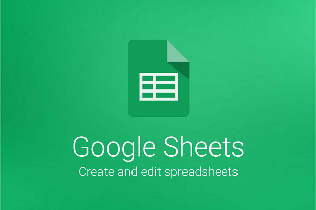

글을 작성한지 오래 지난 포스팅의 경우 지금과 다른 점이 생길 수 있습니다.

블로그에 글이 조금밖에 없는경우에는 직접 살펴볼수도 있지만 100개만 넘어가도 힘든일인데요.

어떻게 해야 할까 생각하다 정말 좋은 방법이 있어 알려드리려고 합니다.

먼저 이 글은 뭐하라님의 <http://nubiz.tistory.com/551> 글을 바탕으로 작성된 것임을 말씀드립니다.

### 완성된 스크린샷 살펴보기

직접 적용한 스크린샷을 확인해보겠습니다.

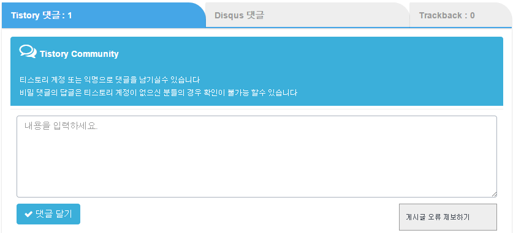

마땅히 넣을 자리가 없어서 댓글 달기 버튼 옆에 넣어주었습니다.

저 상자를 클릭하게 되면 아래 스크린샷 처럼 스르르 열리며 제보가 가능합니다.

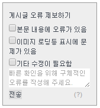

제가 적용한 소스는 뭐하라님의 원본 소스를 조금 수정한 것이며, 혼란을 드리지 않기 위해서 이 글은 뭐하라님의 원본 글로 진행했습니다.

### 구글 스프레드 시트 만들고 활성화 하기

블로그에서 대부분이 DB로 이루어져 있다고 해도 과언이 아닌데요.

티스토리도 글, 댓글, 방명록등등이 티스토리만의 DB에 저장될 것입니다.

이 티스토리 DB는 우리들이 임의로 건들수가 없습니다.

그래서 방문자가 오류를 제보하면 그것을 저장해주는 저장소가 필요합니다.

이때 구글 스프레드시트를 데이터 저장 용도로 사용할 예정입니다.

[구글 드라이브(클릭)](https://drive.google.com)에 접속하셔서 새로 만들기 - Google 스프레드시트를 선택해주세요.

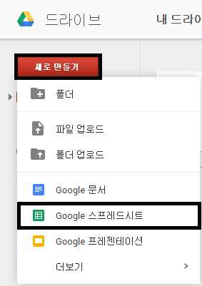

또는 바로 [구글 스프레드시트(클릭)](https://docs.google.com/spreadsheets)에서 새로 만들기 해주세요.

새로 만들어졌습니다.

"제목 없는 스프레드시트"는 나중에 원하시는대로 바꿔주세요.

초록색 박스로 둘러싼 "시트1"은 아래에서 중요합니다.

원하는대로 수정하셔도 되지만, 수정한 다음에는 꼭 기억하세요.

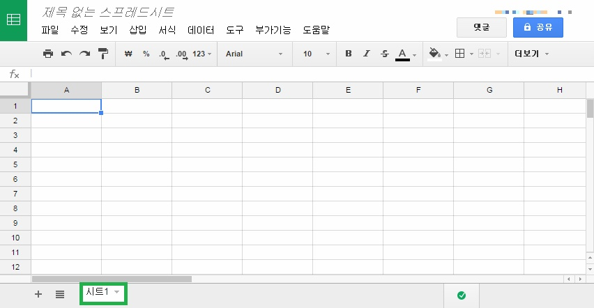

A1부터 C1까지를 각각 Timestamp, path, memo로 체워주세요.

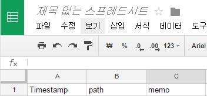

그다음에 도구 - 스트립트 편집기를 눌러주세요.

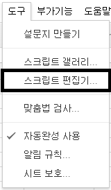

그러면 아래와 같은 창이 뜹니다.

스크립트 만들기 - 빈 프로젝트를 선택해주세요.

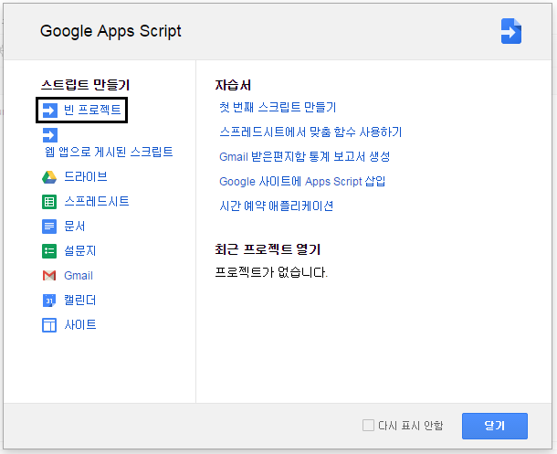

그럼 아래와 같은 모습이 나타납니다.

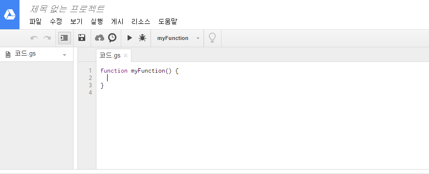

저기있는 function myFunction() { } 을 모두 지우고 아래 내용을 복사해서 넣어주세요.

//  1. Enter sheet name where data is to be written below

var SHEET_NAME = "**시트1**";

//  2. Run > setup

//

//  3. Publish > Deploy as web app

//    - enter Project Version name and click 'Save New Version'

//    - set security level and enable service (most likely execute as 'me' and access 'anyone, even anonymously)

//

//  4. Copy the 'Current web app URL' and post this in your form/script action

//

//  5. Insert column names on your destination sheet matching the parameter names of the data you are passing in (exactly matching case)

var SCRIPT_PROP = PropertiesService.getScriptProperties(); // new property service

// If you don't want to expose either GET or POST methods you can comment out the appropriate function

function doGet(e){

  return handleResponse(e);

}

function doPost(e){

  return handleResponse(e);

}

function handleResponse(e) {

  // shortly after my original solution Google announced the LockService[1]

  // this prevents concurrent access overwritting data

  // [1] http://googleappsdeveloper.blogspot.co.uk/2011/10/concurrency-and-google-apps-script.html

  // we want a public lock, one that locks for all invocations

  var lock = LockService.getPublicLock();

  lock.waitLock(30000);  // wait 30 seconds before conceding defeat.

  try {

    // next set where we write the data - you could write to multiple/alternate destinations

    var doc = SpreadsheetApp.openById(SCRIPT_PROP.getProperty("key"));

    var sheet = doc.getSheetByName(SHEET_NAME);

    // we'll assume header is in row 1 but you can override with header_row in GET/POST data

    var headRow = e.parameter.header_row || 1;

    var headers = sheet.getRange(1, 1, 1, sheet.getLastColumn()).getValues()[0];

    var nextRow = sheet.getLastRow()+1; // get next row

    var row = [];

    // loop through the header columns

    for (i in headers){

      if (headers[i] == "Timestamp"){ // special case if you include a 'Timestamp' column

        row.push(new Date());

      } else { // else use header name to get data

        row.push(e.parameter[headers[i]]);

      }

    }

    // more efficient to set values as [][] array than individually

    sheet.getRange(nextRow, 1, 1, row.length).setValues([row]);

    // return json success results

    return ContentService

          .createTextOutput(JSON.stringify({"result":"success", "row": nextRow}))

          .setMimeType(ContentService.MimeType.JSON);

  } catch(e){

    // if error return this

    return ContentService

          .createTextOutput(JSON.stringify({"result":"error", "error": e}))

          .setMimeType(ContentService.MimeType.JSON);

  } finally { //release lock

    lock.releaseLock();

  }

}

function setup() {

    var doc = SpreadsheetApp.getActiveSpreadsheet();

    SCRIPT_PROP.setProperty("key", doc.getId());

}

맨위에 있는 시트1은 오류를 기록할 시트의 이름입니다.

위에서 수정하셨다면 이것도 바꿔주세요.

다 하셨다면 저장해주세요.

이름은 마음대로.. ㅎㅎ..

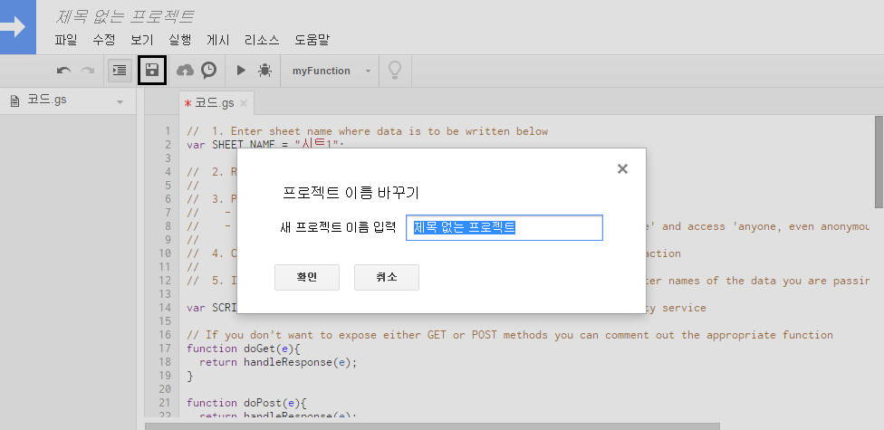

실행 - Setup을 눌러주세요.

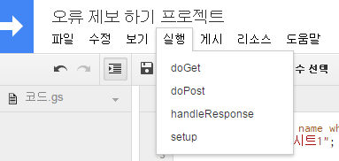

인증이 필요하다고 나옵니다.

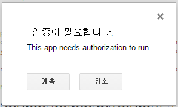

인증해주세요.

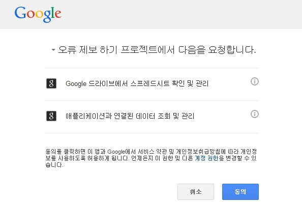

동의 하신다음에 다시한 번 실행 - Setup 해주시면 됩니다.

마지막으로 게시 - 웹 앱으로 배포...을 눌러주세요.

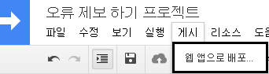

프로젝트 버전 옆 새 버전 저장을 눌러주세요.

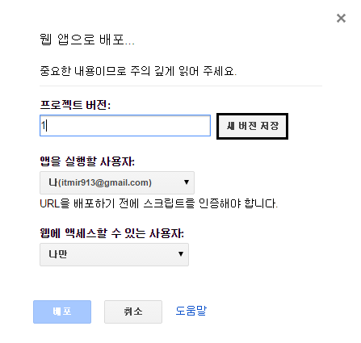
   
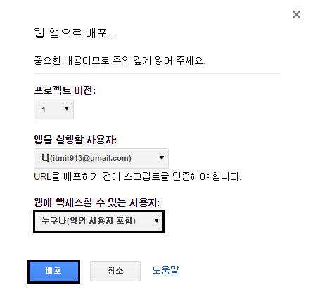

앱을 실행할 사용자는 '나'

웹에 액세스할 수 있는 사용자는 **누구나(익명 사용자 포함)**으로 꼭 바꿔주세요.

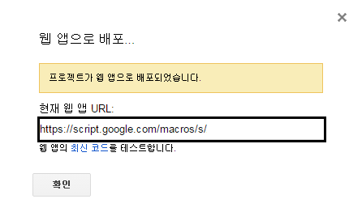

자 이제 구글 스프레드 시트는 끝났습니다.

현재 웹 앱 URL을 복사해주세요 좀 있다가 필요합니다.

이어서 티스토리에 관련 소스를 넣어봅시다.

### 티스토리 html/css 수정하기

이제 마지막 작업으로 html과 css만 수정해주시면 적용이 완료됩니다.

오류 제보 버튼 html 소스를 넣고 싶으신 위치에 넣어주시면 됩니다.

```html
<div id="sendComment">

  <p>오류 제보하기</p>

  <div>

    <input type="checkbox" value="내용상 오류가 있음"/>내용상 오류가 있음<br/>

    <input type="checkbox" value="표시에 문제가 있음"/>표시에 문제가 있음<br/>

    <input type="checkbox" value="기타 수정이 필요함"/>기타 수정이 필요함<br/>

    <textarea placeholder="구체적 내용이나 기타 의견을 남겨주세요."></textarea><br/>

    <input type="button" value="보내기" onclick="sendComment();">

    <a href="http://nubiz.tistory.com/551">(?)</a>

  </div>

</div>

<div style="clear:both" />
```

그다음 skin.html의 </body>부분에 아래 코드를 넣어주시되, 하늘색으로 표시한 부분에는 위에서 복사한 URL을 넣어주세요.

참고로 맨 위의 첫 줄은 jquery입니다.

이미 jquery가 적용된 블로그의 경우 맨 윗 줄은 생략하셔야 합니다.

<script>

//오류제보하기 - http://nubiz.tistory.com/551

$("#sendComment>p").click(function(){

  $("#sendComment>div").toggle(300);

});

function sendComment (){

  $("#sendComment \*").attr("disabled","");

  var errors = []

  $("#sendComment :checkbox:checked").each(function(i){

    errors[i] = $(this).val();

  });

  var comment = $("#sendComment textarea").val();

  $.ajax({

    url: "**https://script.google.com/macros/s/###############################/exec**",

    data: {

      path: decodeURIComponent(location.pathname),

      memo: errors+" / "+comment

    },

    type: "POST",

    success:function(){

      alert("빠른 시일 내에 검토해보겠습니다.\n감사합니다.");

      $("#sendComment :disabled").removeAttr("disabled");

      $("#sendComment textarea").val('');

      $("#sendComment :checkbox").prop("checked",false);

    }

  });

}

</script>

마지막으로 style.css에 아래 코드를 넣어주세요.

```css
#sendComment {

  width:140px;

  background:#eee;

  padding:10px;

  border:#999 solid 1px;

  font-size:0.8em;

  float:right;

}

#sendComment p {

  line-height:2em;

  padding:0; margin:0;

}

#sendComment div {

  display:none;

}

#sendComment a {

  text-decoration:none;

  color:#aaa;

  margin-left:65px;

}
```

그러면 모든 작업이 끝납니다.

### 어떻게 기록되나요?

어떻게 기록되는지 궁금해하실까봐 스샷을 하나 더 준비했습니다.

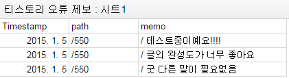

<https://docs.google.com/spreadsheets/d/1BkK9_Yozyrzbbv4OVBFjdUCZw7SdYDPERDUs1uCpkgs/pubhtml>

테스트 해보고 싶으신 분께서는 이 글에 하셔도 좋지만 꼭 테스트라고 말씀해주세요.. ㅎㅎ

### 참조

<http://nubiz.tistory.com/538>

<http://nubiz.tistory.com/551>